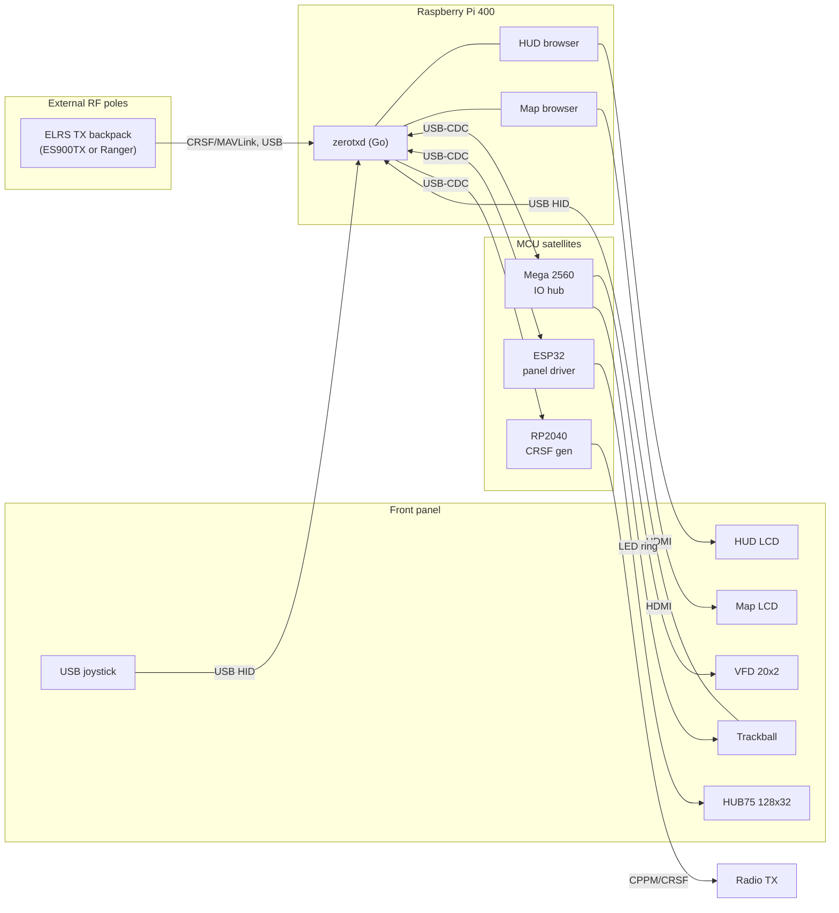
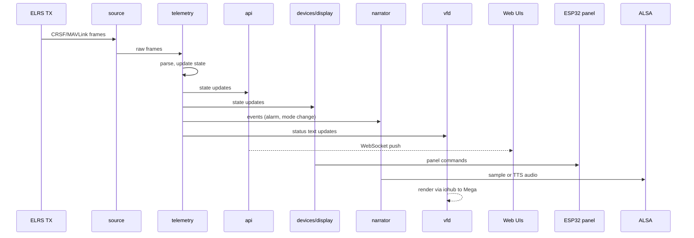
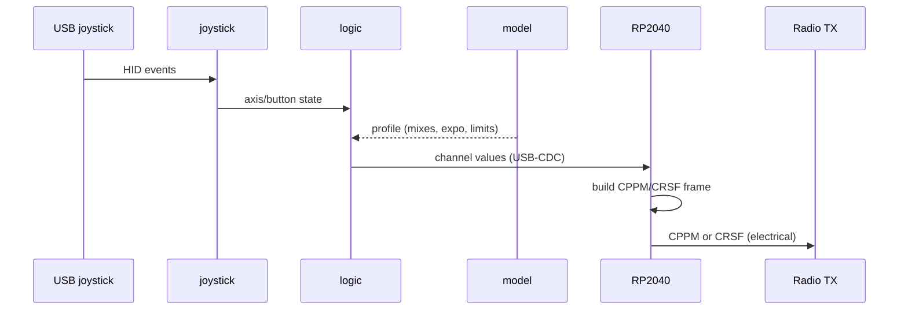

# ZeroTX Architecture

## Purpose and scope

High-level architecture of ZeroTX: a workstation-grade ground control station for FPV and fixed-wing flight. Audience is future-me coming back to the project after a long break. Goal: rebuild the mental model fast.

For wire-level protocols see `docs/protocols/`. For per-firmware detail follow the links at the end. This doc deliberately avoids duplicating either.

## System overview

The Raspberry Pi 400 is the brain. It runs the `zerotxd` Go daemon and two Chromium kiosk browsers (HUD and Map). The daemon ingests CRSF/MAVLink telemetry from an external ELRS TX backpack, drives twin LCDs via HDMI, orchestrates a HUB75 LED panel via an ESP32 satellite, talks to a Mega 2560 IO board for buttons, LEDs, relays, and the VFD, plays audio (pre-baked samples plus Piper TTS), and bridges a USB joystick to CPPM/CRSF for the radio via an RP2040 satellite. The case is wired-only inside; ELRS modules and any other RF live on external poles.

## Components

### Raspberry Pi 400 (brain)
Runs `zerotxd` and two Chromium kiosk browsers. Owns the joystick, trackball HID, LCDs, and the satellite USB-CDC links. See `pi/daemon/`.

### Mega 2560 (IO hub)
Drives VFD, trackball ring LEDs (bicolor green/red), 4 buttons, 4 LEDs, 4 relays, 16-pixel WS2813 strip, LDR, passive piezo buzzer, KY-040 rotary encoder. Active-HIGH default with HAL-flag opt-in for active-LOW per pin. Single shared serial link to daemon. See `firmware/io/README.md`.

### ESP32 (HUB75 panel driver)
Drives 2x Waveshare P2.5 64x32 panels chained, 128x32 logical resolution. USB-CDC link to Pi. RP2040 was attempted earlier and rejected (3.3V signaling insufficient at panel input shift registers); level shifters explicitly ruled out. See `firmware/display/README.md`.

### RP2040 (CRSF generator)
Receives joystick state from the Pi over USB-CDC, generates CPPM/CRSF output to the radio. Hardware watchdog enabled (firmware m1.8-wdt). See `rp2040/README.md`.

### ELRS TX backpack
HappyModel ES900TX or RadioMaster Ranger 2.4GHz, mounted externally on poles, cable-connected via bulkheads. Emits CRSF/MAVLink telemetry to the daemon over USB serial.

### LCDs
Two HDMI panels driven by the Pi's two HDMI ports. Each runs a Chromium kiosk pointed at a daemon-served web UI (HUD on one, Map on the other).

### HUB75 panel
At-a-glance state display: arm state, mode, alarms, big numerics. 2x Waveshare P2.5 64x32 chained. Wire protocol in `docs/protocols/display.md`.

### VFD (Noritake CU20025ECPB-W1J)
20x2 blue/white VFD. Driven by Mega via the vfd.0 subsystem (HD44780 4-bit interface). Originally specced for an RP2040 driver, moved to Mega to consolidate IO.

### Trackball + buttons
Arcade trackball plus 2 USB buttons. USB HID to Pi. Ring LEDs (green and red) driven by Mega via the led.trackball subsystem.

### Joystick
USB HID to Pi (Thrustmaster). Read by the `joystick` subsystem, forwarded to RP2040 over USB-CDC.

### Audio stack
ALSA out from the Pi. Two tiers: pre-baked WAV samples for safety-critical alarms, Piper TTS (en_US-amy-medium) for everything else. See `audio`, `narrator`, `phrasebook`.

### Web UIs
HUD and Map browsers, served by daemon out of `web/`. Shared CSS palette and self-hosted Orbitron variable + DSEG14 Classic fonts.

### Off-cluster
GL-MT6000 Flint 2 router (dual WAN). Home Ubuntu server "stan" running KVM/QEMU with OpenBeken/Home Assistant. Stan also hosts the satellite tile build pipeline and (pinned for later) replay datahub V2.

## Data flows

### Telemetry pipeline

ELRS TX backpack emits CRSF/MAVLink over its USB-serial link. The `source` subsystem reads frames; `telemetry` parses them into structured state. Downstream consumers: `api` (WebSocket push to web UIs), `devices/display` (HUB75 panel commands), `narrator` (audio events), `vfd` (status text), `recorder` (flight log).

### Joystick to radio

USB HID joystick events flow through `joystick` into `logic`, mixed against the active aircraft profile from `model`, then sent to the RP2040 over USB-CDC. The RP2040 formats CPPM/CRSF frames and drives the radio.

### IO events

Mega events (button presses, encoder ticks, LDR readings, etc.) flow over a single shared serial link. The `iohub` subsystem multiplexes the link; downstream subsystems (`vfd`, `trackballled`, future semantic consumers) subscribe to their slice. Outbound effects (LED states, VFD writes, relay commands) go back through `iohub`.

### Panel orchestration

`devices/display` owns the HUB75 panel state model: IDLE, PREFLIGHT, FLIGHT, ALARM, RTH, POSTFLIGHT. It writes commands over USB-CDC to the ESP32 using the `panel` subsystem's protocol writer. Wire grammar and alarm levels in `docs/protocols/display.md`.

## Daemon subsystem map

`pi/daemon/internal/`:

- `api`: HTTP plus WebSocket API for web UIs and external clients
- `arm`: arm state machine, gates flight-critical actions
- `audio`: ALSA playback engine for samples and Piper output
- `crsftee`: CRSF passthrough (ground-side splitter)
- `devices/display`: HUB75 panel mode/alarm orchestration
- `geo`: geographic helpers (great circle, bearing, distance)
- `iohub`: shared serial client multiplexing access to the Mega IO board
- `ipc`: inter-process plumbing for binaries that talk to the daemon
- `joystick`: USB HID joystick reader
- `logbuf`: ring buffer for log lines, exposed via API
- `logic`: cross-cutting orchestration glue
- `model`: aircraft profile loader (yaml in `configs/`)
- `narrator`: Piper TTS scheduler and playback queue
- `netclass`: network classification (link health, etc.)
- `panel`: HUB75 panel wire protocol writer
- `phrasebook`: catalog of pre-baked samples and TTS templates
- `recorder`: flight recording (telemetry plus events)
- `sitl`: Software In The Loop integration for bench testing
- `source`: telemetry source abstraction (real ELRS, SITL, replay)
- `telemetry`: telemetry frame parser and state model
- `tilewarm`: map tile prefetcher around current position
- `trackballled`: bicolor ring LED driver (consumes `iohub`)
- `vfd`: VFD driver (consumes `iohub`)
- `weather`: weather data fetcher
- `wxalert`: weather-derived alerts

Auxiliary binaries in `pi/daemon/cmd/`:

- `zerotxd`: the daemon
- `disptest`: HUB75 panel test harness
- `geobuild`: offline geographic data builder
- `zerotx-axes`: joystick axis calibration
- `zerotx-inspect`: live state inspector

## Arm subsystem

The `arm` subsystem in `pi/daemon/internal/arm/` is the gatekeeper for flight-critical actions. Transitions are driven by telemetry, user input, and timeouts. The source is the source of truth and changes more often than this doc; refer to it for the canonical state list and transition rules.

## Audio architecture

Two tiers, picked at the call site:

1. Pre-baked samples: WAV files for safety-critical alarms (auto-launch faults, link loss, failsafe). Played immediately, no synthesis latency. Catalog managed by `phrasebook`.
2. Piper TTS: `en_US-amy-medium` voice, used for non-critical narration (mode changes, weather alerts, status announcements). Synthesized on demand by `narrator` and queued through `audio`.

Both tiers share the same ALSA output. Sample-tier requests preempt the TTS queue when needed.

## See also

- `docs/protocols/display.md`: HUB75 panel wire protocol
- `firmware/display/README.md`: ESP32 panel firmware
- `firmware/io/README.md`: Mega IO board firmware and HAL
- `rp2040/README.md`: CRSF generator firmware
- `docs/CONNECTIONS.md`: physical wiring and topology
- `docs/OPERATIONS.md`: launch and recovery procedures
- `docs/BOOTSTRAP.md`: bare-metal Pi 400 provisioning
- `docs/DECISIONS.md`: locked architectural decisions
- `docs/ROADMAP.md`: pinned and backlog items

## Glossary

- **CRSF**: Crossfire serial protocol, used by ELRS for radio link control and telemetry
- **CPPM**: Combined PPM, multiplexed RC signal on a single wire
- **MAVLink**: telemetry and command protocol used by ArduPilot and INAV
- **ELRS**: ExpressLRS, open-source long-range radio link
- **HUB75**: shift-register based RGB LED panel interface
- **VFD**: Vacuum Fluorescent Display
- **GCS**: Ground Control Station
- **RTH**: Return To Home (autopilot mode)
- **SITL**: Software In The Loop (simulated flight for bench testing)
- **HAL**: Hardware Abstraction Layer (firmware-side pin and flag layer in `firmware/io/`)
