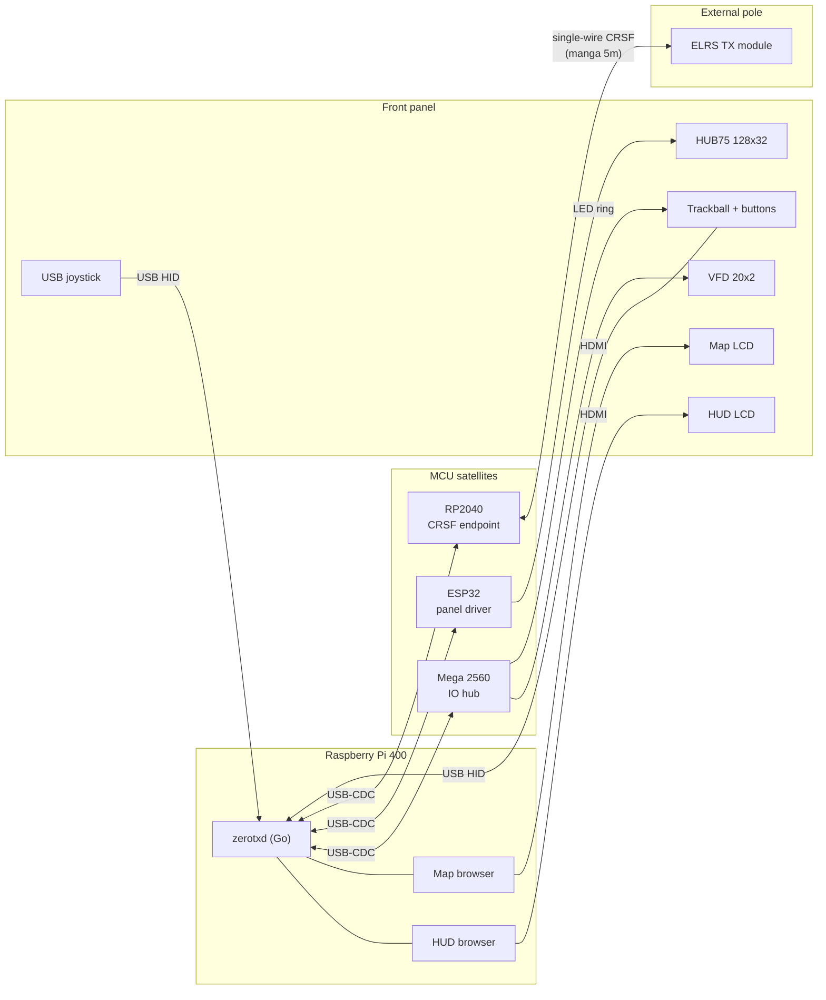
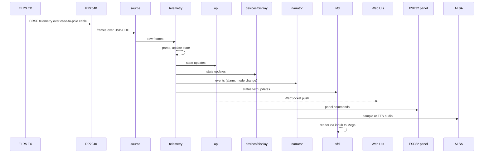
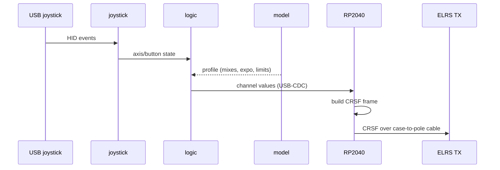
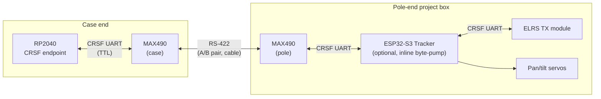

# ZeroTX Architecture

## Purpose and scope

High-level architecture of ZeroTX: a workstation-grade ground control station for FPV and fixed-wing flight. Audience is future-me coming back to the project after a long break. Goal: rebuild the mental model fast.

For wire-level protocols see `docs/protocols/`. For per-firmware detail follow the links at the end. This doc deliberately avoids duplicating either.

## System overview

The Raspberry Pi 400 is the brain. It runs the `zerotxd` Go daemon and two Chromium kiosk browsers (HUD and Map). The daemon ingests CRSF telemetry coming back from the radio link via the RP2040 over USB-CDC, drives twin LCDs via HDMI, orchestrates a HUB75 LED panel via an ESP32 satellite, talks to a Mega 2560 IO board for buttons, LEDs, relays, and the VFD, plays audio (pre-baked samples plus Piper TTS), and sends joystick-derived channel intents to the RP2040 which generates CRSF on a wired link to the externally-mounted ELRS TX module. The case interior is wired-only; ELRS modules and any other RF live on external poles.

The default case-to-pole link is a 5m single-wire CRSF cable carrying signal, signal ground, 12V, and power ground, terminating directly on the ELRS module's CRSF pin. No transceivers, no pole-end electronics. An optional extended configuration adds RS-422 transceivers and a pole-end project box; that configuration is documented separately at the end of this file and is what enables the inline antenna tracker.

## Components

### Raspberry Pi 400 (brain)
Runs `zerotxd` and two Chromium kiosk browsers. Owns the joystick, trackball HID, LCDs, and the satellite USB-CDC links. See `pi/daemon/`.

### Mega 2560 (IO hub)
Drives VFD, trackball ring LEDs (bicolor green/red), 4 buttons, 4 LEDs, 4 relays, 16-pixel WS2813 strip, LDR, passive piezo buzzer, KY-040 rotary encoder. Active-HIGH default with HAL-flag opt-in for active-LOW per pin. Single shared serial link to daemon. See `firmware/io/README.md`.

### ESP32 (HUB75 panel driver)
Drives 2x Waveshare P2.5 64x32 panels chained, 128x32 logical resolution. USB-CDC link to Pi. RP2040 was attempted earlier and rejected (3.3V signaling insufficient at panel input shift registers); level shifters explicitly ruled out. See `firmware/display/README.md`.

### RP2040 (CRSF endpoint)
Bidirectional CRSF on the wire side, USB-CDC to the Pi on the host side. Outbound: receives joystick-derived channel intents from the daemon, generates CRSF frames. Inbound: receives CRSF telemetry coming back from the link, forwards frames to the daemon. The wire side connects directly to the case-to-pole cable; in default configuration this is a single-wire half-duplex link to the ELRS module (TX merged into RX through a series resistor at the case end). Hardware watchdog enabled (firmware m1.8-wdt). See `rp2040/README.md`.

### ESP32-S3 (antenna tracker, optional)
Pole-end add-on. Sits inline on the wired CRSF path between the cable's pole-end MAX490 and the ELRS TX module's CRSF UART, byte-pumps frames transparently in both directions on Core 1 at top priority (the safety floor), parses CRSF GPS telemetry on Core 0, computes az/el to the aircraft, and drives a 2-DOF pan/tilt gimbal autonomously. Daemon-unaware: the case-side stack does not know the tracker exists, and removing it (or hardware-bypassing the cable past it) requires zero daemon changes. Failsafe is hold-last-position by construction. Requires the extended cable configuration described below. See `firmware/tracker/README.md`.

### ELRS TX module
HappyModel ES900TX or RadioMaster Nomad/Ranger, mounted externally on a pole. In default configuration the case-to-pole cable terminates directly on the module's CRSF pin and 12V input. In the optional extended configuration described below the module shares a project box with the antenna tracker; in either case the case-side stack treats the module as the same CRSF endpoint and is unchanged.

### LCDs
Two HDMI panels driven by the Pi's two HDMI ports. Each runs a Chromium kiosk pointed at a daemon-served web UI (HUD on one, Map on the other).

### HUB75 panel
At-a-glance state display: arm state, mode, alarms, big numerics. 2x Waveshare P2.5 64x32 chained. Wire protocol in `docs/protocols/display.md`.

### VFD (Noritake CU20025ECPB-W1J)
20x2 blue/white VFD. Driven by Mega via the vfd.0 subsystem (HD44780 4-bit interface). Originally specced for an RP2040 driver, moved to Mega to consolidate IO.

### Trackball + buttons
Arcade trackball plus 2 USB buttons. USB HID to Pi. Ring LEDs (green and red) driven by Mega via the led.trackball subsystem.

### Joystick
USB HID to Pi (Thrustmaster). Read by the `joystick` subsystem, forwarded to RP2040 over USB-CDC.

### Audio stack
ALSA out from the Pi. Two tiers: pre-baked WAV samples for safety-critical alarms, Piper TTS (en_US-amy-medium) for everything else. See `audio`, `narrator`, `phrasebook`.

### Web UIs
HUD and Map browsers, served by daemon out of `web/`. Shared CSS palette and self-hosted Orbitron variable + DSEG14 Classic fonts.

### Off-cluster
GL-MT6000 Flint 2 router (dual WAN). Home Ubuntu server "stan" running KVM/QEMU with OpenBeken/Home Assistant. Stan also hosts the satellite tile build pipeline and (pinned for later) replay datahub V2.

## Data flows

### Telemetry pipeline

The ELRS TX module emits CRSF telemetry on its UART. In default configuration the telemetry crosses the direct cable to the RP2040 over its CRSF UART; in the extended configuration the pole-end tracker passes it through transparently while sniffing GPS frames to drive its gimbal, then it crosses the RS-422 cable to the case. Either way it reaches the RP2040 and from there flows to the daemon over USB-CDC. The `source` subsystem reads frames from the RP2040 link; `telemetry` parses them into structured state. Downstream consumers: `api` (WebSocket push to web UIs), `devices/display` (HUB75 panel commands), `narrator` (audio events), `vfd` (status text), `recorder` (flight log).

### Joystick to radio

USB HID joystick events flow through `joystick` into `logic`, mixed against the active aircraft profile from `model`, then sent to the RP2040 over USB-CDC. The RP2040 builds CRSF frames and emits them onto the wire. In default configuration they travel as single-wire half-duplex CRSF directly to the ELRS module's CRSF pin; in extended configuration they cross the RS-422 cable to the pole and pass transparently through the tracker's byte-pump before arriving at the same module pin.

### IO events

Mega events (button presses, encoder ticks, LDR readings, etc.) flow over a single shared serial link. The `iohub` subsystem multiplexes the link; downstream subsystems (`vfd`, `trackballled`, future semantic consumers) subscribe to their slice. Outbound effects (LED states, VFD writes, relay commands) go back through `iohub`.

### Panel orchestration

`devices/display` owns the HUB75 panel state model: IDLE, PREFLIGHT, FLIGHT, ALARM, RTH, POSTFLIGHT. It writes commands over USB-CDC to the ESP32 using the `panel` subsystem's protocol writer. Wire grammar and alarm levels in `docs/protocols/display.md`.

## Daemon subsystem map

`pi/daemon/internal/`:

- `api`: HTTP plus WebSocket API for web UIs and external clients
- `arm`: arm state machine, gates flight-critical actions
- `audio`: ALSA playback engine for samples and Piper output
- `crsftee`: CRSF passthrough (ground-side splitter)
- `devices/display`: HUB75 panel mode/alarm orchestration
- `geo`: geographic helpers (great circle, bearing, distance)
- `iohub`: shared serial client multiplexing access to the Mega IO board
- `ipc`: inter-process plumbing for binaries that talk to the daemon
- `joystick`: USB HID joystick reader
- `logbuf`: ring buffer for log lines, exposed via API
- `logic`: cross-cutting orchestration glue
- `model`: aircraft profile loader (yaml in `configs/`)
- `narrator`: Piper TTS scheduler and playback queue
- `netclass`: network classification (link health, etc.)
- `panel`: HUB75 panel wire protocol writer
- `phrasebook`: catalog of pre-baked samples and TTS templates
- `recorder`: flight recording (telemetry plus events)
- `sitl`: Software In The Loop integration for bench testing
- `source`: telemetry source abstraction (real ELRS, SITL, replay)
- `telemetry`: telemetry frame parser and state model
- `tilewarm`: map tile prefetcher around current position
- `trackballled`: bicolor ring LED driver (consumes `iohub`)
- `vfd`: VFD driver (consumes `iohub`)
- `weather`: weather data fetcher
- `wxalert`: weather-derived alerts

Auxiliary binaries in `pi/daemon/cmd/`:

- `zerotxd`: the daemon
- `disptest`: HUB75 panel test harness
- `geobuild`: offline geographic data builder
- `zerotx-axes`: joystick axis calibration
- `zerotx-inspect`: live state inspector

## Arm subsystem

The `arm` subsystem in `pi/daemon/internal/arm/` is the gatekeeper for flight-critical actions. Transitions are driven by telemetry, user input, and timeouts. The source is the source of truth and changes more often than this doc; refer to it for the canonical state list and transition rules.

## Audio architecture

Two tiers, picked at the call site:

1. Pre-baked samples: WAV files for safety-critical alarms (auto-launch faults, link loss, failsafe). Played immediately, no synthesis latency. Catalog managed by `phrasebook`.
2. Piper TTS: `en_US-amy-medium` voice, used for non-critical narration (mode changes, weather alerts, status announcements). Synthesized on demand by `narrator` and queued through `audio`.

Both tiers share the same ALSA output. Sample-tier requests preempt the TTS queue when needed.

## Optional: extended cable configuration with pole-end project box

The default single-wire cable handles a 5m run from the case directly to a pole-mounted ELRS module. Two situations require the extended configuration: cable runs longer than 5m where single-ended TTL stops being viable, and use of the inline antenna tracker.

In the extended configuration the case-to-pole cable carries an RS-422 differential pair instead of single-wire CRSF. A MAX490 transceiver at each end converts between the RP2040's TTL UART and the differential cable. The pole end terminates inside a project box that holds the pole-end MAX490, the ELRS TX module, an optional ESP32-S3 antenna tracker, downstream bucks for servos and logic, and the pan/tilt servos themselves. When the tracker is present it sits inline on the wire between the pole-end MAX490 and the ELRS module, byte-pumping frames transparently and sniffing GPS telemetry to drive the gimbal.

The tracker is daemon-unaware and the case-side stack is identical to the default configuration. Removing the tracker (or hardware-bypassing the cable past it) requires zero daemon changes; the pole-end MAX490 simply talks to the ELRS module directly.

Wiring detail for both configurations is in `docs/CONNECTIONS.md`.

## See also

- `docs/protocols/display.md`: HUB75 panel wire protocol
- `firmware/display/README.md`: ESP32 panel firmware
- `firmware/io/README.md`: Mega IO board firmware and HAL
- `firmware/tracker/README.md`: ESP32-S3 antenna tracker firmware
- `rp2040/README.md`: CRSF endpoint firmware
- `docs/CONNECTIONS.md`: physical wiring and topology
- `docs/OPERATIONS.md`: launch and recovery procedures
- `docs/BOOTSTRAP.md`: bare-metal Pi 400 provisioning
- `docs/DECISIONS.md`: locked architectural decisions
- `docs/ROADMAP.md`: pinned and backlog items

## Glossary

- **CRSF**: Crossfire serial protocol, used by ELRS for radio link control and telemetry
- **CPPM**: Combined PPM, multiplexed RC signal on a single wire
- **MAVLink**: telemetry and command protocol used by ArduPilot and INAV
- **ELRS**: ExpressLRS, open-source long-range radio link
- **HUB75**: shift-register based RGB LED panel interface
- **VFD**: Vacuum Fluorescent Display
- **GCS**: Ground Control Station
- **RTH**: Return To Home (autopilot mode)
- **SITL**: Software In The Loop (simulated flight for bench testing)
- **HAL**: Hardware Abstraction Layer (firmware-side pin and flag layer in `firmware/io/`)
