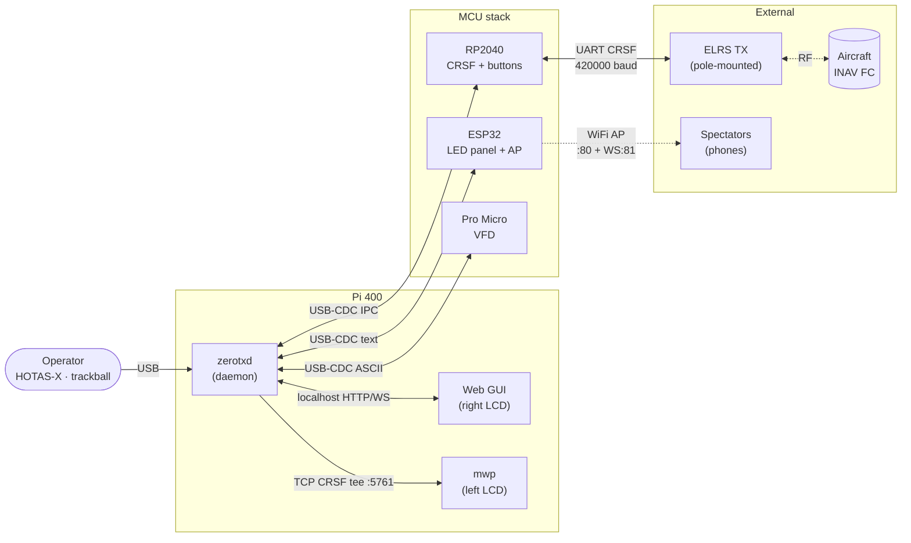
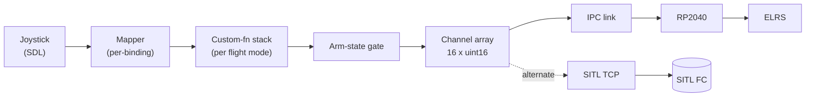
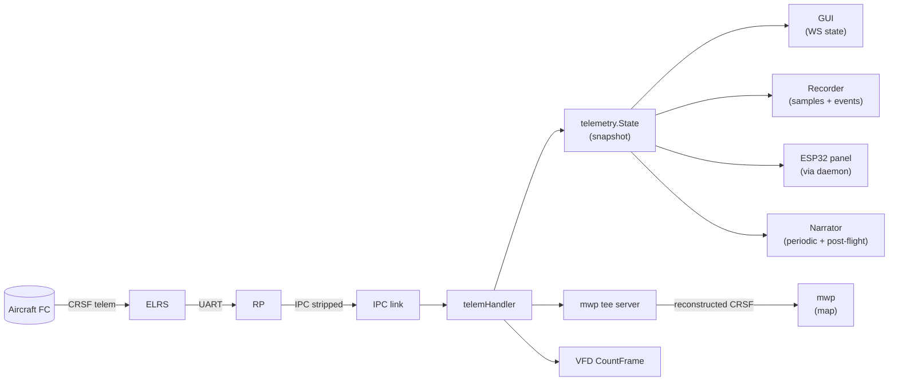

# ZeroTX Architecture Overview

The conceptual map. What the parts are, how they fit together, what
each one owns.

For wiring see [`hardware/wiring.md`](../hardware/wiring.md). For wire
protocols see [`protocols/`](../protocols/). For day-to-day operation
see [`operation.md`](../operation.md).

## Mental model

ZeroTX is a workstation-class FPV ground control system for long-range
fixed-wing INAV aircraft. The bet is that long-range deserves a
desktop-grade tool: real keyboard, two large LCDs, dedicated MCUs for
real-time jobs, structured audio, persistent recording.

The system spans three classes of compute:

1. **Pi 400** runs the Go daemon (`zerotxd`), the right-LCD GUI in
   a browser tab, and the left-LCD `mwp` map.
2. **Three MCUs**, each owning one job:
   - **RP2040**: CRSF uplink + panel buttons + arm key
   - **ESP32**: HUB75 LED panel + spectator WiFi AP
   - **Pro Micro**: VFD diagnostic display
3. **External pole modules**, cabled to case bulkheads:
   - **ELRS TX**: the actual radio link to the aircraft.

Each MCU has its own USB endpoint to the Pi. There is no internal
RF in the case; the aircraft is reached only through the ELRS pole.

## High-level diagram

## Actor responsibilities

### Daemon (`zerotxd`)

The brain. Single Go binary. Owns:

- **Channel intent loop**: at ~50Hz produces the 16-channel CRSF
  state from joystick + logical switches + custom-function stack +
  arm-state gating. Sends to the FC via the IPC link or TCP-SITL.
- **Telemetry decoder**: parses CRSF frames coming back, feeds a
  shared snapshot consumed by the GUI, panel, recorder, and
  post-flight narrator.
- **Arm state machine**: gates the transition from DISARMED →
  ARMING_REQUESTED → ARMED → DISARMED based on key, throttle, FC
  ready, and operator confirm.
- **Audio system**: pre-baked alarms (instant, repeating) plus
  TTS narration (Piper subprocess, disk cache).
- **Recorder**: SQLite per-flight database with telemetry samples,
  events, and end-of-flight summary.
- **HTTP API + GUI server**: REST endpoints + SPA on port 8080.
- **Background services**: periodic narrator, post-flight narrator,
  CRSF tee server, VFD firehose, VFD event emitter.

### MCUs

Each MCU is dumb-on-its-own and smart-with-the-daemon. They do real-
time work the Pi shouldn't (UART framing at 420kbaud, panel scan at
HUB75 refresh rates, watchdog) and forward semantic events to the
daemon.

| MCU | Owns | Talks to daemon via | Failure isolation |
|-----|------|---------------------|---|
| RP2040 | CRSF UART, arm key, panel buttons, mushroom watchdog | USB-CDC, IPC framed protocol | If RP2040 hangs, watchdog resets it; daemon reconnects via handshake |
| ESP32 | HUB75 panel, spectator AP | USB-CDC, line text protocol | Crash takes the panel and AP only; daemon and RP2040 unaffected |
| Pro Micro | VFD | USB-CDC, ASCII line protocol | Cosmetic device; failure has no operational impact |

### External pole modules

Currently one: the ELRS TX. Connected via cable to a case bulkhead.
Future poles (e.g., dedicated AAT module if added) follow the same
pattern.

The mushroom button is wired in two places: the RP2040's GPIO (so
the daemon sees the press) and in line with the ELRS module's power
feed via a relay. Pressing the mushroom physically removes power
from the ELRS module independent of any software state.

## Daemon package map

The daemon is structured around small focused packages. Reading them
in dependency order:

### Foundational

- **`internal/ipc`** — daemon ↔ RP2040 framed protocol over USB-CDC.
  Owns serial port, framing, CRC, handshake, channel-intent emission,
  telemetry forwarding.
- **`internal/sitl`** — alternate FC endpoint over TCP. Speaks raw
  CRSF to INAV SITL on a configured port. Used in bench mode via
  `-fc-tcp-addr`. Same downstream wiring as IPC; the daemon doesn't
  care which endpoint it's connected to.
- **`internal/telemetry`** — CRSF telemetry decoder. Owns the typed
  snapshot exposed to the rest of the daemon (GPS, Battery, Link,
  Attitude, FlightMode, Home).
- **`internal/source`** — input source abstractions. Joystick is
  the real one; mock/file sources exist for tests.
- **`internal/joystick`** — SDL-backed joystick reader, hot-plug
  handling, axis/button normalization.

### Mixer / logic

- **`internal/model`** — EdgeTX YAML + ZeroTX wrapper parser.
  Mixes, flight modes, logical switches, custom functions, channel
  defaults, threshold table, joystick bindings.
- **`internal/mapper`** — joystick + binding → channel value
  conversion (axis curves, button shapes, switch positions).
- **`internal/logic`** — logical switch (LS1..LS4) evaluator.
- **`internal/cf`** — custom function stack: per-flight-mode mixers,
  outputs to channel array.
- **`internal/arm`** — arm state machine. Gates the arm transition;
  produces events the daemon's flight handler subscribes to.

### Output / consumers

- **`internal/audio`** — Player + TTS. Pre-baked stems via mpg123/
  aplay/paplay; Piper subprocess wrapper with disk cache.
- **`internal/phrasebook`** — centralizes spoken strings, en + pt.
- **`internal/narrator`** — boot greeting, post-flight summary,
  periodic in-flight status.
- **`internal/recorder`** — SQLite recordings: telemetry samples,
  events, summary. Per-flight files.
- **`internal/geo`** — offline reverse-geocoding for post-flight
  place-name enrichment.
- **`internal/api`** — HTTP server + REST endpoints + WebSocket
  state stream. Serves the SPA from `web/`.
- **`internal/panel`** — panel state model (switches, selectors,
  buttons) shared between RP2040 input events and downstream
  consumers.
- **`internal/crsftee`** — TCP server that retransmits CRSF
  telemetry to mwp. Read-only; reconstructs full CRSF frames from
  the IPC-stripped form.
- **`internal/vfd`** — VFD driver interface (Null/Log/Serial),
  log-buffer firehose, event emitter helpers.
- **`internal/logbuf`** — in-memory ring buffer of daemon log
  lines. Tapped by both the API (for logs view) and the VFD
  firehose.

### Daemon main

`cmd/zerotxd/main.go` is the wiring layer: parses flags, opens the
FC endpoint, constructs all the packages, hooks up callbacks,
starts goroutines, runs until SIGINT. Most things are boring
plumbing; the interesting logic lives in the packages.

## Data flows

### Channel intent (operator → aircraft)

Channel array is the universal currency. Logical switches and
custom functions reshape it; the arm-state gate forces safe values
when not armed (e.g., zero throttle). The same array is sent to
either the RP2040 (real flight) or SITL (bench).

### Telemetry (aircraft → operator)

Multiple consumers attach to the snapshot. The mwp tee is a parallel
fan-out that reconstructs full CRSF frames so mwp can decode them
the same way it would from a USB radio.

### Audio (event → ear)

Two paths:

- **Path 1 (alarms)**: threshold breach → audio.Player levels →
  matching pre-baked .mp3/.wav from `sounds/<lang>/` → played
  immediately via mpg123/aplay/paplay. Repeats while threshold
  is active. Instant, deterministic.
- **Path 2 (TTS)**: phrasebook string → Piper subprocess →
  cached .wav at `~/.cache/zerotx/tts/<voice>/<hash>.wav` →
  played via aplay. Used for narration where exact wording matters
  (mode changes, post-flight summary, periodic status).

The two paths are mixed at the player; alarms preempt TTS when
they fire.

### VFD scrolling

Two parallel feeds into the VFD:

- **Firehose**: subscribes to `logbuf`, pushes new daemon log
  lines as `L0`/`L1` text overlays at 5Hz.
- **Event emitter**: translates state changes into `E ...`
  commands at 10Hz (tick batches) and 1Hz (mode/lq/batt edges).

The firmware's animation state machine consumes events and
overlays text bursts when L is received. Daemon stays simple;
firmware owns the visual experience.

### Spectator dashboard

ESP32 panel firmware also runs a SoftAP. Snapshot of telemetry
state pushed to the AP loop each tick; the AP broadcasts JSON
to connected WebSocket clients at 5Hz. Self-contained: no
internet, no upstream.

## Persistence

| Path | Owner | Lifetime |
|---|---|---|
| `~/zerotx/recordings/<ts>.db` | recorder | Per-flight; auto-rotated, keeping N most recent |
| `~/zerotx/geo/places-<region>.db` | geo | Permanent; rebuilt by `tools/build-geo.sh` |
| `~/zerotx/voices/*.onnx` | TTS | Permanent; downloaded by `scripts/fetch-voices.sh` |
| `~/zerotx/bin/piper/piper` | TTS | Permanent; downloaded as above |
| `~/.cache/zerotx/tts/` | TTS | Auto-generated; safe to delete |
| `~/.config/zerotx/zerotxd.env` | systemd unit | Per-machine config (paths, lang) |
| `~/.config/zerotx/narrate.yml` | narrator | Periodic-narration on/off + interval + fields |

## What's deliberately not in the daemon

A non-exhaustive list of "we considered it and said no":

- **Internal RF**: case has no antennas. ELRS is external.
- **Bidirectional mwp tee**: tee is read-only. Mission upload
  from mwp would conflict with the channel intent loop's CRSF
  ownership.
- **Live online geocoder fallback**: if `-geo-db` is missing,
  narration omits place names. Field deployment can't assume
  internet.
- **Mic/voice input**: no STT, no microphone capture.
- **Map tile management**: maps live in mwp, not in the daemon.
  The daemon doesn't ship maps.
- **OTA firmware updates**: each MCU is flashed via PlatformIO
  on a developer machine.
- **Multi-aircraft / multi-pilot session management**: one
  aircraft, one operator, one daemon instance per flight.

## Failure model

What happens when each piece dies:

| Component dies | Effect | Recovery |
|---|---|---|
| zerotxd | Channel updates stop. RP2040 watchdog enters HOLD then FAILSAFE. Aircraft enters its configured failsafe (RTH/land). | systemd restarts the daemon; reconnects via IPC handshake |
| RP2040 | IPC link drops. Daemon channel-intent loop sees write errors. Aircraft enters failsafe via radio link timeout. | Replug RP2040; daemon auto-reconnects |
| ESP32 | Panel goes dark; spectator AP disappears. No flight impact. | Replug ESP32 |
| Pro Micro | VFD goes static. No flight impact. | Replug Pro Micro |
| ELRS module | Aircraft enters its configured failsafe. | Power-cycle ELRS via mushroom button or replug |
| Joystick | Channel intent freezes at last value. Arm state gates throttle to zero on disarm but in-flight inputs hold last position. Use mushroom button to abort. | SDL hot-plug detects re-attach; binding is restored automatically |
| Aircraft FC | Telemetry stops flowing. Daemon detects stale on all sensors after timeout. Operator sees "no telemetry" in HUD. | FC-side problem; on the ground |

The mushroom button is the only path that requires no software to
function. Everything else assumes the daemon is alive.
