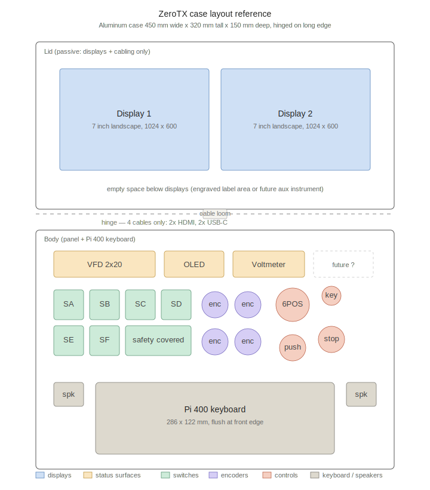

# ZeroTX hardware BOM

This document is the running parts list for the ZeroTX ground station. Items
marked **have** are already in hand. Items marked **buy** still need to be
sourced. Final dimensions, part numbers, and brands are decided at
procurement time.

Layout reference: see `case-layout.svg` next to this file.

## Design summary

Aluminum case 450 x 320 x 150 mm (external), hinged on the long edge,
toolbox/pelican style.

**Lid is passive.** Holds only the two 7" displays. No microcontroller, no
power, no status surfaces. Displays are bonded to the lid metal with a
thermal pad so the entire lid acts as a heatsink.

**Body holds everything else.** Pi 400 keyboard flush at the front edge.
Above the keyboard, a status row (VFD, voltmeter) and a control row
(switches, encoders, 6POS selector, big button, keylock, e-stop). All
electronics (Pi 400, RP2040-Zero, level shifter, audio amp, bucks, terminal
blocks) mounted to the body interior with custom 3D-printed supports
(PETG).

**Hinge bundle: 4 cables only.** Two HDMI to the displays and two USB-C for
display power and touch. Routed through a center spiral-wrapped loom with
strain relief on both halves.

**Three independent failsafe paths:**

1. Software: Pi heartbeat -> RP2040 -> CRSF emission -> FC failsafe on loss
2. ELRS module: RX timeout per its own configuration
3. Hardware kill: e-stop in series with module DC feed, pure mechanical

**Power: external CCTV-style PSU at 13.8V** with a built-in 7Ah SLA UPS,
fed into the case via a panel-mount barrel jack. Inline fuse, then
keylock master switch on the input side. Single 13.8V to 5V buck supplies
Pi 400, RP2040, VFD, level shifter. Audio amp runs directly off the
13.8V rail. ELRS module runs direct from 13.8V (modules accept up to 16V).
Self-contained 7-segment voltmeter is wired across the rail and runs zero
software.

## Section 1 - Input controls (panel-mount, classic style)

Switches:
- 4x 3-position toggle (ON-OFF-ON), 12 mm panel hole **buy**
- 2x 2-position toggle (ON-ON), 12 mm panel hole **buy**
- 1x safety toggle with cover, missile-style **buy**

Rotaries:
- 4x rotary encoder with push, 6 mm shaft **buy**
- 1x 6-position rotary selector, 1P6T mechanical **buy**

Buttons:
- 1x large momentary push, 16-22 mm, distinctive color **buy**
  - Wired to RP2040 GPIO 15 (internal pull-up, switch to GND); emits `MsgInputEvent` input id `0x02` on press. This is the arm-confirm momentary in the three-input arming workflow (see DECISIONS.md). Press-only signal; the firmware does not emit a release event. A kiosk-browser shortcut (Ctrl+Alt+A on `/hud` or `/map`) covers the same role for bench testing.
- 1x keylock master power switch, 19-22 mm panel hole **buy**
- 1x emergency stop, mushroom-head, latching, NC contacts inline on
  module DC feed **buy**

Internal:
- 1x switch breakout / perfboard for aggregating panel inputs to the
  RP2040 header **buy**

Knob style and exact mounting decisions (knurled metal vs pointer skirt
etc) are deferred. Procurement decides.

Switches with embedded LEDs are an option per-part if available.
Software can drive them via the RP2040; or hardwire to the keyed-on rail
for a simple "system on" indication. No commitment until parts arrive.

## Section 2 - Status surfaces

- 2x Noritake CU20025ECPB-W1J 2x20 VFD **have**
  - HD44780 parallel, 4-bit mode (6 GPIO + 2 power = 8 conductors per unit)
  - Two instances on the panel: `vfd.0` and `vfd.1`, different status categories on each
  - Initialized at full brightness
  - Japanese-ROM (A00) variant; ASCII works directly but bytes with bit 7 set render as katakana — a useful diagnostic for floating D7 (a bit-pattern symptom of a broken D7 wire)
- 1x 128x64 ST7920 graphic LCD **have**
  - 3-wire serial mode (CS, SID, CLK) over Mega hardware SPI (pins 51 MOSI / 52 SCK / 53 SS), PSB tied to GND for serial-mode selection. 14-pin header; pins 7-14 unused
  - Hosts the artificial-horizon "cool factor" HUD (`glcd` Mega subsystem) — supplementary, never on the safety path
- 1x 5V 8-channel level shifter (74AHCT125 or similar) for VFD
  data/control lines **have**
- 1x self-contained 7-segment LED voltmeter, direct to 13.8V rail **buy**

## Section 3 - Computer and link hardware

- 1x Raspberry Pi 400 **have/incoming**
- 1x RP2040-Zero **have**
- 1x original Pico (backup) **have**
- 1x microSD 32 GB or larger for Pi 400 **buy**
- 1x USB-C right-angle cable, Pi 400 -> RP2040-Zero, ~30 cm **buy**
- 1x pre-made cat6 cable (length to suit pole-mount module run) **buy**
- 1x RJ45 keystone panel jack, case-side **buy**
- 1x RJ45 locking boot, cable-side **buy**
- JR-bay module mount, 3D-printed **have**

Cat6 conductor allocation, T568B color order:

| Pair | Color              | Function                |
|------|--------------------|-------------------------|
| 1    | Orange / White-Or  | TX + GND (twisted)      |
| 2    | Green / White-Gn   | RX + GND (twisted)      |
| 3    | Blue / White-Bl    | V+ / V+ (paralleled)    |
| 4    | Brown / White-Br   | V- / V- (paralleled)    |

At 35 m worst case with 2 A peak draw, voltage drop is approx 2.8 V,
leaving the module within its input window.

## Section 4 - Power

- 1x CCTV PSU with built-in 7 Ah SLA UPS, 13.8 V output **have**
- 1x 7 Ah SLA battery **have**
- 1x panel-mount DC barrel jack, case input **buy**
- 1x inline fuse holder + ~10 A fuse **buy**
- 1x keylock switch (listed in section 1, on input rail downstream of
  the fuse)
- 1x e-stop (listed in section 1, NC contacts in series with module DC)
- 1x buck converter, 13.8 V -> 5 V at 3 A or higher, for Pi 400, RP2040,
  VFD, level shifter **buy**
- Audio amplifier on 13.8 V rail **have**

PSU lives external to the case. Mains power cable runs from the PSU into
the case via the barrel jack only. No AC mains inside the case.

The ELRS module runs directly off the 13.8 V rail (modules accept up to
16 V), so no module-side buck is needed. If a future module turns out to
prefer lower voltage, two Schottky diodes in series drop ~0.8 V to the
module without rebuilding the rail.

## Section 5 - Displays (Pi 400 outputs)

- 2x 7" 1024 x 600 HDMI touchscreen, identical units **1 have, 1
  incoming** (purchased from same seller)
- 2x HDMI cable, Pi 400 -> displays, right-angle micro-HDMI preferred
  **buy**
- 2x USB-C cable, displays' power, on the 5V rail **buy**
- 2x USB-C cable, displays' touch, to Pi 400 (via hub) **buy**
- 1x powered USB hub, 4-port, USB 2.0 **buy**

Display-to-lid bonding:

- 1x thermal pad, ~1 mm thick, cut to match each display's metal
  backplate **buy**
- Backplate goes flat against the inside of the lid via the thermal pad,
  turning the entire lid aluminum into a heatsink for the ~5-8 W of
  display heat.

Pi 400 has 3 USB ports. Allocation:

| Port    | Use                                  |
|---------|--------------------------------------|
| USB 3.0 | HOTAS T.Flight Hotas X (joystick)    |
| USB 3.0 | RP2040-Zero (USB-CDC link)           |
| USB 2.0 | HDMI capture dongle + USB hub        |

The USB hub on the USB 2.0 port carries both display touch lines and any
expansion (BT dongle for mouse if ever needed, etc). Touch is low
bandwidth, USB 2.0 is plenty.

## Section 6 - Module and RF / Video

ELRS TX:
- 1x ELRS TX module: HappyModel ES900TX or RadioMaster Ranger 2.4 GHz,
  user picks **have both**
- 1x 3D-printed module housing **have**
- Antennas, pole-mounted **have**

Video:
- 1x Aomway 7" monitor (built-in analog VRX + HDMI input) **have**
- 1x Walksnail Avatar VRX **have**
- 1x powered HDMI splitter **have**
- 1x USB HDMI capture dongle for Pi 400 **have**
- HDMI cables (Walksnail -> splitter, splitter -> Aomway HDMI in,
  splitter -> capture dongle) **buy**

The Aomway runs analog over its built-in receiver/antenna. The Walksnail
HDMI feeds the splitter; one branch goes to the Aomway HDMI input, the
other to the Pi 400 capture dongle for DVR / overlay / streaming.

## Section 7 - Enclosure

Case:
- 1x aluminum case, ~450 x 320 x 150 mm external, hinged on long edge,
  trunk latches, side carry handle **have**

Panels:
- 1x black acrylic, 3 mm, lid panel: cutouts for both displays + mounting
  holes + (optional) engraved labels **buy / fabricate**
- 1x black acrylic, 3 mm, body panel: cutouts for VFDs (x2), 128x64 GLCD, voltmeter,
  every switch / encoder / button, the keyboard well, speaker grilles +
  laser-engraved labels **buy / fabricate**
- 1x cardboard or 1 mm acrylic test piece for fit-check before committing
  3 mm panels (optional) **buy**

Cooling:
- Vent slots cut into the body back wall, with replaceable mesh dust
  filter behind **fabricate**
- 1x 40 mm 5V fan + bracket, designed-in but not populated. Drop in only
  if summer use turns out warm. **deferred**
- The case will not be operated in direct sun.

Internal mounting:
- 3D-printed component supports (PETG), designed per-component
  **fabricate**
- Wood blocks, alternative for select supports if convenient **as needed**
- M3 hardware: standoffs (10-15 mm), screws, washers, lockwashers
  **buy**

Cable entry / exit:
- Panel-mount DC barrel jack (already in section 4)
- Panel-mount RJ45 keystone (already in section 3)
- Cable gland or strain relief for any cable leaving the case **buy**

## Power budget

| Source                   | Steady state | Peak transient |
|--------------------------|--------------|----------------|
| Pi 400                   | 3-5 W        | 7 W            |
| RP2040-Zero              | <0.5 W       | <1 W           |
| 5V buck losses (~85%)    | 1-2 W        | 3 W            |
| Audio amp (idle)         | <1 W         | a few W when loud |
| ELRS module              | 5-8 W        | up to 25 W full TX |
| 2x 7" displays           | 5-8 W        | 10 W           |
| Voltmeter, VFD           | <1 W         | <1 W           |
| **Total inside the case**| **~10-16 W** | **~30 W**      |

Aluminum case at ~0.5 m^2 surface dissipates 15-20 W at modest temperature
rise, so steady state is comfortably passive. Transient peaks are
short-duration (full-power TX during link tests, etc).

## Hinge cable bundle

| Cable          | Conductors (carrier) | Notes                       |
|----------------|----------------------|-----------------------------|
| HDMI display 1 | (cable)              | thin or flat HDMI preferred |
| HDMI display 2 | (cable)              | same                        |
| USB-C disp 1   | 4                    | power + touch on one cable  |
| USB-C disp 2   | 4                    | same                        |

Bundled with spiral wrap, anchored at both halves with cable clamps,
~30 cm of slack to allow ~110 deg of hinge rotation.

## Outstanding decisions

These are deferred until parts arrive or design progresses:

- Knob style for encoders and 6POS selector
- Big button color (any distinctive color other than red, since e-stop
  and safety toggle already use red)
- Whether any panel switches will be illuminated (keyed to per-part
  availability of LED-embedded options)
- Hazard tape (yellow/black) around the e-stop
- Label engraving aesthetic (laser-engraved black acrylic vs vinyl)
- Whether to populate the body cooling fan
- Whether to add an auxiliary instrument in the empty area below the
  displays in the lid
- Final cat6 length (set after measuring pole-mount distance)

## Procurement notes

In hand:

- CCTV PSU (13.8 V, SLA UPS), 7 Ah SLA, 8-channel level shifter,
  audio amp, RP2040-Zero, original Pico, ELRS modules (ES900TX, Ranger
  2.4 GHz), 3D-printed module housing, antennas, Aomway 7" monitor,
  Walksnail Avatar VRX, HDMI splitter, USB HDMI capture dongle, 1x 7"
  touchscreen (second incoming), Pi 400 incoming, Noritake VFD,
  aluminum case

To buy:

- Switch row (4x 3-pos, 2x 2-pos, 1x safety covered, 1x big button,
  1x keylock, 1x e-stop)
- 4x rotary encoders, 1x 6-pos selector
- 1x 7-segment voltmeter
- microSD card 32 GB+
- USB-C right-angle cable (Pi -> RP2040)
- Pre-made cat6 cable, RJ45 keystone, locking boot
- DC barrel jack panel mount, fuse + holder
- 1x 13.8 V -> 5 V buck (3 A+)
- HDMI cables (right-angle micro-HDMI x2, internal HDMI runs x3)
- USB-C cables for displays (4x), USB hub
- Thermal pad
- Black acrylic 3 mm sheets x2 (panels), cut + engraved
- Cable gland / strain relief
- Vent mesh
- M3 hardware
- PETG filament for brackets

Switch breakout perfboard, switch panel cabling, and any miscellaneous
wire / connectors as the build progresses.
