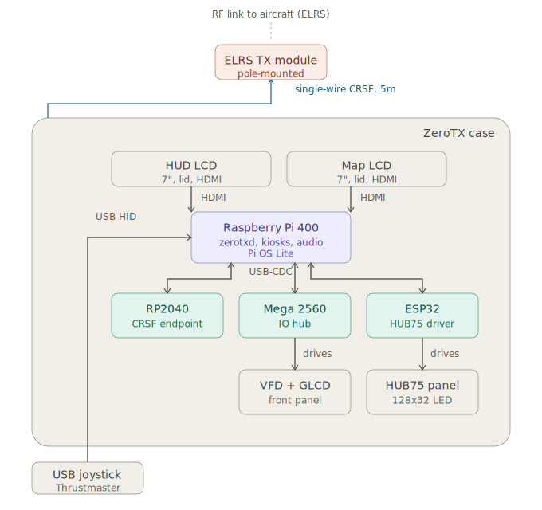

# ZeroTX Builder's Manual

> **Status:** skeleton. H1/H2/H3 only, no prose yet. Sections fill in subsequent patches.

## Front matter

### Purpose and audience
### Scope: what this manual covers and what it doesn't
### Conventions (callouts, command blocks, version markers)
### Prerequisites (assumed skills: soldering, basic Linux, no programming required)
### Required tools and equipment (separate from BOM)
### Time and difficulty estimate
### Version compatibility (which firmware/daemon revisions this matches)
### Safety notice (mains wiring, LiPo handling, ESD; operational safety lives in User Manual)

## 0. Build workstation prep

A Linux workstation set up to build the daemon and all four firmwares from a clean clone. After this section, you have working toolchains for: Go (daemon, host-side tools), PlatformIO (Mega 2560, both ESP32 variants), pico-sdk + arm-gcc + cmake (RP2040), and rpi-imager (Pi 400 SSD imaging). Everything in Sections 5 and 6 assumes this work is done.

You don't need the case, MCUs, or Pi yet. Section 0 is pure software prep that can happen weeks before any hardware arrives.

### 0.1 Host requirements

Supported: **Ubuntu 24.04 LTS** or **Debian 12** (Bookworm), 64-bit (`x86_64` or `aarch64`).

Storage: ~20 GB for toolchains and build artifacts (PlatformIO frameworks alone are ~1 GB). RAM: 8 GB minimum, 16 GB comfortable. Internet for the initial toolchain downloads (~2 GB total across all installs).

Throughout this section, commands assume `bash` and `apt`. If you're on a Debian-derivative not listed above, the apt invocations should still work, but the package versions may diverge in ways the verification step (Section 0.10) will flag.

macOS and Windows are not covered. Go cross-compile to arm64-linux works fine on any host OS, but the firmware toolchains (specifically pico-sdk and PlatformIO's AVR/ESP32 plugins) have host-specific quirks that aren't documented here. Linux is the supported path.

### 0.2 Git and SSH

```
sudo apt update
sudo apt -y install git openssh-client
```

Configure git:

```
git config --global user.name "Your Name"
git config --global user.email "you@example.com"
```

Generate an SSH key for GitHub if you don't have one:

```
ssh-keygen -t ed25519 -C "your-zerotx-build-workstation"
cat ~/.ssh/id_ed25519.pub
```

Add the public key to your GitHub account (Settings → SSH and GPG keys → New SSH key). Test:

```
ssh -T git@github.com
```

Should respond with `Hi <username>! You've successfully authenticated...`.

If you only intend to clone (read-only) and never push, HTTPS cloning works without SSH setup, but every other workflow in this manual assumes you can push and pull, so do the SSH key now.

### 0.3 Clone the ZeroTX repo

```
cd ~
git clone git@github.com:agoliveira/zerotx.git
cd zerotx
```

(HTTPS alternative if you skipped 0.2's key setup: `git clone https://github.com/agoliveira/zerotx.git`.)

Verify:

```
ls
```

Should show directories `pi/`, `firmware/`, `tools/`, `docs/`, plus root files like `README.md` and `SAFETY.md`.

The repo lives at `~/zerotx` throughout the rest of this manual. Section 6.14 (daemon binary deploy) also assumes the Pi has a `~/zerotx` clone for static assets; you can either clone separately on each machine or rsync from the workstation. Cloning on both is the simpler workflow.

### 0.4 Go toolchain

The daemon and host-side tools (zerotx-iohal-config, zerotx-bench, zerotx-replay) are Go. Pinned at 1.25.x for the daemon's `go.mod`.

Use upstream Go, not the apt version. The apt package is typically a major release behind, and on some Debian/Ubuntu derivatives `apt install golang-go` silently installs `gccgo` which doesn't parse modern `go.mod` files.

```
GO_VERSION=1.25.10
cd /tmp
curl -L -O https://go.dev/dl/go${GO_VERSION}.linux-amd64.tar.gz
sudo rm -rf /usr/local/go
sudo tar -C /usr/local -xzf go${GO_VERSION}.linux-amd64.tar.gz
echo 'export PATH=$PATH:/usr/local/go/bin' | sudo tee /etc/profile.d/go.sh
sudo chmod +x /etc/profile.d/go.sh
source /etc/profile.d/go.sh
go version
```

Should print `go version go1.25.10 linux/amd64`.

(If your workstation is aarch64 itself, swap `linux-amd64` for `linux-arm64` in the URL.)

The daemon's `go.mod` carries a `toolchain go1.25.10` directive, so any installed Go from 1.21 forward will auto-fetch 1.25.10 on first build. Installing it up front skips that round trip.

### 0.5 PlatformIO

PlatformIO drives the Mega 2560 (AVR), ESP32 (panel driver), and ESP32-S3 (tracker) builds. One package, three toolchains. It runs in Python virtualenvs and downloads its own framework packages on first use.

```
sudo apt -y install python3 python3-venv python3-pip
pip install --user --break-system-packages platformio
```

The `--break-system-packages` flag is required on Bookworm/Ubuntu 24 because the user-site-packages location is otherwise marked managed-by-distro. PlatformIO works fine outside the system Python.

Verify:

```
~/.local/bin/pio --version
```

Or add `~/.local/bin` to your `PATH`:

```
echo 'export PATH=$PATH:~/.local/bin' >> ~/.bashrc
source ~/.bashrc
pio --version
```

The first time you run `pio run` against any firmware project, PlatformIO downloads the relevant toolchain and framework (atmelavr for Mega, espressif32 for ESP32 variants). Expect a few hundred MB and several minutes. Subsequent builds are incremental.

### 0.6 RP2040 build chain (pico-sdk + arm-gcc + cmake + picotool)

The RP2040 firmware doesn't use PlatformIO; it uses cmake + pico-sdk + the ARM Embedded toolchain. Plus picotool for flashing.

ARM toolchain and cmake:

```
sudo apt -y install \
    cmake \
    gcc-arm-none-eabi \
    libnewlib-arm-none-eabi \
    libstdc++-arm-none-eabi-newlib \
    build-essential
```

Verify:

```
arm-none-eabi-gcc --version       # should report a recent gcc
cmake --version                   # 3.13 or newer
```

pico-sdk (clone alongside the ZeroTX repo, not inside it):

```
cd ~
git clone --depth 1 https://github.com/raspberrypi/pico-sdk.git
cd pico-sdk
git submodule update --init
```

Export `PICO_SDK_PATH` so cmake can find it:

```
echo 'export PICO_SDK_PATH=$HOME/pico-sdk' >> ~/.bashrc
source ~/.bashrc
```

Verify:

```
echo $PICO_SDK_PATH    # should print /home/<user>/pico-sdk
```

picotool (for flashing without the BOOTSEL drag-and-drop dance, see Section 5.1.2):

```
sudo apt -y install libusb-1.0-0-dev
cd /tmp
git clone --depth 1 https://github.com/raspberrypi/picotool.git
cd picotool
mkdir -p build && cd build
cmake ..
make -j$(nproc)
sudo install -m 0755 picotool /usr/local/bin/picotool
picotool version
```

Should print picotool version info.

If you prefer not to build picotool from source, recent Ubuntu/Debian ship a `picotool` apt package (`sudo apt -y install picotool`); the apt version may lag the upstream by a release, but works for flashing.

### 0.7 rpi-imager

For provisioning the Pi 400's USB SSD (Section 6.1).

```
sudo apt -y install rpi-imager
```

Or download the AppImage from `https://www.raspberrypi.com/software/` if your distro doesn't have a recent enough package.

Verify:

```
rpi-imager --version
```

`rpi-imager` needs a connected SSD (via USB-to-SATA adapter or USB enclosure) to flash. You won't run it as part of Section 0's verification; it's just installed and ready for Section 6.

### 0.8 Voice fetch dependencies

ZeroTX's narrator uses Piper TTS with ONNX voice models. The models live under `~/zerotx/third_party/voices/` and are fetched via `scripts/fetch-voices.sh` in the repo. The script needs:

```
sudo apt -y install curl
```

(Almost certainly already installed.)

Voice fetching can happen on the Pi (Section 6.8) or on the workstation and then synced to the Pi via rsync/scp. Doing it on the workstation lets you smoke-test voices before deploying:

```
cd ~/zerotx
./scripts/fetch-voices.sh
```

This is optional at workstation-prep time; you can defer to Section 6.8 on the Pi.

The Piper *binary* (not just voices) is fetched and installed on the Pi only, not on the workstation. The narrator runs as a daemon subprocess; the workstation never needs to invoke Piper directly for builds.

### 0.9 USB device permissions

When you flash MCUs from the workstation (Section 5), you need write access to `/dev/ttyACM*` and `/dev/ttyUSB*`. On Debian/Ubuntu, that's controlled by the `dialout` group.

```
sudo usermod -a -G dialout $USER
```

**Log out and log back in** for the group change to take effect. (Or reboot. New group membership is read at session start, not propagated to running processes.)

Verify after re-login:

```
groups
```

Should list `dialout` among others.

If you skip this, every `pio run --target upload` and `picotool` invocation needs `sudo`, which works but is ugly and risks running build steps as root.

A more targeted alternative if you prefer not to put your user in `dialout`: add per-device udev rules with explicit `MODE="0666"` for the specific VID/PIDs of the MCUs. Not covered here; `dialout` is the simpler path for a development workstation.

### 0.10 Verification build

End of Section 0: clean clone, all toolchains in place. Run a full build of the daemon plus all four firmwares to confirm everything works.

```
cd ~/zerotx
```

Build the daemon (workstation-native binary, useful for desktop runs and tools):

```
cd pi/daemon
go build -o /tmp/zerotxd-native ./cmd/zerotxd
ls -la /tmp/zerotxd-native      # ~30 MB ELF
```

Cross-compile the daemon for Pi (arm64-linux):

```
GOOS=linux GOARCH=arm64 go build -o /tmp/zerotxd-pi ./cmd/zerotxd
file /tmp/zerotxd-pi             # should report ARM aarch64
```

Build the host-side tools:

```
cd ~/zerotx/tools/zerotx-iohal-config
go mod tidy
go build
ls -la zerotx-iohal-config       # binary present

cd ~/zerotx/tools/zerotx-bench
go build

cd ~/zerotx/tools/zerotx-replay
go build
```

Build the four firmwares:

```
# RP2040
cd ~/zerotx/firmware/crsf
mkdir -p build && cd build
cmake ..
make -j$(nproc)
ls -la zerotx-fw.uf2             # UF2 artifact present

# Mega 2560
cd ~/zerotx/firmware/io
pio run
ls -la .pio/build/megaatmega2560/firmware.hex

# ESP32 (HUB75 panel)
cd ~/zerotx/firmware/display
pio run
ls -la .pio/build/*/firmware.bin

# ESP32-S3 (tracker, optional)
cd ~/zerotx/firmware/tracker
pio run
ls -la .pio/build/*/firmware.bin
```

If every command above completes without error and the listed artifacts exist, Section 0 is done. You have a fully working build environment.

If any build fails, debug it now before moving to Section 5 / Section 6 where the same builds will be invoked under time pressure. Common failure modes:

- `cmake: command not found` → Section 0.6
- `PICO_SDK_PATH not set` → `source ~/.bashrc`, or re-run the `echo 'export...'` line
- `pio: command not found` → Section 0.5, ensure `~/.local/bin` is on `PATH`
- `go: command not found` → Section 0.4, ensure `/usr/local/go/bin` is on `PATH`
- PlatformIO build hangs forever → first-build framework download in progress; let it finish (one-time, several minutes per platform)
- `go mod tidy` reports network errors → either your network is restricting Go module proxy access or `GOPROXY` is set wrong; default `GOPROXY=https://proxy.golang.org,direct` works in most environments

## 1. System overview

### What ZeroTX is


ZeroTX is a portable ground control station for long-range fixed-wing FPV. It replaces a hand-held transmitter with a desktop-style station in an aluminum briefcase. A Raspberry Pi 400 runs the show, paired with three MCU satellites (Mega 2560, ESP32, RP2040). A Thrustmaster HOTAS joystick plugs into a front-panel USB-A port. Twin 7" HDMI LCDs in the lid drive a HUD and a map. A HUB75 LED panel, a 2x20 VFD, and a 128x64 graphic LCD give at-a-glance state on the body's front panel. The case is wired-only inside: no RF, no antennas, no transceivers. The ELRS TX module lives externally on a pole, connected to the case by a single cable.

The defaults are conservative: hardware kill in series with the module DC feed, a 950 ms end-to-end failsafe chain, recorded telemetry on every flight, and audio narration for non-trivial events. Nothing in the case is bespoke silicon; everything is off-the-shelf modules wired into a custom panel layout, with firmware in this repo.

### Topology block diagram



The case interior groups into four bands: the lid LCDs at the top, the Pi 400 brain in the middle, the three MCU satellites below it, and the front-panel surfaces driven by Mega and ESP32 along the bottom. The USB joystick plugs in externally via a front-panel USB-A jack. The single-wire CRSF cable exits the case to the externally-mounted ELRS TX module on a pole. Bidirectional arrows mark links where data flows both ways (USB-CDC to the MCUs, CRSF to the ELRS module); unidirectional arrows mark display-only or input-only paths (HDMI to the LCDs, USB HID from the joystick, drive lines from Mega and ESP32 to their panel surfaces).

The diagram shows the **default** cable configuration. The **extended** cable configuration replaces the single-wire CRSF run with an RS-422 differential pair (MAX490 transceivers on each end) and adds an inline ESP32-S3 antenna tracker between the cable's pole end and the ELRS module. The tracker byte-pumps frames transparently and is invisible to the daemon. Cable choices in Section 4, tracker firmware in Section 5.

### Subsystem responsibilities

#### Raspberry Pi 400 (brain)

Runs the `zerotxd` Go daemon and two Chromium kiosk browsers (HUD and Map). Owns the USB joystick, both HDMI displays, the audio output, and the three USB-CDC links to the MCU satellites. Boots from a USB SSD; built-in keyboard is the operator input device for menus, settings, and (during build) provisioning. Pi OS Lite, no desktop environment, no greeter. The daemon ingests CRSF telemetry from the RP2040, drives the LCDs through the kiosk browsers, orchestrates the HUB75 panel through the ESP32, talks to the Mega for buttons and status displays, plays audio, and sends joystick-derived channel intents back to the RP2040 for CRSF emission.

#### RP2040 (CRSF endpoint)

Bidirectional CRSF gateway. On the host side, USB-CDC to the Pi. On the wire side, half-duplex CRSF on the case-to-pole cable. Outbound: receives channel intents from the daemon, builds CRSF frames, drives the wire. Inbound: receives telemetry frames coming back from the link, forwards them to the daemon. Hardware watchdog enabled. In the default cable configuration, TX and RX are merged through a 470Ω series resistor at the case end for single-wire half-duplex. RP2040-Zero is the production board; original Pico is kept as a backup.

#### Mega 2560 (IO hub)

Drives the front-panel status and control surfaces. Currently fitted: one VFD (20x2, HD44780 4-bit), one 128x64 ST7920 graphic LCD (artificial horizon), six of the ten panel buttons in the button matrix. Firmware scaffolds additional peripherals on independent pin groups: a second VFD instance, an I2C LCD, four indicator LEDs, four relays, a 16-pixel WS2813 strip, an LDR, a passive piezo buzzer, and a KY-040 rotary encoder. Active-HIGH default; HAL flags opt individual pins into active-LOW. Single shared USB-CDC link to the daemon, multiplexed by the daemon's `iohub` subsystem.

#### ESP32 (HUB75 panel driver)

Drives the HUB75 LED panel: two Waveshare P2.5 64x32 panels chained for 128x32 logical resolution. USB-CDC link to the Pi. Owns its own state model (IDLE, PREFLIGHT, FLIGHT, ALARM, RTH, POSTFLIGHT) and renders modes based on commands from the daemon's `devices/display` subsystem. RP2040 was tried for this role and rejected: 3.3V signaling insufficient at the panel's input shift registers, level shifters explicitly ruled out per locked decision.

#### ESP32-S3 (antenna tracker, optional)

Pole-end add-on, not in the case. Sits inline on the wired CRSF path between the cable's pole-end MAX490 and the ELRS TX module's CRSF UART. Byte-pumps frames transparently in both directions on Core 1 at top priority (this is the safety floor; the only task registered with the hardware watchdog). Parses CRSF GPS telemetry on Core 0, computes az/el to the aircraft, drives a 2-DOF pan/tilt gimbal autonomously. Daemon-unaware. Removing the tracker (or hardware-bypassing the cable past it) requires zero daemon-side changes. Failsafe is hold-last-position by construction. Requires the extended cable configuration (RS-422), not deployable on single-wire CRSF.

### End-to-end signal path

Outbound (operator to aircraft):

```
USB joystick (HID) ----USB---> Pi 400 / zerotxd
                                    | reads axes & buttons
                                    | mixes against active EdgeTX model
                                    | (input map, expo, limits)
                                    v
                              channel intents
                                    |
                                    | USB-CDC (framed COBS + CRC)
                                    v
                                  RP2040
                                    | builds CRSF frame
                                    v
                              CRSF on the wire
                                    |
                                    | single-wire half-duplex
                                    | (5m manga blindado)
                                    v
                              ELRS TX module ----RF---> aircraft RX -> FC
```

Inbound (aircraft to operator) is the same path in reverse: ELRS TX emits CRSF telemetry on its UART, the RP2040 reads it off the wire and forwards over USB-CDC, the daemon parses frames into structured state, then fans out to the HUD (via WebSocket to the kiosk), to the HUB75 panel (via ESP32), to the VFD (via Mega), to the narrator (audio), and to the recorder (SQLite log).

The single-wire half-duplex CRSF is the default. In the extended cable configuration the wire is replaced by an RS-422 differential pair (MAX490 transceivers on each end), which lets cable runs go well beyond 5m cleanly and is also the substrate the inline antenna tracker requires. The RP2040 firmware is unchanged between configurations.

### Failsafe chain

Every wiring choice in this manual exists to make this chain reliable:

```
Pi daemon stops sending intents
    |  ~200ms
    v
RP2040 watchdog notices, stops emitting fresh CRSF
    |  ~600ms
    v
ELRS module sees no fresh data, declares link down
    |  ~150ms
    v
FC (INAV) failsafe triggers, executes its configured behavior
(RTH, land, hold; configured per airframe on the FC, not here)
```

Total roughly **950 ms** from "Pi-side daemon goes quiet" to "FC takes over."

Three things follow from this chain that the builder must respect:

1. **The hardware kill (e-stop, NC contacts) is wired into the module DC feed**, not into the Pi or the RP2040. Cutting power to the ELRS module is faster and more deterministic than asking software to stop. The chain still fires after a hardware kill (the module's link drop is what propagates to the FC), but the case-side path is no longer required.
2. **The daemon goes silent on loss of joystick input.** It does not emit last-known values forever; going silent is what makes the chain fire. No wiring depends on this, but it affects acceptance criteria in Section 7.
3. **The FC owns the post-failsafe behavior**, not ZeroTX. ZeroTX cannot guarantee RTH executes correctly; that is INAV configuration per airframe, tested on the bench before first flight.

### Power tree

A single 12VDC input on a panel-mount jack feeds the entire case. Battery backup is external (operator-supplied 12V SLA + charger upstream of the jack). Two 12V to 5V bucks split the 5V loads: one for the Pi 400, one for the powered USB hub.

```
12VDC input (panel jack)
    |
    +---- inline fuse ---- keylock switch ----+---- 12V bus
                                              |
12V bus ----+---- buck #1: 12V -> 5V ---- Pi 400
            |
            +---- buck #2: 12V -> 5V ---- powered USB hub
            |                              (Mega, ESP32 panel, joystick,
            |                               USB DAC, front-panel USB)
            |
            +---- direct 12V ---- audio amplifier
            |
            +---- direct 12V ---- voltmeter (display only)
            |
            +---- direct 12V via e-stop (NC) ---- ELRS module
                                                  (modules tolerate up to 16V)
```

Current budgets, fuse sizing, and bench-measured draws are detailed in Section 4 (Wiring). For now, the points worth absorbing are: two bucks (not one), ELRS direct off 12V (no module-side regulation), and the e-stop in series with the module DC feed (hardware kill).

## 2. Bill of materials

This section is the complete parts list for replicating a ZeroTX ground station. Every part needed inside and outside the case is listed here, organized by subsystem. Tables use the columns **Item / Qty / Notes**. Where a specific brand or model is named, it is the part being used in the reference build; substitutes are fine if they meet the noted specs.

Operator-supplied external gear (12V SLA + charger, joystick) is listed but not part of the case-internal BOM. Marked clearly where it differs.

### 2.1 Case and mechanical

| Item | Qty | Notes |
|---|---|---|
| Aluminum case, ~450 x 320 x 150 mm external | 1 | Hinged on long edge, toolbox/pelican style, trunk latches, side carry handle. Lid is passive (displays only); body holds everything else. |
| Vent mesh, replaceable | 1 | Behind body back-wall vent slots, dust filter |
| 40 mm 5V fan + bracket | 0-1 | Designed-in slot but not populated by default. Add only if summer use turns out warm. |

The lid carries only the two 7" displays bonded against the inside aluminum (thermal pad turns the lid into a heatsink). The body holds Pi 400, MCUs, audio, power conversion, panel switches/encoders, status surfaces (VFDs, GLCD, voltmeter, HUB75), and all cabling.

### 2.2 Computer (Pi 400 and accessories)

| Item | Qty | Notes |
|---|---|---|
| Raspberry Pi 400 | 1 | The brain; integrated keyboard |
| USB SSD, 256 GB+ | 1 | Boot drive. Faster and more reliable than microSD; ZeroTX boots from SSD via the Pi's USB 3.0 port. |
| microSD card, 32 GB+ | 1 | Optional spare for recovery boot or initial provisioning if SSD route is troublesome |
| Powered USB hub, 4-port, USB 2.0 | 1 | Hosts Mega 2560, ESP32 panel, USB DAC, HDMI capture dongle, and front-panel USB-A breakout. Powered from internal buck #2. |
| USB HDMI capture dongle | 1 | For Pi-side ingest of the Walksnail VRX HDMI output (DVR, overlay, streaming) |

Pi 400 USB port allocation:

| Port | Use |
|---|---|
| USB 3.0 | Boot SSD |
| USB 3.0 | RP2040-Zero (USB-CDC link to CRSF endpoint) |
| USB 2.0 | Powered USB hub (Mega 2560 + ESP32 panel + joystick + USB DAC + HDMI capture + front-panel USB-A) |

The RP2040 gets a dedicated Pi root port (not behind the hub) for jitter and reliability isolation. CRSF I/O is the most safety-critical USB path in the system; putting it behind a hub introduces failure modes (hub power glitch, bandwidth contention with HID, enumeration races on cold boot) that don't exist on a direct connection.

### 2.3 Microcontrollers

| Item | Qty | Notes |
|---|---|---|
| RP2040-Zero | 1 | CRSF endpoint. USB-C to Pi over USB-CDC; CRSF over wire to ELRS module. Hardware watchdog firmware (m1.8-wdt). |
| Raspberry Pi Pico (original) | 1 | Spare/backup for the RP2040-Zero |
| Arduino Mega 2560 | 1 | IO hub: drives VFDs, GLCD, panel buttons, indicator LEDs, relays, encoders. Single shared USB-CDC link to the Pi multiplexed by the daemon's `iohub` subsystem. |
| ESP32 dev board with native USB | 1 | HUB75 panel driver. USB-CDC to the Pi. Specific board: TODO confirm during procurement. |
| USB-C right-angle cable, ~30 cm | 1 | Pi 400 to RP2040-Zero |
| Internal USB-A to USB-B cable, ~30-50 cm | 1 | Mega 2560 to USB hub |
| Internal USB-A to USB-C/micro cable, ~30-50 cm | 1 | ESP32 to USB hub (length and connector depend on chosen ESP32 board) |

### 2.4 Displays (HUD and Map LCDs)

| Item | Qty | Notes |
|---|---|---|
| 7" 1024 x 600 HDMI touchscreen | 2 | Identical units, purchased from the same seller, lid-mounted |
| Right-angle micro-HDMI to HDMI cable | 2 | Pi 400 micro-HDMI out to display HDMI in, internal run through hinge |
| USB-C cable for display power | 2 | Display power on the 5V rail from buck #1 |
| USB-C cable for display touch | 2 | Display touch to Pi 400 via the USB hub |
| Thermal pad, ~1 mm thick | 1 | Cut to match each display's metal backplate; turns the lid aluminum into the displays' heatsink |

Touch is low-bandwidth USB HID; routing it through the USB 2.0 hub is fine.

### 2.5 HUB75 LED panel

| Item | Qty | Notes |
|---|---|---|
| Waveshare P2.5 64x32 RGB LED panel | 2 | Chained for 128x32 logical resolution. P2.5 = 2.5 mm pixel pitch. |
| HUB75 ribbon cable (16-pin) | 1 | Panel-to-panel chain and panel-to-driver |
| 5V supply line to first panel | 1 | From buck #1 / 5V rail; current sized for full-white worst case (see Section 2.15) |
| Front-panel mounting frame, 3D-printed | 1 | Holds the chained 128x32 assembly behind a tinted bezel cutout |

The ESP32 drives the panel directly; no level shifters between ESP32 and panel inputs. RP2040 was tried for this role and rejected (3.3V signaling insufficient at the panel's input shift registers).

### 2.6 Status row (VFDs, GLCD, voltmeter, level shifter)

| Item | Qty | Notes |
|---|---|---|
| Noritake CU20025ECPB-W1J 2x20 VFD | 2 | HD44780 4-bit parallel; 8 conductors per unit (6 GPIO + 2 power). Japanese ROM A00 variant. `vfd.0` wired and driven; `vfd.1` is a reserved slot on independent Mega pin groups. |
| 128x64 ST7920 graphic LCD | 1 | 3-wire serial mode (CS/SID/CLK) over Mega hardware SPI. Hosts artificial-horizon "cool factor" HUD via the `glcd` Mega subsystem. Never on the safety path; loss of GLCD does not block flight. |
| 5V 8-channel level shifter (74AHCT125 or similar) | 1 | For VFD data/control lines |
| Self-contained 7-segment LED voltmeter | 1 | Direct to 12V rail; runs zero software; visible at-a-glance health check |

### 2.7 Control row (switches, encoders, big button, keylock, e-stop)

Panel-mount, classic instrument style. Knob style (knurled metal, pointer skirt, etc.) and exact mounting decisions deferred to procurement.

Switches:

| Item | Qty | Notes |
|---|---|---|
| 3-position toggle (ON-OFF-ON), 12 mm panel hole | 4 | |
| 2-position toggle (ON-ON), 12 mm panel hole | 2 | |
| Safety toggle with cover, missile-style | 1 | Red cover; second use of red after the e-stop |

Rotaries:

| Item | Qty | Notes |
|---|---|---|
| Rotary encoder with push, 6 mm shaft | 4 | KY-040 module style or equivalent |
| 6-position rotary selector, 1P6T mechanical | 1 | |

Buttons and safety:

| Item | Qty | Notes |
|---|---|---|
| Large momentary push, 16-22 mm, distinctive color | 1 | Arm-confirm momentary (three-input arming workflow). Wired to RP2040 GPIO 15, internal pull-up, switch to GND. Press-only; firmware does not emit a release event. Distinctive color, NOT red. |
| Keylock master power switch, 19-22 mm | 1 | On input rail downstream of fuse |
| Emergency stop, mushroom-head, latching, NC contacts | 1 | NC contacts inline on ELRS module DC feed; hardware kill path |

Internal supporting hardware:

| Item | Qty | Notes |
|---|---|---|
| Switch breakout perfboard | 1 | Aggregates panel inputs into the harness going to the Mega and RP2040 headers |

Optional: switches with embedded LEDs. If chosen, can be driven by the RP2040 GPIOs or hardwired to the keyed-on rail for a simple "system on" indicator.

### 2.8 Audio

| Item | Qty | Notes |
|---|---|---|
| Generic USB audio board (USB DAC) | 1 | Plugged into the USB hub; provides the Pi's audio output path. Specific model: TODO confirm. |
| Audio amplifier, 12V input | 1 | Class D or similar; drives the case speaker. Runs directly off the 12V rail (not the 5V buck). |
| Speaker, panel-mount | 1 | Specific size and impedance: TODO confirm. Sized for narration intelligibility, not high fidelity. |
| Speaker grille | 1 | Front-panel cutout aligned with the speaker; protective mesh |

The audio path is ALSA out of the Pi to the USB DAC, line-level into the amp, amp out to the speaker. Two audio tiers in software: pre-baked WAV samples for safety-critical alarms (link loss, failsafe), Piper TTS for everything else.

### 2.9 Power

External (operator-supplied, not part of the case BOM):

| Item | Qty | Notes |
|---|---|---|
| 12V SLA battery + charger / UPS unit | 1 | CCTV-style or equivalent. Capacity chosen for desired field runtime. Sits upstream of the case input. |

Internal:

| Item | Qty | Notes |
|---|---|---|
| Panel-mount DC barrel jack, 12VDC input | 1 | Rear panel; case-side 12V entry |
| Inline fuse holder + fuse, ~10 A | 1 | Fuse rating finalized after measured peak load |
| Buck converter, 12V to 5V at 3 A+ | 2 | One for Pi 400 (and downstream USB devices the Pi powers, including the boot SSD and HDMI displays), one for the powered USB hub |
| Terminal block, 12V distribution | 1 | Distributes 12V to: bucks (x2), audio amp, voltmeter, ELRS module DC feed (via e-stop) |
| Terminal block, 5V distribution | 1-2 | One per buck output |
| Schottky diodes (optional) | 0-2 | Two in series can drop ~0.8V on the module DC feed if a future ELRS module turns out to prefer lower than 12V |

The keylock master switch (listed in 2.7) is on the input rail downstream of the fuse. The e-stop (also listed in 2.7) has its NC contacts in series with the ELRS module DC feed for hardware kill. Neither of those is duplicated in this table.

### 2.10 Cabling and connectors

Case-to-pole (default cable configuration):

| Item | Qty | Notes |
|---|---|---|
| Shielded multi-core cable, 5m | 1 | "Manga blindada" / shielded mic-style cable. Conductor count: minimum 4 (signal CRSF, signal GND, V+ 12V, V- power GND). Default cable configuration is single-wire half-duplex CRSF; 470 Ω series resistor at the case end on RP2040 GP0/TX line merges TX and RX. |
| Cable gland or strain relief, case-end | 1 | Where the cable exits the rear bulkhead |
| Panel-mount connector for cable, case-end | 1 | Specific connector TBD; multi-pin DIN, M12, or similar |
| Mating connector, pole-end | 1 | Mates the cable to the ELRS module housing |

Note: Cat6 + RS-422 (MAX490) is the **extended** cable configuration used only when a pole-end antenna tracker is fitted. See 2.13.

Internal harnesses:

| Item | Qty | Notes |
|---|---|---|
| Hookup wire, 22-24 AWG, multiple colors | as needed | For Mega/RP2040 inputs, panel switches, LEDs |
| 12V distribution wire, 18 AWG | as needed | Higher current for ELRS module feed and audio amp |
| Heat-shrink, assorted | as needed | |
| JST or Dupont pin headers and crimps | as needed | For modular subsystem connections |

Front-panel and rear-panel connectors:

| Item | Qty | Notes |
|---|---|---|
| Panel-mount USB-A, front | 1-2 | One for joystick (always-present); second for ad-hoc / charging |
| Speaker grille | 1 | Listed in 2.8 |
| Vent mesh | 1 | Listed in 2.1 |
| Panel-mount DC jack, rear | 1 | Listed in 2.9 |
| Case-to-pole connector, rear | 1 | Listed above |

### 2.11 ELRS module and pole-mount RF

Mounted externally on a pole, connected to the case via the cable above.

| Item | Qty | Notes |
|---|---|---|
| ELRS TX module | 1 | HappyModel ES900TX (900 MHz) or RadioMaster Ranger 2.4 GHz. User picks per band/range requirements. |
| 3D-printed module housing | 1 | Pole-mount enclosure; protects module and connections from weather |
| Pole-mount hardware | 1 | Bracket, U-bolts, clamp; specifics depend on pole size |
| Antennas, pole-mounted | 1+ | Per ELRS module antenna requirements (typically 1x for TX) |

Operator supplies their own pole or tripod.

### 2.12 Video downlink (FPV)

Separate from the data link. Two parallel video paths: analog via the Aomway built-in receiver, and digital via the Walksnail Avatar HDMI out into a splitter.

| Item | Qty | Notes |
|---|---|---|
| Aomway 7" monitor (analog VRX + HDMI input) | 1 | Built-in analog receiver with antenna; also accepts HDMI input from the Walksnail splitter |
| Walksnail Avatar VRX | 1 | Digital video receiver |
| Powered HDMI splitter | 1 | Walksnail HDMI out feeds into the splitter; outputs to Aomway HDMI input AND USB HDMI capture dongle (the latter is listed in 2.2) |
| HDMI cable, Walksnail to splitter | 1 | |
| HDMI cable, splitter to Aomway HDMI input | 1 | |
| HDMI cable, splitter to capture dongle | 1 | |

The Aomway runs analog by default off its built-in antenna. The Walksnail provides digital. The splitter lets one Walksnail feed go to both the Aomway HDMI port AND the Pi for capture/DVR/overlay. Pick the active video feed at the operator's discretion in flight.

### 2.13 Antenna tracker pole-end (optional)

Optional pole-end add-on. Requires the **extended** cable configuration (RS-422 over Cat6 or equivalent) instead of the default single-wire CRSF. The tracker sits inline on the wired CRSF path between the cable's pole-end RS-422 transceiver and the ELRS module's CRSF UART.

Status: hardware partially specified, not yet integrated. Selections marked TODO.

| Item | Qty | Notes |
|---|---|---|
| ESP32-S3 dev board with native USB | 1 | Specific board: TODO confirm |
| MAX490 RS-422 transceiver module | 2 | One at the case end, one at the pole end |
| Cat6 or equivalent cable | 1 | Length set after measuring pole-mount distance. Conductor allocation: pair 1 (TX differential), pair 2 (RX differential), pair 3 (V+), pair 4 (V-). T568B color order. At 35 m worst case with 2 A peak draw, voltage drop is approx 2.8 V (still within ELRS module input window when fed from a 12V rail). |
| RJ45 keystone panel jack, case-end | 1 | |
| RJ45 locking boot, cable-end | 1 | |
| 2-DOF pan/tilt gimbal kit | 1 | Two hobby servos, 2-axis mount. Specific kit: TODO confirm |
| Pole-end project box | 1 | Houses tracker + pole-end MAX490 + servo wiring; weather-resistant. TODO specify. |

The tracker firmware byte-pumps frames transparently between MAX490 (case-side) and ELRS module on Core 1 at top priority; the only task registered with the hardware watchdog. Parser, math, servo loop, and console run on Core 0. Failsafe is hold-last-position by construction.

### 2.14 Fasteners, 3D-printed parts, panel fabrication

3D-printed parts (PETG):

| Item | Qty | Notes |
|---|---|---|
| Front panels (3D-printed) | as designed | Primary panel material. Print holds cutouts for VFDs, GLCD, voltmeter, switches, encoders, buttons, keyboard well, speaker grille. Labels modeled into the print or applied as overlays. Cut acrylic remains an option for any panel where 3D-printed quality is insufficient. |
| Lid panel (3D-printed) | 1 | Display cutouts; bonds against lid aluminum via thermal pad |
| Internal component supports | as designed | Brackets and standoffs for Pi 400, MCUs, level shifter, amp, bucks, terminal blocks |
| Module housing (pole-end) | 1 | Already listed in 2.11 |

Materials and hardware:

| Item | Qty | Notes |
|---|---|---|
| PETG filament | sufficient | For all printed parts |
| M3 standoffs, 10-15 mm | bulk | Mounting electronics to the case interior |
| M3 screws, washers, lockwashers | bulk | |
| Wood blocks | as needed | Alternative for select supports if more convenient than printing |

Optional panel alternative:

| Item | Qty | Notes |
|---|---|---|
| Black acrylic 3 mm sheet, lid panel | 0-1 | Fallback if 3D-printed lid panel doesn't satisfy fit / finish / optical needs. Laser-cut and engraved. |
| Black acrylic 3 mm sheet, body panel | 0-1 | Same fallback for body panel |
| 1 mm acrylic or cardboard test piece | 0-1 | Fit-check before committing to 3 mm panels |

### 2.15 Power budget

Per-component current/power draw, used to size the 12V fuse, the bucks, the case-to-pole cable conductor gauge, and the operator's external SLA capacity.

| Source | Steady state | Peak transient |
|---|---|---|
| Pi 400 | 3-5 W | 7 W |
| RP2040-Zero | <0.5 W | <1 W |
| 5V buck losses (~85% efficient) | 1-2 W | 3 W |
| Audio amp (idle) | <1 W | several W during narration / alarms |
| ELRS module | 5-8 W | up to 25 W full TX |
| 2x 7" displays | 5-8 W | 10 W |
| Voltmeter, VFD, GLCD | <1 W | <1 W |
| **Total inside the case** | **~10-16 W** | **~30 W** |

The aluminum case at ~0.5 m^2 surface area dissipates 15-20 W passively at modest temperature rise, so steady state runs cool without forced airflow. Transient peaks (full-power TX during link tests) are brief and not thermally significant.

For a 4-hour field session at ~15 W average, an external 12V SLA needs roughly 60 Wh; a 7 Ah SLA at 12V provides ~84 Wh, comfortable margin.

### 2.16 Hinge cable bundle

Four cables cross the hinge between body and lid. No power, no microcontroller, no status surfaces in the lid; the lid is passive.

| Cable | Conductors | Notes |
|---|---|---|
| HDMI display 1 | (cable) | Thin or flat HDMI preferred for hinge flex |
| HDMI display 2 | (cable) | Same |
| USB-C, display 1 | 4 | Power + touch on one cable |
| USB-C, display 2 | 4 | Same |

Bundled with spiral wrap, anchored at both halves with cable clamps. ~30 cm of slack to allow ~110 deg of hinge rotation without strain.

### 2.17 Outstanding decisions

Items deferred until parts arrive, the build progresses, or the design proves itself in early flights. None of these block first power-on or first flight; they refine the build.

- Knob style for encoders and 6POS selector (knurled metal, pointer skirt, etc.)
- Big button color (distinctive, non-red; the safety toggle and e-stop already use red)
- Whether any panel switches will be illuminated (depends on per-part LED availability)
- Hazard tape (yellow/black) around the e-stop
- Label engraving aesthetic (3D-printed embossed, laser-engraved black acrylic, vinyl overlay)
- Whether to populate the body cooling fan (added only if summer use proves warm)
- Whether to add an auxiliary instrument in the empty area below the LCDs in the lid
- Final case-to-pole cable length (set after measuring pole-mount distance)
- ESP32 board model (specific dev board not yet committed)
- ESP32-S3 board model for the tracker (not yet committed)
- 2-DOF pan/tilt gimbal kit for the tracker (not yet committed)
- Pole-end project box for the tracker (not yet committed)
- USB DAC model (generic, but specific board not yet committed)
- Case speaker model and impedance (not yet committed)

### 2.18 Sourcing notes and substitution guidance

What can be substituted freely, what should be matched closely, what is locked.

**Locked** (substitution will break the build or break a locked decision in DECISIONS.md):

- Raspberry Pi 400 (form factor, integrated keyboard, dual micro-HDMI, 3 USB ports are all assumed by the build)
- RP2040 (CRSF firmware targets RP2040 specifically; hardware watchdog use)
- Mega 2560 (Mega IO firmware uses Mega-specific pin counts and HAL EEPROM)
- ESP32 with native USB for the HUB75 driver (RP2040 was rejected at this role; 3.3V signaling insufficient at panel input shift registers)
- Noritake CU20025ECPB-W1J VFDs (HD44780-compatible 2x20 with the specific A00 Japanese ROM behavior)
- ST7920 128x64 graphic LCD (Mega `glcd` subsystem assumes this controller)
- ELRS protocol on the wire (CRSF-over-UART, half-duplex on default cable)

**Match closely** (substitution OK if specs match):

- 7" 1024 x 600 HDMI touchscreens (any pair of identical units with the same panel and same touch interface)
- Powered USB hub (any 4-port USB 2.0 hub with external power input; the Pi cannot power everything itself)
- Audio amp (any class D module rated for 12V input and the chosen speaker impedance)
- Bucks (any 12V to 5V converter rated for 3 A+ continuous, with input/output capacitors sized appropriately)
- Toggles, encoders, big button (any panel-mount parts matching the hole sizes listed)

**Free substitution** (any equivalent part):

- Cabling (any shielded multi-core for the case-to-pole run, any hookup wire for internal harness)
- Fasteners (M3 is the assumed thread, but lengths and finishes are flexible)
- 3D-printed parts (filament brand, color, layer settings all up to the builder)
- USB DAC (any USB-Audio Class compliant board the Pi enumerates and ALSA can drive)
- microSD / SSD brands

Total cost ballpark: building from zero (no parts on hand) the project sits roughly in the **mid hundreds of USD** range, dominated by the case, the two LCDs, the Pi 400, the video downlink gear (Walksnail VRX especially), and the ELRS modules. Exact figure depends heavily on regional pricing and what's already on the bench.

## 3. Mechanical assembly

> **Placeholder.** Section to be filled after first physical build is complete and the 3D-printed panels are fitted. Planned sub-sections: case prep, mounting plan, hinge bundle, lid bonding, panel fabrication (3D-printed primary, machined/cut alternative noted), 3D-printed internal supports, status/control row mounting.

## 4. Wiring

### 4.1 Reading this section

This section covers physical wiring inside and outside the ZeroTX case: power distribution, USB topology, MCU connections, the case-to-pole cable, and the panel and lid harnesses. Read it with the BOM (Section 2) and the topology diagram (Section 1.2) at hand.

Conventions:
- **Active-HIGH default** project-wide. The Mega IO HAL has per-pin flags to opt individual pins into active-LOW where wiring requires it; that detail is captured in the canonical Mega pin reference (Appendix A).
- **Pin tables** in this section are limited to what's needed to wire the subsystem. Full per-MCU pin tables and HAL flag inventories live in Appendix A.
- **Single 12VDC input** is the only power input to the case. Battery backup is external (operator-supplied 12V SLA + charger upstream). See Section 1.6 and 2.9 for the topology and BOM; this section is the wiring detail.
- **Items marked TODO** are values to confirm during physical assembly (specific connector models, exact cable lengths, bench-measured currents). Don't proceed past a TODO without a real value or an explicit decision to defer.

### 4.2 Power distribution

#### Rail topology

```
12VDC input (panel jack)
    |
    +---- inline fuse ---- keylock switch ----+---- 12V bus
                                              |
12V bus ----+---- buck #1: 12V -> 5V ---- Pi 400 (USB-C)
            |                              + downstream USB devices the Pi powers
            |                                (boot SSD, HDMI displays via Pi USB-C)
            |
            +---- buck #2: 12V -> 5V ---- powered USB hub
            |                              (Mega, ESP32 panel, joystick,
            |                               USB DAC, front-panel USB-A)
            |
            +---- direct 12V ---- audio amplifier
            |
            +---- direct 12V ---- voltmeter (display only)
            |
            +---- direct 12V via e-stop (NC) ---- ELRS module
                                                  (modules tolerate up to 16V)
```

Three rules that wiring choices in this section serve:

1. **The hardware kill cuts the ELRS module's DC feed directly.** The e-stop's NC contacts are in series between the 12V bus and the ELRS module. Pressing the e-stop physically opens the module's power. The kill is not routed through the Pi or any MCU; it's a pure mechanical circuit break.
2. **Two bucks, not one.** Buck #1 feeds the Pi 400 (and everything the Pi powers via USB-C: boot SSD on USB 3.0, HDMI displays on USB-C). Buck #2 feeds the powered USB hub (and all its downstream devices). Separate bucks isolate Pi brownout from hub-side transient loads (joystick hotplug, USB DAC spin-up, MCU resets).
3. **ELRS module runs direct off 12V.** No module-side buck. ELRS modules accept up to ~16V, so the 12V rail is within spec. If a future module turns out to prefer lower voltage, two Schottky diodes in series drop ~0.8V on the module DC feed without rebuilding the rail.

#### Safety wiring

| Element | Position | Why |
|---|---|---|
| Inline fuse | Between barrel jack and keylock switch | Protects against short-circuit faults in the rest of the case. Sized after measured peak (see budget below); ~10 A starting placeholder. |
| Keylock master switch | Between fuse and 12V bus | Operator-level on/off; key-removed = case is electrically off |
| E-stop, NC contacts | In series with ELRS module DC feed | Hardware kill of the RF transmitter; opens module supply when pressed (latching). |

The fuse is upstream of everything else, including the keylock. A short downstream of the keylock blows the fuse, not the operator's hand. The keylock removes operator-accessible power without requiring fuse handling.

#### Per-component power budget

Initial estimates. Refine with bench measurements once the assembly is complete and the regulator topology is finalized. The "TODO peak" rows are where the build expects to find a number after first power-on.

| Component | Voltage | Est. current | Notes |
|---|---|---|---|
| Pi 400 | 5V | 1.5A typical, 2.5A peak | USB-C input |
| Boot SSD | 5V | 0.5A typical | via USB |
| HUB75 panels (2x P2.5 64x32) | 5V | TODO peak | Dominant load; can hit 4-6A at full white |
| HUD LCD | TODO | TODO | Model-dependent |
| Map LCD | TODO | TODO | Model-dependent |
| Mega 2560 | 5V | ~0.2A | via USB |
| ESP32 (panel driver) | 5V | ~0.3A | via USB |
| RP2040 (CRSF endpoint) | 5V | ~0.1A | via USB |
| Noritake VFD (CU20025ECPB-W1J) | 5V | TODO | Confirm against datasheet |
| ST7920 GLCD (128x64) | 5V | <0.1A | |
| Self-contained voltmeter | 12V | <0.05A | |
| Audio amplifier | 12V | <1A idle, several A loud | |
| Powered USB hub | 5V (from buck #2) | TODO | Sizing depends on hub model and downstream load |
| ELRS TX module (default) | 12V via cable | ~1A peak | Direct off the case 12V rail through the pole cable |
| Pole-end project box (extended cfg only) | 12V via cable | TODO | Tracker + ELRS + 2x servos under bucks; servos dominate |

**Steady-state total** inside the case: ~10-16 W. **Peak transient**: ~30 W (full-power TX during link tests, all displays at full brightness, audio loud). The aluminum case at ~0.5 m² surface dissipates 15-20 W passively at modest temperature rise, so steady state runs cool without forced airflow.

**To confirm during first power-on:**
- HUB75 5V peak at maximum brightness with all LEDs lit. The 4-6A estimate is the worst case; the dominant uncertainty for buck #1 sizing.
- Powered USB hub's input current with all downstream devices enumerated and active.
- HUD/Map LCD inputs (some 7" panels take 12V via a barrel jack rather than 5V via USB-C; confirm against the actual unit purchased).

#### Same input, field or lab

Field or lab makes no difference to the case. The same 12VDC barrel jack accepts a bench supply, a 12V SLA + charger pack, or a vehicle 12V outlet; the case is source-agnostic above the jack.

### 4.3 USB topology

The Pi 400 has 3x external USB-A ports (2x USB 3.0, 1x USB 2.0), plus its internal keyboard. Three things hang directly off the Pi: the boot SSD, the RP2040 CRSF endpoint, and a powered USB hub. Everything else lives behind the hub.

**Why the RP2040 gets a dedicated port (not behind the hub):** CRSF I/O is the most safety-critical USB path in the system. Putting it behind a hub introduces failure modes (hub power glitch, bandwidth contention with HID, enumeration races on cold boot) that don't exist on a direct connection.

```
Pi 400 USB port A (USB 3.0)
  +-- Boot SSD                  (root filesystem; system boots from this)

Pi 400 USB port B (USB 3.0)
  +-- RP2040 CRSF endpoint      (id: usb-Raspberry_Pi_Pico_<serial>)

Pi 400 USB port C (USB 2.0)
  +-- Powered USB hub
        +-- Mega 2560 IO board       (id: usb-Arduino_LLC_Mega_2560_R3_<serial>)
        +-- ESP32 panel driver       (id: usb-<vendor>_<chip>_<serial>)
        +-- USB joystick             (Thrustmaster T.Flight Hotas X)
        +-- USB DAC                  (audio out, generic USB Audio Class)
        +-- USB HDMI capture dongle  (Walksnail VRX HDMI capture for the Pi)
        +-- Front-panel USB-A x N    (ad-hoc, charging, dev access)
```

**TODO:** confirm which physical Pi port each device lands on after final assembly. Document the final assignment in the udev rules and in this table.

**Stable enumeration names.** The daemon launches against stable names under `/dev/serial/by-id/`. udev rules in `/etc/udev/rules.d/` further alias them where useful (e.g., `/dev/zerotx-rp2040`). udev setup is covered in Section 6 (Pi provisioning).

**Powered USB hub power.** Buck #2's 5V rail feeds the hub. The hub does **not** run from the Pi's USB-C power; it gets its own 5V/3A+ supply from the dedicated buck. This protects the Pi from any hub-side transient.

**TODO:** finalize the hub model and confirm whether it's powered through its own external brick (then ignored) or fed from buck #2 (then wired in). Buck #2 is the documented choice; an external-brick hub is acceptable but introduces an extra power cord at the case.

### 4.4 Display signal paths

#### HDMI to lid LCDs

The Pi 400 has 2x micro-HDMI ports: **HDMI0** (next to the USB-C power connector) and **HDMI1**.

| Pi port | Cable | Destination |
|---|---|---|
| HDMI0 | micro-HDMI to HDMI, right-angle, through hinge | HUD LCD (left in lid) |
| HDMI1 | micro-HDMI to HDMI, right-angle, through hinge | Map LCD (right in lid) |

**TODO:** confirm which physical port maps to HUD vs Map after final assembly. The kiosk autostart in `~/.xinitrc` (covered in Section 6.10) sets the `xrandr` mapping that determines which page lands on which display. If the mapping turns out swapped, swap it in `~/.xinitrc`, not by relabeling the cables.

LCD power and touch are USB-C, not HDMI; covered separately in Section 4.9 (Lid wiring).

#### HUB75 panel chain

ESP32 drives two Waveshare P2.5 64x32 panels chained in series for 128x32 logical resolution. Standard HUB75 16-pin ribbon between ESP32 and Panel A IN, then Panel A OUT to Panel B IN. Panel B OUT is unused.

```
ESP32 GPIO --(IDC 16-pin ribbon)--> Panel A (IN)
                                    Panel A (OUT) --(ribbon)--> Panel B (IN)
                                                                Panel B (OUT) unused

5V high-current rail --(thick gauge, short run)--> Panel A power -> Panel B power
GND star-point --> shared with ESP32 GND, panel power return
```

ESP32 GPIO mapping (R1, G1, B1, R2, G2, B2, A, B, C, D, E, CLK, LAT, OE) is set in the ESP32 panel firmware; full pin assignment in Appendix A.

**Power for the panels** is a separate high-current 5V run (thick gauge, short length to minimize voltage drop) tapped from buck #1. Panel ground returns to the same buck's GND through a star-point.

#### VFD and GLCD on Mega

Noritake CU20025ECPB-W1J 20x2 VFD, driven by Mega via HD44780 4-bit interface. 6 Mega GPIOs (D4-D7, RS, E) drive the VFD data and control lines, through a 5V 8-channel level shifter (74AHCT125 or similar) to clean up the Mega's 5V logic to the VFD's 5V logic. Pin assignment in Appendix A.

ST7920 128x64 graphic LCD, driven by Mega via 3-wire serial mode over hardware SPI:

| Mega pin | LCD pin | Function |
|---|---|---|
| 51 (MOSI) | SID (D11) | Serial data in |
| 52 (SCK) | CLK (D10) | Serial clock |
| 53 (SS) | CS (D5) | Chip select |
| 5V | VCC | Power |
| GND | GND, PSB | PSB tied to GND selects serial mode |

GLCD pins 7-14 are unused.

The GLCD hosts the artificial-horizon HUD via the `glcd` Mega subsystem. It is never on the safety path; loss of the GLCD doesn't block flight (the LCD HUD page on the lid LCD is the authoritative attitude display).

### 4.5 Mega IO connections

Pin assignments for all Mega-attached peripherals are managed via the HAL EEPROM v3 system in the Mega IO firmware. The active configuration can be read and modified with `tools/zerotx-iohal-config/` (covered in Section 5.2).

**Currently fitted:** VFD (`vfd.0`), 6 of the 10 button slots (`button.0..button.5`), the 128x64 GLCD (`glcd`).

**Scaffolded** (firmware supports, no hardware fitted yet): second VFD on independent pin group (`vfd.1`), I2C LCD (`lcd.0`), four indicator LEDs (`led.0..3`), four relays (`relay.0..3`), 16-pixel WS2813 strip (`ws.0`), LDR (`ldr.0`), passive piezo buzzer, KY-040 rotary encoder (`enc.0`).

The canonical Mega pin table (subsystem to pin, with HAL flags) is reproduced in Appendix A. **Do not memorize pin numbers from this section**; pull them from Appendix A or read them off the running Mega via `zerotx-iohal-config`. Pin numbers may be reassigned between HAL versions; the firmware is the source of truth for the active build.

Project-wide convention: **active-HIGH default**, per-pin HAL flag opts into active-LOW where wiring requires it (typical for switches with internal pull-ups and a switch-to-GND wiring).

### 4.6 RP2040 wiring

The RP2040 has the smallest pin count of any MCU in the build and the most safety-critical responsibilities. Inline table here covers everything.

| Pin | Direction | Function | Wiring notes |
|---|---|---|---|
| USB-C | host | USB-CDC + 5V power | To Pi USB port B (direct, NOT through hub). Both data and power on the USB-C. |
| GP0 | output | UART0 TX to ELRS module (CRSF) | Hardware UART. 470 Ω series resistor at the case end of the cable merges TX and RX for single-wire half-duplex CRSF (default cable). In extended cable config, GP0 goes to MAX490 DI (no resistor). |
| GP1 | input | UART0 RX from ELRS module (CRSF) | Hardware UART, telemetry return path. In default cable config, GP1 connects to the same single wire as GP0 after the resistor. In extended config, GP1 comes from MAX490 RO. |
| GP14 | input | Aviator-style arm key (SF-equivalent) | Internal pull-up. Switch to GND. Far from UART and LED to avoid timing-sensitive neighbours. Logical UP = switch closed = pin LOW. |
| GP15 | input | Arm-confirm momentary (SH-equivalent) | Internal pull-up. Switch to GND. Press fires `armMachine.Confirm()` in the daemon. Press-only signal; release is not emitted. Adjacent to GP14 so one panel cable carries GP14, GP15, and shared GND. |
| GND | shared | Signal and chassis return | Shared with the case-to-pole cable GND. Star-point at the case-end bulkhead. |
| WS2812 status LED (onboard) | output | Onboard RP2040-Zero RGB LED | Status indicator: green = streaming intents, amber = idle, red = error/fault. No external wiring needed. |

**Single-wire CRSF wiring detail (default cable):**

The 470 Ω resistor sits at the case end on the TX line. TX and RX merge to a single wire on the cable. The resistor prevents the RP2040 from short-circuiting the ELRS module when the module drives telemetry back, and lets the wire be high-impedance enough for the module to override. Half-duplex contention is managed by the protocol (CRSF) which expects directional turnaround per frame.

```
RP2040 GP0 (TX) ----[470 Ω]----+-------+
                               |       |
                               |    case-to-pole single wire ----> ELRS module CRSF pin
                               |
RP2040 GP1 (RX) ---------------+
```

**Software fallback for the momentary (GP15):** when the physical button is unavailable (bench rigs, partial builds), pressing **Ctrl+Alt+A** in either kiosk (HUD or Map) POSTs `/api/v1/arm/confirm` to the daemon, the same call the daemon makes when it receives an IPC press event from the RP2040. Both paths converge on `armMachine.Confirm()`. Useful during build for verifying the arm flow without panel wiring complete.

### 4.7 Case-to-pole cable

Two configurations. The default is short, simple, and the daily-driver choice. The extended configuration is for long cable runs and is the substrate the antenna tracker requires.

#### 4.7.1 Default configuration (single-wire, up to 5m)

5m, 4-conductor shielded multi-core cable (`cabo manga blindado 4x0.5mm² malha de cobre puro flexível`). Runs from the case rear bulkhead directly to the pole-mounted ELRS TX module's CRSF connector.

| Conductor | Function | Notes |
|---|---|---|
| 1 | CRSF signal | Single wire; TX merged into RX through 470 Ω at case end |
| 2 | Signal GND | Pair with conductor 1 |
| 3 | 12V power | To ELRS module DC input |
| 4 | Power GND | Star-point at case GND |
| Outer shield | Chassis GND, case end only | Single-end shield termination to avoid ground loops |

```
Case end                                                            Pole end
+--------+                                                          +-----+
| RP2040 | TX (GP0) -----[470 Ω]-----+                              |     |
|        | RX (GP1) -----------------+----------- signal ---------> |ELRS |
|        | GND ------------------------- signal GND --------------> |     |
+--------+                                                          | TX  |
12V rail (via e-stop NC) ----------- 12V cable -------------------> |     |
GND ------------------------- power GND --------------------------> |     |
                                                                    |     |
Outer shield: chassis GND at case end only.                         +-----+
```

No transceivers, no pole-end electronics. CRSF is half-duplex on a single wire; the 470 Ω series resistor on TX prevents driver contention with the module's telemetry direction.

**Case-end termination:** the cable enters through a panel-mount connector (specific connector model: TODO; multi-pin DIN, M12, or aviation-style locking connector are all candidates). Strain relief and cable gland at the bulkhead.

**Pole-end termination:** terminates inside the 3D-printed module housing. Solder joints under the housing's strain relief; module CRSF and DC inputs wired direct.

#### 4.7.2 Extended configuration (RS-422, longer runs and tracker support)

Replaces the default single-wire CRSF with an RS-422 differential pair driven by MAX490 transceivers at each end. **Required** for the inline antenna tracker (the tracker firmware byte-pumps RS-422 between the pole-end MAX490 and the ELRS module's CRSF UART, so the substrate has to be RS-422). **Recommended but not required** for cable runs significantly longer than 5m where single-wire TTL CRSF signal integrity becomes uncertain; single-wire may continue to work at longer distances depending on the cable, the routing environment, and acceptable bit-error tolerance. Build it, bench it; upgrade to MAX490 if you see bit errors or telemetry dropouts in normal use.

Cable: Cat6 or equivalent shielded twisted pair, T568B color order.

| Pair | Color | Function |
|---|---|---|
| 1 | Orange / White-Or | RS-422 differential, signal A and B (twisted) |
| 2 | Green / White-Gn | reserved spare differential, or split for additional signal (twisted) |
| 3 | Blue / White-Bl | V+ paralleled (12V) |
| 4 | Brown / White-Br | V- paralleled (GND) |

At 35m worst case with 2 A peak draw, voltage drop is approximately 2.8 V, leaving the module within its input window when fed from the case 12V rail.

```
Case end                                     Pole end (project box)
+----------+                                 +----------+
| RP2040   |  CRSF UART (TTL)                |  MAX490  |
|  (CRSF)  |---->----+                       |          |
|          |<----+   |    +-------------+    |          |
+----------+     |   v    | RS-422 pair |    |          |
                 |  +-------------------+--->|          |
                 +--| Case-end MAX490   |    |          |
                    +-------------------+<---|          |
                                             +----+-----+
                                                  |
                                                  v (CRSF TTL)
                                          +-------+--------+
                                          | ESP32-S3       |
                                          | tracker        |
                                          | (byte-pump)    |
                                          +-------+--------+
                                                  |
                                                  v (CRSF TTL)
                                          +-------+--------+
                                          | ELRS TX module |
                                          | (CRSF UART)    |
                                          +----------------+
                                                  |
                                                  v RF out via pole antenna
```

If the tracker is not installed, the pole-end MAX490 connects directly to the ELRS module's CRSF UART. The case-side stack is identical whether or not the tracker is present.

**Case-end MAX490 wiring:**

| MAX490 pin | Connect to | Notes |
|---|---|---|
| DI (driver in) | RP2040 GP0 | TX from RP2040, no series resistor here (RS-422 driver handles contention) |
| RO (receiver out) | RP2040 GP1 | RX to RP2040 |
| DE (driver enable), RE# (receiver enable) | tied permanently active OR driven by RP2040 GPIO | Half-duplex bus; tie active for full-duplex on the differential pair, or drive from a spare GPIO for half-duplex |
| A, B | Cat6 pair 1 (Orange / White-Or) | Differential pair to pole-end MAX490 |
| VCC | 5V (from Pi via internal harness) | |
| GND | shared signal GND | |

**TODO:** decide on DE/RE# wiring. Full-duplex on the differential pair is simpler (tie both enables active); half-duplex is closer to native CRSF behavior but requires a GPIO and direction-flipping firmware. Default to full-duplex unless bench testing reveals contention.

#### 4.7.3 Pole-end project box (extended only)

External to the case, mounted on the pole. Houses the ELRS module, pole-end MAX490, local power conditioning, and (when present) the antenna tracker and its servos. Receives 12V from the case via the multi-conductor cable. The tracker is optional within this configuration; an RS-422 cable run without a tracker is a valid use of the extended layout when the only requirement is cable length.

| Component | Role | Wiring notes |
|---|---|---|
| Pole-end MAX490 | RS-422 to TTL | Mirror of the case-end MAX490. A/B from cable to MAX490; DI/RO to next stage (tracker or ELRS module). |
| ESP32-S3 (tracker, optional) | Byte-pump + tracker logic | Sits between pole-end MAX490 and ELRS module on the CRSF path |
| ELRS TX module | RF link | UART connection to tracker (if present) or directly to pole-end MAX490 |
| 6V buck | Servo rail | Feeds pan and tilt servos |
| 5V buck | Logic rail | Feeds the ESP32-S3 and the pole-end MAX490 |
| 2-DOF PTZ gimbal | Pan/tilt mount | Ø82mm pan bearing carries the load; servo specs TBD per BOM 2.13 |
| Pole antenna | RF emitter | External to the project box, ELRS TX module's antenna port |

ESP32-S3 pin map (tracker firmware):

| Function | GPIO |
|---|---|
| UART1 RX (cable / MAX490 RO) | GP17 |
| UART1 TX (cable / MAX490 DI) | GP18 |
| UART2 RX (from ELRS module CRSF TX) | GP4 |
| UART2 TX (to ELRS module CRSF RX) | GP5 |
| Pan PWM (LEDC ch 0) | GP6 |
| Tilt PWM (LEDC ch 1) | GP7 |
| I2C SDA (reserved, future magnetometer) | GP8 |
| I2C SCL (reserved, future magnetometer) | GP9 |

The tracker is the only component on the pole that needs USB-CDC access, and only for calibration. In normal operation the cable is the only connection between case and pole.

**TODO:** hardware bypass jumper for field recovery if the tracker firmware fails. Routes the cable's RS-422 pair around the tracker, directly to the ELRS module. Planned for the project box mechanical layout.

### 4.8 Front-panel wiring

The front panel of the case body holds the status row, the control row, the keyboard well, and the speaker grille. All status surfaces are Mega-driven; all control surfaces are split between Mega (most switches and encoders) and RP2040 (the two arm-related inputs).

#### 4.8.1 Status row (Mega-driven)

- **VFD `vfd.0`** (Noritake CU20025ECPB-W1J 20x2): Mega HD44780 4-bit interface plus 5V power. Through the 5V 8-channel level shifter on the data and control lines. Pin assignment in Appendix A.
- **GLCD `glcd`** (ST7920 128x64): Mega hardware SPI (pins 51 MOSI / 52 SCK / 53 SS) plus 5V power, PSB tied to GND for serial mode. See 4.4 for the pin table.
- **Voltmeter** (self-contained 7-segment): wired directly across the 12V rail. No software, no Mega connection. Two wires to the rail, mounted in a panel cutout.

#### 4.8.2 Control row (Mega + RP2040)

- **Switches and encoders** (Mega-driven via the button matrix and `enc.0..n` subsystems): each switch terminal goes to a Mega GPIO with internal pull-up; the other terminal to shared GND. Per-pin HAL flags configure active-HIGH or active-LOW polarity. Specific pin assignments in Appendix A.
- **6-position rotary selector**: 1P6T mechanical; common pin to a Mega analog input, six output pins to a resistor divider, or six discrete digital inputs. Implementation choice depends on Mega pin budget; canonical wiring in Appendix A.
- **Arm key (SF-equivalent)**: aviator-style toggle, ON-OFF, on the upper face of the panel guarded by the safety cover. NC contact closes on UP. Wired to **RP2040 GP14** + shared GND (NOT Mega). This is the safety-significant input; RP2040 owns it directly so the daemon's arm machine reads it via the same path as channel intents.
- **Arm-confirm momentary (SH-equivalent)**: large distinctive-colored push-button. Wired to **RP2040 GP15** + shared GND. Press-only, release ignored. Co-located with the arm key on the panel so both fall under one hand.
- **Keylock master switch**: keyed power switch on the input rail downstream of the fuse. Two terminals: 12V in, 12V out. Not connected to any MCU.
- **E-stop**: mushroom-head, latching, NC contacts. The NC contacts sit in series between the 12V bus and the ELRS module DC feed (refer to 4.2). Not connected to any MCU; pure mechanical break of the module's power.

#### 4.8.3 Front-panel USB-A

One or two panel-mount USB-A jacks on the front face, wired internally to the powered USB hub (NOT to the Pi directly). The joystick lives in the primary front-panel USB-A; the secondary jack is ad-hoc (charging, debug USB-serial, etc.).

#### 4.8.4 Heartbeat LED (optional, Pi GPIO breakout)

Optional. A discrete LED on a Pi GPIO pin lights when `zerotxd` is alive (kicked by a heartbeat goroutine). Wiring: Pi GPIO pin to LED anode through a ~330 Ω resistor; LED cathode to GND. Specific GPIO pin in Appendix A. Adds confidence at a glance that the Pi side is running; never on the safety path (the LED can be dark and the system still operating, e.g., if the heartbeat goroutine has crashed but the daemon is otherwise functional).

### 4.9 Lid wiring (hinge bundle)

The lid is passive: it holds the two 7" displays and nothing else. No MCU, no power conditioning, no status surfaces in the lid.

Four cables cross the hinge:

| Cable | Function | Notes |
|---|---|---|
| HDMI display 1 | Video to HUD LCD | Thin or flat HDMI preferred for hinge flex |
| HDMI display 2 | Video to Map LCD | Same |
| USB-C display 1 | Power (5V) + touch | One cable carries both; 4 conductors minimum |
| USB-C display 2 | Power (5V) + touch | Same |

Bundle the four cables with spiral wrap, anchor at both halves with cable clamps. ~30 cm of slack inside the bundle accommodates ~110° of hinge rotation without strain or kinking. The strain-relief anchors take the mechanical load; the cables themselves should never see tension.

Display power on the 5V rail comes from buck #1 (the Pi-side buck). USB-C cables exit the body interior wired to a 5V terminal block; touch lines run from the same USB-C cables to the powered USB hub. Inside the lid, the cables terminate at each display's USB-C input.

### 4.10 External case I/O (bulkhead inventory)

Case-side connectors. **TODO:** confirm final list and locations after physical assembly.

| Connector | Type | Position | Purpose |
|---|---|---|---|
| Power input | DC barrel jack | Rear | 12VDC from operator-supplied source (bench supply, SLA+charger pack, vehicle 12V) |
| Pole connector | Multi-pin (default: 4-conductor, extended: 8-conductor) | Rear | Default: CRSF + signal GND + 12V + power GND; extended: RS-422 pair + 12V + GND + spare. Feeds the ELRS module directly (default) or the pole-end project box (extended). |
| Front-panel USB | USB-A x 1-2 | Front | Joystick (primary); ad-hoc devices, charging, dev access (secondary) |
| Speaker grille | Cutout | Front | Acoustic opening for the case speaker |
| Vent slots | Cutouts + mesh | Rear (lower) | Convective cooling for the body interior |
| Hinge bundle exit | Strain-relief gland | Top, body-side | Cable bundle to the lid |

No RF, antennas, or SMA bulkheads anywhere on the case. All RF lives on the pole.

### 4.11 Wiring verification (pre-power-on checks)

Before applying 12V for the first time, run through these checks with a multimeter and the case open. They catch the failure modes that turn first power-on into an electrical incident.

**Continuity checks (case unpowered, both fuse and keylock removed):**

1. No continuity between 12V bus and GND anywhere. If there is, find the short before applying power.
2. Continuity from barrel jack center pin, through the empty fuse holder, through the keylock switch in its OFF position, to the 12V bus. The keylock should break the path in OFF.
3. Continuity from 12V bus to buck #1 input, buck #2 input, audio amp 12V input, voltmeter, and the e-stop's NC contact terminal that faces the 12V bus.
4. Continuity from the other side of the e-stop's NC contacts, through to the ELRS module DC feed at the pole connector. Press the e-stop and verify continuity breaks.
5. No continuity from 12V bus to chassis GND on the case. Power GND and chassis GND are isolated except at the single-point bond at the barrel jack's mounting hardware.

**Buck output check (case unpowered, multimeter on buck output terminals):**

6. Confirm both bucks' output terminals show open circuit between V+ and V- (no shorted output caps).

**RP2040 USB direction check:**

7. RP2040 USB-C connects to Pi USB port B (USB 3.0), NOT through the hub. Trace the cable. If routed through the hub, move it.

**E-stop wiring direction check:**

8. With e-stop released (normal): NC contact closed = continuity from 12V bus to ELRS DC feed.
9. With e-stop pressed (latched): NC contact open = ELRS module DC isolated.

**Panel switch initial states:**

10. Keylock OFF, e-stop released, arm key DOWN (disarmed), all toggles in their visually-OFF positions, all encoders unrotated. The case should start in a known idle posture before first power-on.

**First power-on procedure** (only after the checks above pass):

11. Fuse out, keylock OFF. Apply 12V at the jack. Multimeter on 12V bus: expect 12V. If anything else (no voltage, low voltage, fluctuating voltage), remove power and investigate.
12. Install fuse. Voltage still on 12V bus, nothing on buck outputs (keylock still OFF). Confirm.
13. Turn keylock ON. 12V bus stays at 12V. Buck outputs come up to 5V each. The 7-segment voltmeter lights up showing ~12.0V.
14. Verify the Pi 400 powers on (boot SSD activity light blinks, displays show Pi boot output once HDMI cables and displays are connected; this is also the start of Section 7 first-boot verification).
15. With Pi up, the MCU satellites enumerate (visible in `dmesg | tail` over SSH or directly on the Pi). VFD shows boot banner; HUB75 panel runs self-test or idle pattern; the voltmeter still shows 12V; audio amp may emit a brief turn-on pop.
16. Press the e-stop. ELRS module DC drops; CRSF emission ceases at the wire (verifiable later when the module is connected). Pi side continues running.
17. Release/twist the e-stop. ELRS module DC restores.
18. Turn keylock OFF. Everything in the case loses power except the voltmeter (still on 12V upstream of the keylock). Wait, then remove the 12V at the jack.

If any step diverges from expected, stop and investigate before continuing.

The full first-boot verification (daemon up, kiosks loading, MCU subsystems responding, audio path tested) lives in Section 7. Steps 14-17 above are the *electrical* portion; everything past "Pi boots" is logical and belongs in Section 7.

## 5. MCU firmware flashing

This section flashes the firmware onto each MCU. Assumes Section 0 (workstation prep) is complete: PlatformIO, pico-sdk + arm-gcc-none-eabi, picotool, and the ZeroTX repo cloned. Flashing happens from the workstation, with each MCU temporarily connected to the workstation via USB (not yet wired into the case).

**Suggested order:** flash MCUs one at a time, in the order below. Each flash is independent, but the sequence (1) front-loads the safety-critical RP2040, (2) tackles the most peripheral-diverse part (Mega + HAL config) while concentration is fresh, (3) gives early visual confirmation with the HUB75 panel, and (4) defers the optional tracker.

1. **RP2040** (CRSF endpoint, safety-critical, simplest flash)
2. **Mega 2560** (IO hub, includes HAL EEPROM configuration)
3. **ESP32** (HUB75 panel driver, gives visible self-test)
4. **ESP32-S3** (antenna tracker, optional, only for extended cable configurations)

After each flash, the MCU is left disconnected from the case and lives on the workbench until Section 7 (first-boot verification), where everything gets wired together for the first time.

### 5.1 RP2040 (CRSF generator)

Firmware source: `firmware/crsf/`. Build via cmake + pico-sdk, flash via BOOTSEL drag-and-drop or `picotool`.

#### 5.1.1 Build

One-time pico-sdk setup (covered in Section 0; repeated here as a sanity check):

```
sudo apt install cmake gcc-arm-none-eabi libnewlib-arm-none-eabi libstdc++-arm-none-eabi-newlib
git clone --depth 1 https://github.com/raspberrypi/pico-sdk.git ~/pico-sdk
( cd ~/pico-sdk && git submodule update --init )
echo 'export PICO_SDK_PATH=~/pico-sdk' >> ~/.bashrc
source ~/.bashrc
```

Build:

```
cd ~/zerotx/firmware/crsf
mkdir -p build && cd build
cmake ..
make -j$(nproc)
```

Output: `build/zerotx-fw.uf2` (the UF2 file is the flash artifact).

If the cmake step complains about `PICO_SDK_PATH` not set, your shell's environment variable didn't survive the `cd`. Re-export and retry:

```
export PICO_SDK_PATH=~/pico-sdk
cmake ..
```

#### 5.1.2 Flash via BOOTSEL

The RP2040-Zero has a BOOT button on the silkscreen edge. Hold it down while plugging the USB-C cable into the workstation. The board enumerates as a USB mass-storage volume labeled `RPI-RP2`.

Drag-and-drop the UF2 onto the volume:

```
cp build/zerotx-fw.uf2 /media/$USER/RPI-RP2/
```

(Adjust the path to wherever your distribution auto-mounts the volume; some mount points are `/run/media/$USER/RPI-RP2/` instead.)

The board reboots automatically into the new firmware when the copy completes; the `RPI-RP2` volume disappears.

Alternative via picotool (does not require holding BOOT after the first flash; the firmware exposes a USB reset that picotool can use):

```
picotool load -f build/zerotx-fw.uf2
picotool reboot
```

The `-f` flag forces flashing even if the board reports it's already running compatible firmware. After the first picotool flash, subsequent flashes can skip the BOOTSEL hold.

#### 5.1.3 Verify

With the RP2040 plugged in (and no daemon running on the workstation), the WS2812 status LED on the board should cycle through:

| State | Pattern | When |
|---|---|---|
| BOOT | white slow pulse | Briefly at power-on |
| PENDING | amber solid | Waiting for daemon over USB-CDC |
| FAILSAFE | red rapid blink | Default state with no daemon connected |

A board flashing red rapidly is correct after first flash with no daemon talking to it: the firmware sees no heartbeat from the Pi and goes into FAILSAFE (no CRSF emission, safe state).

Check USB enumeration on the workstation:

```
ls /dev/serial/by-id/ | grep -i pico
```

Should report something like `usb-Raspberry_Pi_Pico_E66138935F3C4824-if00`. Note the serial number; you'll plug it into the udev rule in Section 6.11.

Optional bench test (drives channel intent and heartbeats over USB-CDC, prints anything the firmware logs back):

```
cd ~/zerotx/firmware/crsf/tools
pip install --user pyserial    # one-time
./m1_bench.py
```

REPL commands include `set <ch> <val>`, `arm`, `disarm`, `throttle <val>`, `safe`, `sweep <ch>`, `pause`, `resume`, `state`, `help`, `quit`.

`pause` is the failsafe test: stop sending CHANNEL_INTENT, watch the LED transition green → amber-blink (HOLD) within 200 ms, then red-blink (FAILSAFE) ~600 ms after that. CRSF emission stops at the FAILSAFE transition. This confirms the watchdog chain inside the RP2040 firmware works as intended.

### 5.2 Mega 2560 (IO board)

Firmware source: `firmware/io/`. Build and flash via PlatformIO.

#### 5.2.1 Build

```
cd ~/zerotx/firmware/io
pio run
```

PlatformIO downloads the AVR toolchain and Arduino framework on first build (one-time, a few hundred MB) and compiles the firmware. Output: `.pio/build/megaatmega2560/firmware.hex`.

A clean rebuild after a code change is just `pio run` again; the build system is incremental.

#### 5.2.2 Flash

Plug the Mega 2560 into the workstation via USB-B cable. It enumerates as `/dev/ttyACM0` (or `/dev/ttyACM1`, etc., depending on what's already plugged in).

```
pio run --target upload
```

If you have multiple USB-serial devices and want to target a specific port, add `--upload-port`:

```
pio run --target upload --upload-port /dev/ttyACM0
```

Flashing takes ~5-10 seconds. Output ends with `===== [SUCCESS] =====`. If you get `avrdude: stk500v2_ReceiveMessage(): timeout`, the upload-port is wrong; double-check `/dev/ttyACM*` and retry.

Monitor the serial output to confirm the firmware booted:

```
pio device monitor --port /dev/ttyACM0 --baud 115200
```

Should print a boot banner with the firmware version, the HAL EEPROM status (valid / regenerating from defaults / blank), and the list of registered subsystems.

#### 5.2.3 HAL EEPROM configuration

The Mega firmware reads its pin map and per-pin polarity flags from EEPROM at boot. On a fresh chip the EEPROM is blank, so the firmware falls back to compiled defaults (the table in Appendix A.2). For the reference build those defaults are correct; for a custom wiring layout you change them via `tools/zerotx-iohal-config/` without reflashing.

Build the tool (one-time):

```
cd ~/zerotx/tools/zerotx-iohal-config
go mod tidy
go build
```

Output: `./zerotx-iohal-config` binary.

Capture the Mega's current map as JSON (good first step for a fresh chip):

```
./zerotx-iohal-config -port /dev/ttyACM0 -export > ~/.config/zerotx/iohal.json
```

The exported file shows the active pin map (compiled defaults if EEPROM is blank, or the EEPROM contents if a previous run wrote any).

For the reference build, the defaults are correct; no further configuration is needed. The Mega is ready.

For a custom wiring layout, edit `~/.config/zerotx/iohal.json` to suit, then push:

```
./zerotx-iohal-config -port /dev/ttyACM0 -config ~/.config/zerotx/iohal.json
```

The tool diffs the file against the Mega's current state, sends only the changed assignments via `SET hal pin` and `SET hal flag` commands, and reboots the Mega. No reflash needed for pin re-routing.

#### 5.2.4 Verify

With the Mega plugged in and the serial monitor connected (115200 baud, line-mode), issue:

```
GET version
```

Should respond with the firmware version banner.

```
GET caps
```

Lists registered subsystems (`vfd.0`, `glcd`, `button.0..button.9`, etc.).

```
SET vfd.0 line0 "ZeroTX bench"
```

If a VFD is wired (Section 4.4 / Appendix A.2), this should display the text on `vfd.0`'s top line. If no VFD is wired yet, the command still succeeds (returns `ok`); you'll see the text after the case is assembled and the VFD is connected.

Disconnect from the workstation; the Mega is flashed and ready for case integration.

Check USB enumeration on the workstation:

```
ls /dev/serial/by-id/ | grep -i mega
```

Should report something like `usb-Arduino_LLC_Mega_2560_R3_<serial>-if00`.

### 5.3 ESP32 (HUB75 panel driver)

Firmware source: `firmware/display/`. Build and flash via PlatformIO.

#### 5.3.1 Build

```
cd ~/zerotx/firmware/display
pio run
```

First build downloads the ESP32 Arduino framework (large; ~500 MB). Subsequent builds are incremental. Output: `.pio/build/esp32dev/firmware.bin`.

#### 5.3.2 Flash

Plug the ESP32 into the workstation via USB. It enumerates depending on the chip's USB-serial bridge:

- ESP32 DevKit V1 (CP2102 bridge): `/dev/ttyUSB0`
- ESP32-S3 with native USB: `/dev/ttyACM0`

```
pio run --target upload
```

If PlatformIO can't auto-detect the port, specify it:

```
pio run --target upload --upload-port /dev/ttyUSB0
```

Some ESP32 boards need the BOOT button held during reset for flashing. PlatformIO usually handles the reset via DTR/RTS; if it stalls, hold BOOT, press the EN/RESET button briefly, then release BOOT. Retry `--target upload`.

#### 5.3.3 Verify

Open the serial monitor:

```
pio device monitor --port /dev/ttyUSB0 --baud 115200
```

Boot banner shows the firmware version. The firmware then waits for HUB75 wire-protocol commands from the daemon over USB-CDC.

Visible self-test (if the panel is wired to the ESP32, which it isn't yet during bench flashing): on first power-on the panel runs a brief self-test pattern (color sweeps, text "ZeroTX boot") before transitioning to IDLE mode.

If the panel is not yet wired, the ESP32 still boots and enumerates correctly; the panel-visible part of verification is deferred to Section 7.

Check USB enumeration on the workstation:

```
ls /dev/serial/by-id/ | grep -i -E 'cp210|esp'
```

Should report a board identifier you can pin into the udev rule in Section 6.11. Update the `<ESP32_VID>` and `<ESP32_PID>` placeholders in the udev rule with the values from:

```
udevadm info --query=property --name=/dev/ttyUSB0 | grep -E 'ID_VENDOR_ID|ID_MODEL_ID'
```

### 5.4 ESP32-S3 (antenna tracker, optional)

Only needed if the build uses the extended cable configuration and the antenna tracker (Section 2.13, Section 4.7.2-4.7.3). Skip this entire subsection if the default cable configuration is in use.

Firmware source: `firmware/tracker/`. Build and flash via PlatformIO. The ESP32-S3 has native USB; flashing is direct without a USB-serial bridge.

#### 5.4.1 Build

```
cd ~/zerotx/firmware/tracker
pio run
```

First build downloads the ESP32-S3 Arduino framework. Output: `.pio/build/esp32-s3-devkitc-1/firmware.bin` (exact env name depends on the platformio.ini; verify with `pio run --list-targets`).

#### 5.4.2 Flash

Plug the ESP32-S3 into the workstation via the USB-C connector that drives native USB (NOT the UART USB-C; on the DevKit-C-1 the right-side jack is native USB-CDC).

```
pio run --target upload
```

Native-USB flashing should work without manual BOOT/RESET dance. If it fails, hold BOOT, briefly tap RESET, release BOOT, retry.

#### 5.4.3 Bench self-test on bare board

The tracker firmware exposes a USB-CDC console for calibration and self-test. Open the serial monitor:

```
pio device monitor --port /dev/ttyACM0 --baud 115200
```

Type `help` and Enter; the firmware lists available commands (calibrate, set-station-gps, set-servo-trims, dump-config, save-nvs, factory-reset).

Self-test on bare board (no MAX490, no servos wired):

```
> selftest
```

The firmware reports:
- Byte pump task running on core 1 with watchdog kicks
- Parser task running on core 0
- LEDC channels initialized for pan/tilt PWM
- NVS storage accessible
- Free heap, IPC FIFO depth

A passing self-test means the firmware loads and runs; failure modes get logged with specific subsystem names so you can identify which part needs attention.

#### 5.4.4 NVS configuration

The tracker stores station-side configuration in NVS (non-volatile storage): station GPS coordinates (used as the origin for az/el calculations), servo trim values, servo travel limits, and slew-rate parameters.

Set the station coordinates to your home field (or the field where the tracker will be deployed):

```
> set-station-gps <lat> <lon> <alt_m>
> save-nvs
```

Lat and lon in decimal degrees. Altitude in meters AMSL. The tracker uses these as the fixed origin for aircraft az/el; if the tracker is physically relocated, run this again at the new site.

Set servo trims and limits (per the gimbal mechanical assembly):

```
> set-pan-trim <us>
> set-tilt-trim <us>
> set-pan-limits <min_us> <max_us>
> set-tilt-limits <min_us> <max_us>
> save-nvs
```

Microsecond values feed directly into the LEDC PWM ISR. Trim shifts the zero position; limits clamp travel to keep the servos from running into mechanical stops.

For first-flash on bare bench (no gimbal yet), leave the servo values at defaults; they don't affect anything until servos are physically attached.

#### 5.4.5 Verify

With the tracker plugged in and console open:

```
> dump-config
```

Lists the current NVS contents (station GPS, servo trims, slew rates) and confirms NVS write/read works.

```
> stats
```

Shows runtime stats: bytes pumped on the byte-pump task, watchdog kicks, GPS frames parsed (if any have arrived; on bare bench none will), CPU usage per core.

If `stats` shows the byte-pump task is alive and kicking the watchdog, and `dump-config` reflects the values you set in 5.4.4, the tracker is ready for integration.

Disconnect from the workstation; the tracker is flashed and ready for pole-end assembly. Full system integration verification (with cable, MAX490 transceivers, ELRS module, and servos) happens in Section 7 / Section 8 bench test once the case is wired and the pole-end project box is built.

## 6. Pi 400 provisioning

This section provisions the Pi 400 from a brick to a running ZeroTX host: Pi OS Lite to USB SSD, base packages, Go toolchain (optional), Piper TTS, audio, hardware overlays (RTC, GPS, heartbeat), udev rules, auto-login on tty1, kiosks via `~/.xinitrc`, daemon binary, and a systemd unit. Designed for the smallest practical install: no desktop, no greeter, no extras the daemon doesn't need. Pi OS Bookworm Lite (64-bit) is the assumed distribution; other versions are not tested.

Throughout this section, `<user>` is the username chosen during imaging. Pick one and stick with it; the daemon systemd unit, the home-directory paths, and the auto-login override all assume one consistent user account. The hostname in this manual is `zerotx`; choose your own if you prefer.

### 6.1 OS image to USB SSD

ZeroTX boots from a USB SSD, not an SD card. The SSD is faster, more reliable, and supports the larger working set the daemon and kiosks need.

On the provisioning machine:

1. Install `rpi-imager`.
2. Connect the SSD via USB.
3. Launch `rpi-imager`.
4. Choose:
   - **Device:** Raspberry Pi 400
   - **OS:** Raspberry Pi OS **Lite** (64-bit), Bookworm or current stable. **Not** the desktop image.
   - **Storage:** the USB SSD (be careful to pick the right device).
5. Open advanced options (gear icon). Set:
   - **Hostname:** `zerotx` (or your choice)
   - **SSH:** enabled, public key auth (paste your key)
   - **Username:** `<user>` (your choice; will be referenced in this manual as `<user>`)
   - **Password:** any (you'll mostly use SSH key auth)
   - **Wi-Fi credentials:** optional. Set if you want network for setup. Field operation does not require Wi-Fi.
   - **Locale, keyboard layout, timezone:** set appropriately
6. Write the image. Eject when done. Plug the SSD into one of the Pi 400's USB 3.0 ports.

### 6.2 Boot order EEPROM tweak

The Pi 400 default `BOOT_ORDER=0xf41` (SD, then USB, then loop) already falls through to USB when no SD card is inserted; ZeroTX boots from the SSD without any EEPROM change. To skip the SD probe and shave a couple of seconds off cold boot:

```
sudo rpi-eeprom-config --edit
```

Set:

```
BOOT_ORDER=0xf14
```

Read right-to-left: 4 = USB, 1 = SD, f = restart loop. Save and reboot.

Verify:

```
vcgencmd bootloader_config | grep BOOT_ORDER
```

### 6.3 First boot

After first boot, SSH in (or use the keyboard/HDMI directly):

```
sudo apt update
sudo apt -y full-upgrade
sudo timedatectl set-timezone America/Sao_Paulo   # or your zone
sudo hostnamectl set-hostname zerotx
sudo reboot
```

Confirm the SSD is the root filesystem (not the SD card path that wouldn't exist anyway since there's no SD):

```
findmnt /
```

Should report a USB-attached `nvme0n1pX` or `sdaX`, not `mmcblk0pX`.

Confirm swap is sane:

```
df -h /
free -h
```

If swap is missing or undersized:

```
sudo dphys-swapfile swapoff
sudo sed -i 's/^CONF_SWAPSIZE=.*/CONF_SWAPSIZE=2048/' /etc/dphys-swapfile
sudo dphys-swapfile setup
sudo dphys-swapfile swapon
```

### 6.4 Networking: non-blocking

Field use means no Wi-Fi available. Without changes, `multi-user.target` waits up to 90 seconds for `*-wait-online.service` to give up. Disable both services so cold-boot to operational kiosks isn't blocked on a network that's never coming up:

```
sudo systemctl disable --now NetworkManager-wait-online.service
sudo systemctl mask NetworkManager-wait-online.service
sudo systemctl disable --now systemd-networkd-wait-online.service
sudo systemctl mask systemd-networkd-wait-online.service
```

The daemon's systemd unit (Section 6.15) uses `Wants=network.target` rather than `network-online.target`, so it does not block on network either. Online features (tile fetches, weather, NTP) degrade gracefully when offline.

### 6.5 Disable unused services

Pi OS Lite ships fewer services than the desktop image, but a few common ones still load:

```
for svc in bluetooth.service hciuart.service \
           triggerhappy.service \
           ModemManager.service \
           avahi-daemon.service avahi-daemon.socket \
           cups.service cups-browsed.service ; do
    sudo systemctl disable --now "$svc" 2>/dev/null || true
done
```

The `2>/dev/null || true` swallows "service not found" for the ones that aren't installed on Lite. The script is idempotent across image variants.

Skip the `bluetooth.service` and `hciuart.service` entries if you actually use Bluetooth on this Pi.

### 6.6 Base packages

Kiosk and audio packages:

```
sudo apt -y install \
    xserver-xorg-core xserver-xorg-input-libinput \
    xserver-xorg-video-fbdev xserver-xorg-video-vc4 \
    xinit x11-xserver-utils \
    unclutter \
    chromium-browser \
    alsa-utils \
    curl ca-certificates
```

What that pulls in:

- `xserver-xorg-core`, `xinit`: the X server and `startx`
- `xserver-xorg-input-libinput`: input driver (needed even if no keyboard at runtime)
- `xserver-xorg-video-fbdev`, `xserver-xorg-video-vc4`: video drivers; the right one is auto-selected at start
- `x11-xserver-utils`: provides `xset` and `xrandr`
- `unclutter`: hides the cursor when idle
- `chromium-browser`: the only kiosk renderer
- `alsa-utils`: `aplay`, `amixer` for the audio path
- `curl`, `ca-certificates`: health-check probe in `.xinitrc`, plus any HTTPS the daemon does

Notably absent: no Wayfire, no labwc, no LXDE, no greetd, no plymouth, no display manager. X starts from the user's shell on tty1 and Chromium does its own window management.

Build-time and utility packages (only needed if you intend to build the daemon or firmware on the Pi itself; otherwise skip):

```
sudo apt -y install \
    build-essential git pkg-config \
    libusb-1.0-0-dev libudev-dev \
    wget jq xdotool
```

PlatformIO for occasional firmware reflash from the Pi (optional):

```
pip install --user --break-system-packages platformio
```

### 6.7 Go toolchain

Required only if you build the daemon on the Pi. Cross-compiling from a workstation (Section 0.4) is the recommended path and skips this section.

Use upstream Go, not the apt version. The apt package is typically a major release behind, and on some Debian/Ubuntu derivatives `apt install golang-go` silently installs `gccgo` which doesn't parse modern `go.mod` files.

```
GO_VERSION=1.25.10
cd /tmp
curl -L -O https://go.dev/dl/go${GO_VERSION}.linux-arm64.tar.gz
sudo rm -rf /usr/local/go
sudo tar -C /usr/local -xzf go${GO_VERSION}.linux-arm64.tar.gz
echo 'export PATH=$PATH:/usr/local/go/bin' | sudo tee /etc/profile.d/go.sh
sudo chmod +x /etc/profile.d/go.sh
source /etc/profile.d/go.sh
go version
```

Pinned to 1.25.10 here as known-good. The daemon's `go.mod` has both a `go 1.25.0` floor (minimum) and a `toolchain go1.25.10` directive (auto-fetch target if your installed Go is older). Installing any Go >= 1.21 above will work; installing 1.25.10 up front saves the auto-fetch round trip.

### 6.8 Piper TTS install and voice fetch

Piper is third-party and lives under `~/zerotx/third_party/piper/`, alongside the ONNX voice models in `~/zerotx/third_party/voices/`.

```
mkdir -p ~/zerotx/third_party/piper
cd ~/zerotx/third_party/piper
```

Fetch the Piper release for arm64. Filename and version vary by release; check `https://github.com/rhasspy/piper/releases` and adjust:

```
PIPER_VERSION=2023.11.14-2
PIPER_TARBALL=piper_linux_aarch64.tar.gz
curl -L -O https://github.com/rhasspy/piper/releases/download/${PIPER_VERSION}/${PIPER_TARBALL}
tar xzf ${PIPER_TARBALL}
rm ${PIPER_TARBALL}
```

**TODO**: confirm Piper version and tarball name on next refresh of this manual.

Voice models: `scripts/fetch-voices.sh` in the repo is the supported way to install them. It puts the `.onnx` + `.onnx.json` files under `~/zerotx/third_party/voices/`. For an ad-hoc smoke test you can also fetch one model manually:

```
mkdir -p ~/zerotx/third_party/voices
cd ~/zerotx/third_party/voices
curl -L -O https://huggingface.co/rhasspy/piper-voices/resolve/main/en/en_US/amy/medium/en_US-amy-medium.onnx
curl -L -O https://huggingface.co/rhasspy/piper-voices/resolve/main/en/en_US/amy/medium/en_US-amy-medium.onnx.json
```

For Portuguese narration, the en + pt voice pair is the canonical pair; the daemon's narrator selects between them based on configured language. Adjust paths in `scripts/fetch-voices.sh` to install both.

Smoke test once the audio path (Section 6.9) is up:

```
echo "ZeroTX online" | ~/zerotx/third_party/piper/piper \
  --model ~/zerotx/third_party/voices/en_US-amy-medium.onnx \
  --output_file /tmp/test.wav
aplay /tmp/test.wav
```

### 6.9 Audio

The case audio path: Pi → USB DAC (plugged into the powered USB hub) → analog line out → audio amplifier (on the 12V rail) → speaker. ALSA is the kernel-side interface; PulseAudio is not required for the daemon's audio pipeline, but is installable if you prefer.

List available cards:

```
aplay -l
```

The USB DAC should show as a `card N` entry where N is typically 1 or 2 (the onboard audio is `card 0` unless disabled, and 0 indexing depends on enumeration order). Pick the DAC's card index and set ALSA default in `~/.asoundrc`:

```
pcm.!default { type hw card 1 device 0 }
ctl.!default { type hw card 1 }
```

(Adjust `card N` to the index aplay reports for your DAC.)

System volume (assuming card 1):

```
amixer -c 1 set PCM 80%
sudo alsactl store
```

`alsactl store` persists the volume across reboots.

Onboard Pi audio can be disabled if you want only the USB DAC to enumerate. Edit `/boot/firmware/config.txt`:

```
dtparam=audio=off
```

(Or leave `dtparam=audio=on` and just point `.asoundrc` at the DAC; both approaches work, the explicit-disable removes ambiguity.)

Verify audio path end-to-end:

```
speaker-test -t sine -f 440 -l 1
```

Should produce a 1-second 440 Hz tone through the DAC → amp → speaker.

**TODO:** confirm the DAC card index after final assembly and update `~/.asoundrc`.

### 6.10 Hardware overlays

Edits to `/boot/firmware/config.txt` enable Pi-side peripherals (RTC, GPS UART, heartbeat LED, GPU memory split). After editing, reboot. Some apply on next boot regardless; the RTC and GPS specifically require reboot.

#### 6.10.1 I2C and DS3231 RTC

The Pi 400 has no battery-backed RTC of its own; without network the system clock resets to a default value at every boot. A DS3231 module on the I2C bus gives ZeroTX accurate timestamps in flight recordings without network access at the field.

Enable I2C:

```
sudo raspi-config nonint do_i2c 0
sudo apt -y install i2c-tools
```

Reboot or `sudo modprobe i2c-dev`. Verify:

```
ls /dev/i2c-1
i2cdetect -y 1
```

`i2cdetect` should show the bus with no devices yet (DS3231 not wired or not powered).

Wire the DS3231 module: VCC to header pin 1 (3V3), GND to header pin 6, SDA to header pin 3 (GPIO 2), SCL to header pin 5 (GPIO 3). Some modules ship with an EEPROM at 0x57; that's harmless and unused.

After wiring, confirm detection:

```
i2cdetect -y 1
```

Address `0x68` should show. Add the kernel overlay so the RTC is exposed as a hardware clock device:

```
sudo sed -i '/^dtparam=i2c_arm=on/a dtoverlay=i2c-rtc,ds3231' /boot/firmware/config.txt
```

Or hand-edit `/boot/firmware/config.txt` and add `dtoverlay=i2c-rtc,ds3231` near the existing `dtparam` lines.

Disable the userspace fake-hwclock that would otherwise compete:

```
sudo apt-get -y remove fake-hwclock
sudo update-rc.d -f fake-hwclock remove
sudo systemctl disable fake-hwclock
```

Edit `/lib/udev/hwclock-set` and comment out the three lines that return early when `systemd` is in use:

```
#if [ -e /run/systemd/system ] ; then
#    exit 0
#fi
```

The kernel's `hctosys` already handles the RTC-to-system sync at boot; the udev rule is harmless to leave intact on most setups but comment-out is the conservative move documented in the kernel RTC howto.

Reboot. Verify the RTC is recognized:

```
sudo dmesg | grep -i rtc
sudo hwclock -r
```

`dmesg` should show `rtc-ds1307 ... registered as rtc0`. `hwclock -r` should print the current time. If the RTC battery is fresh and the chip has never been written, the time will be wrong; set it from the network-synced kernel clock once (do this while online):

```
sudo hwclock -w
```

After this, the kernel reads the RTC at boot before chrony or any network is available, so flight recordings get accurate timestamps even with no network at the field.

#### 6.10.2 GPS UART (optional)

ZeroTX supports an optional Pi-attached serial GPS module (u-blox M6, M7, M10, or any NMEA TTL device) on UART3 (header pins 7/29). The daemon parses NMEA in-process and exposes a state snapshot to other subsystems. Failure to open the device is non-fatal: the daemon logs and continues, and consumers fall back to other position sources.

Wire the module: GPS VCC to header pin 1 (3V3) or pin 4 (5V, depending on the module's input range), GPS GND to header pin 6 or 9, GPS TX to header pin 29 (GPIO 5, UART3 RX), GPS RX to header pin 7 (GPIO 4, UART3 TX). Most modules are 3V3-compatible on both rails; check the datasheet before connecting 5V power.

Enable UART3 in the Pi's device tree:

```
echo 'dtoverlay=uart3' | sudo tee -a /boot/firmware/config.txt
```

Reboot. After boot the device appears as `/dev/ttyAMA1`. (The Pi's primary mini-UART, `/dev/ttyAMA0`, stays where it is and is normally used by Bluetooth or the serial console.)

Verify raw NMEA flows:

```
ls /dev/ttyAMA*
sudo cat /dev/ttyAMA1
```

If you see garbage rather than readable text, the baud is probably wrong. Common GPS baud rates: 9600 (default for u-blox M6/M7/M10), 38400, 115200. Set explicitly:

```
stty -F /dev/ttyAMA1 9600 raw -echo
sudo cat /dev/ttyAMA1
```

Lines beginning with `$GP...` or `$GN...` arriving at 1 Hz (default) or faster mean the GPS is talking.

Daemon flags (added to the systemd unit in Section 6.15):

```
-gps-port /dev/ttyAMA1
-gps-baud 9600
```

Default `-gps-port` is empty (disabled). When set, the daemon opens the port at startup and runs an internal NMEA parser. The reader silently absorbs malformed sentences and rate-limits parse-error logs (one per minute) so a flaky cable doesn't flood the journal.

#### 6.10.3 Heartbeat LED (optional)

A small LED on a Pi GPIO pin gives at-a-glance feedback that `zerotxd` is alive. Wire a low-current LED + ~1k resistor from header pin 11 (GPIO 17) to any ground pin (e.g., pin 9). Active-high: pin 11 high turns the LED on.

The daemon enables the heartbeat with `-heartbeat-gpio 17`. Default is `-1` (disabled), so the daemon runs identically without a breakout.

Verify with the GPIO line tool while the daemon is stopped:

```
sudo apt -y install gpiod
gpioget gpiochip0 17
gpioset gpiochip0 17=1   # LED on
gpioset gpiochip0 17=0   # LED off
```

When the daemon runs with `-heartbeat-gpio 17`, the LED blinks at 1 Hz while the 50 Hz mapper loop is healthy and goes dark on hang.

Optional but worth fitting: gives one-bit confidence that the Pi side is running, independent of whether the kiosks are visible. Add `gpu_mem=128` and any other config.txt tweaks in the same edit pass; see Section 6.16.

### 6.11 udev rules for MCUs

The daemon launches against `/dev/serial/by-id/` paths, which are vendor-stable on their own. udev SYMLINKs are optional but ergonomic, especially when scripts or systemd units need short paths.

Create `/etc/udev/rules.d/99-zerotx.rules`:

```
# RP2040 CRSF generator
SUBSYSTEM=="tty", ATTRS{idVendor}=="2e8a", ATTRS{idProduct}=="000a", \
  ATTRS{serial}=="<RP2040_SERIAL>", SYMLINK+="zerotx-rp2040"

# Mega 2560 IO board
SUBSYSTEM=="tty", ATTRS{idVendor}=="2341", ATTRS{idProduct}=="0042", \
  SYMLINK+="zerotx-mega"

# ESP32 panel driver
SUBSYSTEM=="tty", ATTRS{idVendor}=="<ESP32_VID>", ATTRS{idProduct}=="<ESP32_PID>", \
  SYMLINK+="zerotx-esp32"

# ESP32-S3 antenna tracker (optional; only needed if calibrating via USB on the Pi)
SUBSYSTEM=="tty", ATTRS{idVendor}=="<S3_VID>", ATTRS{idProduct}=="<S3_PID>", \
  SYMLINK+="zerotx-tracker"
```

Replace the `<...>` placeholders with the actual values from your hardware. Find them by plugging each MCU into the Pi (one at a time, to avoid ambiguity) and running:

```
udevadm info --query=property --name=/dev/ttyACM0 | grep -E 'ID_VENDOR_ID|ID_MODEL_ID|ID_SERIAL_SHORT'
```

The RP2040-Zero in particular has a unit-specific serial number; pin the exact one in the rule so a replacement board (different serial) doesn't silently take the symlink.

Reload udev:

```
sudo udevadm control --reload-rules
sudo udevadm trigger
```

After replug or reboot, verify:

```
ls -l /dev/zerotx-*
```

The symlinks should point at the appropriate `/dev/ttyACM*` or `/dev/ttyUSB*` device nodes.

### 6.12 Auto-login on tty1

The Pi needs to land in a shell session on tty1 with no greeter so `~/.bash_profile` (Section 6.13) can fire `startx` automatically.

Drop a getty override:

```
sudo systemctl edit getty@tty1
```

Editor opens. Add:

```
[Service]
ExecStart=
ExecStart=-/sbin/agetty --autologin <user> --noclear %I $TERM
```

Save and exit. The empty `ExecStart=` line is required: it clears the inherited value, then the second one replaces it. Substitute your username for `<user>`.

Reload:

```
sudo systemctl daemon-reload
sudo systemctl restart getty@tty1
```

Reboot to verify login lands on tty1 as `<user>` without prompting.

### 6.13 .xinitrc kiosk launcher

In `~/.bash_profile` (create if it doesn't exist), trigger `startx` on tty1:

```
[ -f ~/.bashrc ] && . ~/.bashrc

if [ -z "$DISPLAY" ] && [ "$(tty)" = "/dev/tty1" ]; then
    exec startx
fi
```

Only on tty1, only when no X session is already running. Other ttys (e.g., SSH) get a normal shell.

`startx` runs `~/.xinitrc`. This file is the entire X session: no window manager, just disable screensaver, position the displays, wait for the daemon, launch two Chromium kiosks. Create `~/.xinitrc`:

```
#!/bin/sh
# Disable screensaver, DPMS, and screen blanking. Without these the
# kiosks would dim themselves after a few minutes of no input.
xset s off
xset -dpms
xset s noblank

# Hide the mouse cursor after 1s idle. Even though there's no mouse
# at runtime, X draws a cursor at startup and it sits there.
unclutter -idle 1 -root &

# Position the two displays side by side. The output names depend on
# how the kernel labels the Pi 400's two micro-HDMI ports. Run
# `xrandr` once to see what your hardware reports (typical: HDMI-1
# and HDMI-2, or HDMI-A-1 and HDMI-A-2). Adjust the names below.
xrandr --output HDMI-1 --auto --pos 0x0 \
       --output HDMI-2 --auto --right-of HDMI-1

# Wait for the daemon's HTTP server. zerotxd.service starts in
# parallel with the X session, so the kiosks would otherwise fail
# to load on the first try and depend on Chromium's own retry. A
# couple of curl probes is faster and quieter.
until curl -s -o /dev/null http://127.0.0.1:8080/api/v1/health ; do
    sleep 0.5
done

# Common Chromium flags shared by both kiosks.
common_flags="--kiosk --noerrdialogs --disable-infobars \
    --disable-translate --no-first-run --no-default-browser-check \
    --disable-features=TranslateUI \
    --disable-component-extensions-with-background-pages \
    --disable-background-networking \
    --disable-renderer-backgrounding \
    --disable-extensions \
    --disk-cache-size=33554432"

# HUD on the left display. Each kiosk needs its own user-data-dir;
# Chromium locks the profile and refuses to launch a second instance
# against the same one. /tmp is tmpfs so the dirs vanish on reboot,
# which is what we want for a stateless kiosk.
#
# Both kiosks land on /status first. The operator clicks "Proceed
# to flight" once the system check is satisfied; the daemon flips
# the syscheck gate, both pages observe the transition over the
# WebSocket stream, and each navigates to the path encoded in its
# ?dest= query (?dest=hud -> /hud/, ?dest=map -> /map/). A daemon
# reboot resets the gate so the operator sees /status again on
# next boot.
chromium-browser $common_flags \
    --user-data-dir=/tmp/chromium-hud \
    --window-position=0,0 --window-size=1920,1080 \
    "http://127.0.0.1:8080/status/?dest=hud" &

# Map on the right display. Adjust the X offset to match the left
# display's width.
chromium-browser $common_flags \
    --user-data-dir=/tmp/chromium-map \
    --window-position=1920,0 --window-size=1920,1080 \
    "http://127.0.0.1:8080/status/?dest=map" &

# Keep the X session alive as long as either kiosk is running. If
# both exit, X exits and the user gets dropped back to the shell on
# tty1, at which point .bash_profile re-launches startx.
wait
```

Make it executable:

```
chmod +x ~/.xinitrc
```

**Display arrangement:** if your displays land in different positions or different resolutions than the script assumes, SSH in while X is running and check actual output names and modes:

```
DISPLAY=:0 xrandr
```

Edit `~/.xinitrc` to match (output names, `--auto` vs explicit `--mode 1920x1080`, `--pos` and `--window-position`/`--window-size` values).

**HUD/Map mapping:** if the HUD lands on the Map physical screen and vice versa, swap the two `--window-position` lines in `.xinitrc` rather than relabeling the cables. The kiosk-to-display assignment is purely a software config; cables stay as wired.

### 6.14 Daemon binary deploy

Cross-compile from a workstation (preferred; keeps the Go toolchain off the Pi):

```
# On the workstation, in the repo:
GOOS=linux GOARCH=arm64 go build -o /tmp/zerotxd ./pi/daemon/cmd/zerotxd
scp /tmp/zerotxd <user>@<pi-host>:/tmp/

# On the Pi:
sudo install -m 0755 /tmp/zerotxd /usr/local/bin/zerotxd
```

The daemon expects a working-directory layout under `~/zerotx/`:

```
~/zerotx/
  pi/daemon/web/          # web UI static assets (HUD + Map kiosks)
  third_party/piper/       # piper binary (from Section 6.8)
  third_party/voices/      # piper voice models
  recordings/              # flight recordings written here
  sounds/                  # pre-baked alarm samples
  configs/                 # EdgeTX model YAML files
  maptiles/                # PMTiles files for offline tile serving
```

If your repo lives elsewhere, adjust the paths in the systemd unit (Section 6.15) accordingly.

### 6.15 zerotxd systemd unit

Create `/etc/systemd/system/zerotxd.service`:

```
[Unit]
Description=ZeroTX daemon
Wants=network.target
After=network.target

[Service]
Type=simple
User=<user>
WorkingDirectory=/home/<user>
ExecStart=/usr/local/bin/zerotxd \
    -api 127.0.0.1:8080 \
    -port /dev/zerotx-rp2040 \
    -iohub-port /dev/zerotx-mega \
    -web-dir /home/<user>/zerotx/pi/daemon/web \
    -recordings-dir /home/<user>/zerotx/recordings \
    -sounds-dir /home/<user>/zerotx/sounds \
    -piper-binary /home/<user>/zerotx/third_party/piper/piper \
    -model /home/<user>/zerotx/configs/big_talon_zerotx.yml \
    -site-lat -22.91 -site-lon -47.06 \
    -gps-port /dev/ttyAMA1 \
    -heartbeat-gpio 17

Restart=on-failure
RestartSec=5

# Resource hygiene: the daemon doesn't need elevated privileges and
# shouldn't touch root-owned files. ProtectSystem= and friends guard
# against accidents in development; remove if they conflict with a
# specific feature added later.
NoNewPrivileges=yes
ProtectSystem=strict
ProtectHome=read-only
ReadWritePaths=/home/<user>/zerotx/recordings /tmp /run /var/run
PrivateTmp=yes

[Install]
WantedBy=multi-user.target
```

`Wants=network.target` (not `network-online.target`) is the non-blocking line. The daemon doesn't need internet to start; weather and tile fetches degrade gracefully when offline.

Substitute your username for `<user>` throughout. Adjust:
- `-site-lat` and `-site-lon` to your home field
- `-model` to your active EdgeTX model YAML (drop the flag if you don't use one yet)
- `-gps-port /dev/ttyAMA1` — drop this flag if no Pi-attached GPS is fitted
- `-heartbeat-gpio 17` — drop this flag if no heartbeat LED is fitted

Enable and start:

```
sudo systemctl daemon-reload
sudo systemctl enable --now zerotxd.service
```

Verify:

```
systemctl status zerotxd.service
journalctl -u zerotxd -f
```

Should be `active (running)`. Logs should show the daemon opening the RP2040 and Mega ports, starting its HTTP server on 8080, and beginning the mapper loop.

### 6.16 Pi 400 optimizations

Reduce CPU load and tighten boot. Two Chromium kiosks on a Pi 400 sit around 70-80% CPU; the optimizations below trim that, mostly by trimming GPU/CPU contention and reducing background work.

#### GPU memory split

`/boot/firmware/config.txt`:

```
gpu_mem=128
```

128 MB to the GPU helps both Chromium kiosks run smoothly. Combine with the RTC/UART/audio overlays from Section 6.10 in one edit pass.

#### CPU governor

For consistent performance under the kiosk load:

```
echo 'performance' | sudo tee /sys/devices/system/cpu/cpu0/cpufreq/scaling_governor
```

This applies to one CPU; the kernel propagates the policy across all four cores. To persist across reboot, either install `cpufrequtils` (apt) and edit `/etc/default/cpufrequtils`, or drop a small unit:

```
sudo tee /etc/systemd/system/cpu-governor.service <<EOF
[Unit]
Description=Set CPU governor to performance
After=multi-user.target

[Service]
Type=oneshot
ExecStart=/bin/sh -c 'echo performance | tee /sys/devices/system/cpu/cpu*/cpufreq/scaling_governor'
RemainAfterExit=yes

[Install]
WantedBy=multi-user.target
EOF
sudo systemctl enable cpu-governor.service
```

#### Browser flags

Already included in the `common_flags` variable in `~/.xinitrc` (Section 6.13). Listed here for reference:

```
--disable-features=TranslateUI
--disable-component-extensions-with-background-pages
--disable-background-networking
--disable-renderer-backgrounding
--disable-extensions
--disk-cache-size=33554432
```

#### tmpfs for noisy directories (optional)

Trades durability for write reduction. With a USB SSD, this is mostly belt-and-suspenders.

`/etc/fstab`:

```
tmpfs /tmp                tmpfs defaults,noatime,size=512M       0 0
tmpfs /var/log            tmpfs defaults,noatime,size=64M        0 0
```

Note: `journalctl` history is lost on reboot if `/var/log` is tmpfs. ZeroTX's own log buffer (the `/api/v1/logs` endpoint) doesn't depend on disk-persisted journals, so this is fine.

#### Boot speed measurement

Once everything is wired, measure:

```
systemd-analyze
systemd-analyze blame | head -20
systemd-analyze critical-chain
```

Typical Pi 400 + Pi OS Lite + this setup: 18-25 seconds from kernel start to `multi-user.target`, plus 3-5 seconds for X + Chromium to reach the kiosk pages. Total cold boot to operational kiosks: roughly 25-30 seconds.

If `systemd-analyze blame` flags a service taking >5 s and you don't need it, mask it. Common culprits on Lite:

- `apt-daily.service`, `apt-daily-upgrade.service` — disable if the Pi is rarely online
- `man-db.service` — slow first-run, mask
- `e2scrub_all.service` — mask
- `dpkg-db-backup.service` — mask

Mask with `sudo systemctl mask <name>`. Re-run `systemd-analyze blame` to confirm the bottleneck moved.

### 6.17 SSD backup

Once provisioning is complete and the system is verified working (the verification checklist lives in Section 7), image the SSD on another machine:

```
# On a workstation, with the SSD plugged in via USB:
sudo dd if=/dev/<ssd_device> of=zerotx-bootstrap-$(date +%Y%m%d).img bs=4M status=progress
gzip zerotx-bootstrap-$(date +%Y%m%d).img
```

Store the compressed image off-Pi (NAS, cloud backup, secondary SSD, whatever you trust).

This is the canonical baseline for cloning to a fresh SSD. Re-image after any major Pi-side change: kernel update, daemon dependency change, audio reconfig, addition of new udev rules, etc. The cost is ~30 minutes; the value is "back to a known good state in 15 minutes when something gets corrupted at the field."

## 7. First-boot verification

### 7.1 Reading this section

Picks up where Section 4.11 (electrical verification) and Section 6 (Pi provisioning) left off. The case is fully assembled and wired, all four MCU firmwares are flashed (Section 5), the Pi's SSD is provisioned, the daemon is installed with its systemd unit, the `~/.xinitrc` is in place, and the operator has just turned the keylock to ON for the first time as a complete system.

This section's job: confirm every subsystem is responsive *in isolation* before any flight-relevant testing happens. Each check is a single, narrow pass/fail. Deeper troubleshooting per failure mode lives in Section 9.

End-to-end SITL flight testing (with a simulated FC, simulated telemetry, simulated failsafe events) is Section 8's job.

Run the checks in order. If a check fails, fix it before moving on; later checks assume earlier ones pass.

### 7.2 Pre-flight software checklist

Quick checklist to run before turning the keylock to ON. Verifies the provisioning side is intact, in case time has passed since Section 6.

```
# On the Pi over SSH (or directly if you still have a keyboard):
ls /usr/local/bin/zerotxd                   # daemon binary present
ls /etc/systemd/system/zerotxd.service      # systemd unit present
systemctl is-enabled zerotxd.service        # should print: enabled
ls /etc/udev/rules.d/99-zerotx.rules        # udev rules present
ls ~/.xinitrc                               # kiosk launcher present
ls ~/zerotx/third_party/piper/piper         # Piper binary present
ls ~/zerotx/third_party/voices/             # at least one .onnx voice
ls ~/zerotx/configs/                        # at least one EdgeTX model YAML
```

All entries should resolve. Any missing file means Section 6 didn't complete; return to the relevant subsection and finish it.

If you can't reach the Pi over SSH because the case is already closed and the kiosks are running, that's expected; this checklist is for the bench phase before final assembly. The remainder of Section 7 runs from the kiosks and HDMIs visible on the case itself.

### 7.3 Power-on observation

Apply 12V at the rear jack with the keylock OFF and the e-stop released. Turn the keylock to ON. Watch and listen for the first 30 seconds:

| Time | What you should see / hear |
|---|---|
| t=0s | Voltmeter wakes, shows ~12.0V. Audio amp may emit a brief power-on pop through the speaker. |
| t=1-3s | Pi 400 begins booting. Boot SSD activity LED flickers. Both LCDs show Pi boot output (kernel messages on a black background). |
| t=4-8s | Pi reaches userspace. tty1 auto-login fires; the brief shell appears, then `startx` launches and the screens go black. Display managers? None. There is no greeter. |
| t=8-12s | Chromium starts on both displays. White-background loading appears on both LCDs. |
| t=10-15s | Kiosks land on the daemon's `/status` page (HUD on the left, Map on the right; or swapped if your wiring puts them that way). The Map kiosk shows a tile-loading state, the HUD shows pre-flight readouts as placeholders. |
| t=2-5s (parallel with above) | MCU satellites enumerate via USB:<br>- VFD `vfd.0` shows the boot banner text<br>- HUB75 panel shows "ZEROTX <version>" briefly (~800ms), then transitions to its IDLE state (dim "ZEROTX" centered with a clock tick)<br>- RP2040 status LED transitions through BOOT → PENDING (amber) and eventually to OK (green) once the daemon connects |

If after 30 seconds the kiosks aren't showing the `/status` page, something has gone wrong in either the daemon's startup or the kiosk launch chain. Skip to Section 9 (Troubleshooting) for the relevant subsystem.

### 7.4 SSD boot

SSH into the Pi (the Pi will be reachable over Ethernet if connected; over Wi-Fi if configured; otherwise plug a USB keyboard into a front-panel USB-A and use the Pi's keyboard):

```
findmnt /
```

Expected: a USB-attached `nvme0n1pX` or `sdaX` device, **not** `mmcblk0pX`. If `mmcblk0pX` appears, an SD card was somehow detected and booted from; remove it and reboot.

Also verify:

```
cat /proc/cmdline | grep -o 'root=[^ ]*'
```

Should print a UUID-form path or `/dev/sdaX`-style path corresponding to the SSD partition. If it prints an `mmcblk` path, the boot order is wrong; revisit Section 6.2.

### 7.5 udev symlinks present

```
ls -l /dev/zerotx-*
```

Expected output (varies depending on what's plugged in and your specific board USB IDs):

```
lrwxrwxrwx 1 root root 7 ... /dev/zerotx-rp2040 -> ttyACM0
lrwxrwxrwx 1 root root 7 ... /dev/zerotx-mega   -> ttyACM1
lrwxrwxrwx 1 root root 7 ... /dev/zerotx-esp32  -> ttyUSB0
```

`/dev/zerotx-tracker` should be absent unless the optional ESP32-S3 tracker is connected and you've added its udev rule.

If any symlink is missing:

```
sudo udevadm trigger
ls -l /dev/zerotx-*
```

If still missing, the udev rule's `idVendor` / `idProduct` / `serial` don't match the actual device. Confirm with `udevadm info --query=property --name=/dev/ttyACM0` (substitute the actual device path), then update `/etc/udev/rules.d/99-zerotx.rules` to match and re-trigger.

### 7.6 zerotxd service active

```
systemctl status zerotxd.service
```

Expected: `Active: active (running)`. PID and uptime should be sensible. The `Loaded:` line should show the unit was loaded successfully.

If `Active: failed`, capture the failure mode:

```
journalctl -u zerotxd.service -n 100 --no-pager
```

Look at the most recent failure. Common causes: udev symlinks not present (preceding 7.5), daemon binary path wrong in the unit, MCU firmware not running (Section 5), config files not present in `~/zerotx/configs/`.

Tail the journal during the next start attempt for live diagnostics:

```
sudo systemctl restart zerotxd.service
journalctl -u zerotxd.service -f
```

Healthy daemon startup output includes: opening each MCU port, loading the EdgeTX model file (if `-model` is set), starting the HTTP server on 127.0.0.1:8080, starting the mapper loop, and announcing systems ready.

### 7.7 HTTP API responds

```
curl -s http://127.0.0.1:8080/api/v1/health
```

Expected: a JSON response with `"status":"ok"` (or similar; the exact schema is the daemon's, but a 200 with non-empty body is the pass bar). Status code 200.

If you get a connection refused, the daemon isn't running or isn't listening on 8080; back to 7.6.

If you get an unexpected response shape, the daemon is running but possibly a wrong version. Confirm with:

```
curl -s http://127.0.0.1:8080/api/v1/version
```

### 7.8 Kiosks loaded

Look at both LCDs. Each should be showing the daemon's `/status` page: a "Pre-flight" header, a list of subsystem readiness items (RP2040 link OK, both HDMI displays OK, etc.), and a "Proceed to flight" button at the bottom.

Specifically:

- **HUD kiosk** (left LCD by default): URL bar (if visible) shows `http://127.0.0.1:8080/status/?dest=hud`. Page renders without scrollbars.
- **Map kiosk** (right LCD by default): URL `?dest=map`. Same page until the operator clicks "Proceed to flight" on either kiosk.

If both kiosks show "This site can't be reached" or a connection error, the daemon's HTTP server isn't responding to the kiosks. Confirm:

```
curl -s http://127.0.0.1:8080/api/v1/health   # from inside the Pi
```

If that works but the kiosks don't load, the kiosks may have started before the daemon. The `.xinitrc` has a `curl` health probe before launching Chromium specifically to prevent this; if the probe was skipped or timed out, restart X:

```
# Switch to tty2 over SSH, kill X:
sudo pkill -KILL Xorg
# X exits, bash falls back to tty1 shell, .bash_profile re-launches startx
```

The HUD and Map mapping (which kiosk lands on which physical screen) is controlled by `~/.xinitrc`'s `--window-position` flags. If swapped, edit the file rather than physically rewiring the HDMI cables.

### 7.9 Mega: HAL EEPROM and subsystems

The daemon talks to the Mega over `/dev/zerotx-mega` (USB-CDC at 115200 baud, line-mode protocol). The daemon should have already issued `GET caps` and `GET hal-status` at startup; check the journal:

```
journalctl -u zerotxd.service --no-pager | grep -i 'mega\|hal\|iohub' | tail -20
```

Healthy output mentions: HAL EEPROM v3 (or current version) detected as valid, subsystems registered (`vfd.0`, `glcd`, `button.0..N`, plus any scaffolded subsystems your wiring activates).

If the daemon log shows "HAL EEPROM blank, using compiled defaults," that's not necessarily wrong; the Mega is operating against its compiled-in defaults, which is fine for the reference build. Section 5.2.3 covers how to capture and persist the current map to EEPROM if you want it explicit.

Direct interaction with the Mega for verification (with the daemon stopped to avoid contention):

```
sudo systemctl stop zerotxd.service
screen /dev/zerotx-mega 115200
# Type: GET version<Enter>
# Type: GET caps<Enter>
# Type: SET vfd.0 line0 "test"<Enter>
# Then Ctrl-A, K to quit screen
sudo systemctl start zerotxd.service
```

Each `GET` returns `> body...`; each `SET` returns `ok`. The `SET vfd.0 line0 "test"` should change the visible VFD text in real time.

### 7.10 VFD boot banner

Look at the VFD. After power-on it should show the boot banner the Mega firmware emits (e.g., "ZEROTX IO v0.6"), then transition to whatever the daemon writes on top of it (typically status text plus a clock).

If the VFD is dark with no text:

- Confirm 5V power is reaching the VFD (multimeter on VCC vs GND at the VFD header)
- Confirm the level shifter has 5V on both VCC pins (74AHCT125 requires VCC on both pin 1 and pin 14)
- The Mega's `vfd.0` subsystem is on the wiring described in Appendix A.2; trace each data and control line for shorts or breaks

If the VFD shows katakana characters where ASCII should appear, the D7 line is floating or broken (Japanese ROM A00 quirk; ASCII works with bit 7 clear, but a floating D7 sets bit 7 and renders as katakana). See Section 9.

If the VFD shows random characters that change with daemon activity but never resolve to readable text, the data lines may be wired in the wrong order; verify against the canonical pinout in Appendix A.2.

### 7.11 HUB75 panel self-test

At power-on the HUB75 firmware shows "ZEROTX <version>" centered on the panel for ~800ms, then transitions to IDLE mode. IDLE renders a dim "ZEROTX" text centered on the panel and an updated clock tick every second.

Once the daemon connects to the ESP32 over USB-CDC, it issues mode commands. The expected state right after first boot (with no flight active) is IDLE.

If the panel stays dark:

- Confirm 5V high-current power to the panel chain (not just the ESP32 logic 5V)
- Confirm the HUB75 ribbon is fully seated at both ends and oriented correctly
- The daemon's panel subsystem journal should show "ESP32 panel connected" or similar; if absent, the USB-CDC link to the ESP32 is the problem

If the panel shows garbled or scrambled output, the GPIO mapping in the firmware doesn't match the panel chain wiring. Confirm against Appendix A.3 and re-flash if needed.

### 7.12 RP2040 CRSF endpoint

Status LED on the RP2040-Zero board (visible through the case if a viewing slot exists, or by opening the case during bench testing):

| LED color/pattern | State | What it means |
|---|---|---|
| White slow pulse | BOOT | Just powered, firmware initializing |
| Amber solid | PENDING | Waiting for daemon to talk to it |
| Green solid | OK | Daemon connected, channel intents flowing |
| Amber rapid blink | HOLD | Lost daemon heartbeat, holding last channels (200-800ms window) |
| Red rapid blink | FAILSAFE | No heartbeat too long; CRSF emission has stopped |

Expected state at idle (daemon up, but no joystick driving, no model loaded): **OK (green solid)** with steady channels at their idle values.

Confirm the daemon log shows the RP2040 link healthy:

```
journalctl -u zerotxd.service --no-pager | grep -i 'rp2040\|crsf' | tail -10
```

Should mention: opening `/dev/zerotx-rp2040`, IPC framing initialized, RP2040 firmware version, heartbeat established.

### 7.13 Joystick enumerates and binds

Plug the Thrustmaster joystick into the front-panel USB-A. On the Pi:

```
ls /dev/input/by-id/ | grep -i thrustmaster
```

Should report a `usb-Thrustmaster_*` symlink. Test the HID interface directly:

```
sudo apt -y install evtest
evtest /dev/input/by-id/usb-Thrustmaster_<rest>
```

Press buttons and move axes; `evtest` should report events in real time. Quit with Ctrl+C.

Confirm the daemon recognizes the joystick:

```
journalctl -u zerotxd.service --no-pager | grep -i joystick | tail -10
```

Should mention: joystick `Thrustmaster <model>` bound, axis count and button count reported.

If the joystick doesn't enumerate at all, the front-panel USB-A wiring is suspect (back to Section 4.8.3); try plugging it into a Pi USB port directly to isolate the panel wiring from the joystick itself.

### 7.14 Audio path (Piper smoke test)

The audio path is Pi → USB DAC (in the hub) → audio amplifier → speaker.

Confirm ALSA sees the DAC:

```
aplay -l
```

The USB DAC should be one of the listed cards.

Run the Piper smoke test from Section 6.8 (now with the real speaker path):

```
echo "ZeroTX online" | ~/zerotx/third_party/piper/piper \
  --model ~/zerotx/third_party/voices/en_US-amy-medium.onnx \
  --output_file /tmp/test.wav
aplay /tmp/test.wav
```

Pass: the phrase plays audibly through the case speaker, clear enough to understand from arm's length.

Common failure modes:

- No sound at all: ALSA card index wrong in `~/.asoundrc`; back to Section 6.9
- Faint or distorted sound: amp gain not set, or amp not powered (check 12V on the amp's input); speaker impedance mismatch with amp's specified load
- Tinny sound with noticeable noise floor: USB DAC ground loop with the Pi's power; usually resolved by ensuring the USB DAC is on the powered hub (5V via buck #2), not directly on a Pi port

The daemon's TTS for narrated events uses the same path; once this smoke test passes, in-flight narration will too.

### 7.15 RTC reads correct time (if fitted)

Skip if you didn't install a DS3231 RTC.

```
sudo hwclock -r
date
```

Both should print the current time, within a few seconds of each other. If `hwclock` reports a clearly-wrong time (years off), the RTC battery may be drained or the chip was never written; set it from the kernel clock once while online and the kernel will pick it up at every subsequent boot:

```
sudo hwclock -w
```

Verify the kernel sees the RTC as `rtc0`:

```
ls /sys/class/rtc/
dmesg | grep -i 'rtc.*registered'
```

Should show `rtc0` and a `rtc-ds1307 ... registered as rtc0` line in dmesg.

### 7.16 GPS UART produces NMEA (if fitted)

Skip if you didn't wire a Pi-attached GPS.

```
sudo cat /dev/ttyAMA1
```

Should print lines starting with `$GP...` or `$GN...` arriving at the configured rate (1 Hz default for u-blox M-series). Press Ctrl+C to stop.

If you get garbage, set the baud explicitly (the GPS may be at a different rate than the default):

```
stty -F /dev/ttyAMA1 9600 raw -echo
sudo cat /dev/ttyAMA1
```

Confirm the daemon parses GPS frames:

```
journalctl -u zerotxd.service --no-pager | grep -i 'gps\|nmea' | tail -10
```

Should mention: opening `/dev/ttyAMA1`, NMEA parser started, GPS fix state changes (no-fix initially; 2D/3D fix once the antenna has sky view).

GPS fix from inside a building typically doesn't acquire. Take the case outside or to a window for sky view, wait 30-90 seconds for first fix.

### 7.17 Heartbeat LED (if fitted)

Skip if you didn't wire a heartbeat LED.

With `zerotxd` running and `-heartbeat-gpio 17` in the systemd unit, the LED should blink at 1 Hz steadily.

LED dark: either the daemon's mapper loop has hung, or the LED is miswired. Confirm wiring with `gpioset`:

```
sudo systemctl stop zerotxd.service
gpioset gpiochip0 17=1    # LED should light
gpioset gpiochip0 17=0    # LED should darken
sudo systemctl start zerotxd.service
```

If `gpioset` controls the LED but the daemon doesn't blink it, check the daemon log for heartbeat-related messages or errors. If `gpioset` doesn't control the LED, the wiring is wrong (Section 4.8.4).

### 7.18 Telemetry via SITL bench mode

End-to-end telemetry verification without a real FC or aircraft. Uses INAV SITL (Simulator In The Loop) to provide simulated CRSF telemetry that the daemon ingests and displays on the kiosks.

Setup: INAV SITL on a workstation accessible to the Pi over the network. The daemon's `-fc-tcp-addr` flag points at the SITL endpoint instead of (or in addition to) the RP2040 wire path.

```
# Add to the systemd unit's ExecStart (temporary, for verification):
-fc-tcp-addr <workstation_ip>:5760
```

`systemctl daemon-reload && systemctl restart zerotxd.service`.

Launch INAV SITL on the workstation per its own documentation (the `howto/bench-test-sitl.md` reference covers the full setup).

Expected on the kiosks: HUD telemetry tiles start populating with simulated values (battery voltage, GPS coordinates, attitude, link stats). Map kiosk shows the simulated GPS position. Audio narration may trigger if you simulate events that the daemon recognizes (e.g., low battery threshold crossed).

This is the strongest pre-flight check: it exercises the full data path from telemetry frames → daemon parsers → typed state → API → WebSocket → kiosk renderer, end to end. If this works with SITL, real telemetry from a real aircraft will work the same way.

Remove the `-fc-tcp-addr` flag from the unit when SITL testing is done; the daemon will fall back to reading from the RP2040 wire (Section 8 bench test exercises the wire path).

### 7.19 Pass/fail acceptance summary

Quick reference for what counts as ready-to-bench-test. If every row passes, the system is healthy in isolation and ready for Section 8 (bench test before field deployment).

| Check | Pass criterion | If fail |
|---|---|---|
| Power-on observation (7.3) | All listed visual cues in the right time window | Section 9, electrical or boot issue |
| SSD boot (7.4) | `findmnt /` shows USB-attached drive, not mmcblk | Section 6.2 (boot order) |
| udev symlinks (7.5) | `/dev/zerotx-*` all present for fitted MCUs | Section 6.11 (udev rules) |
| zerotxd service (7.6) | `active (running)` | journalctl, fix per-error |
| HTTP API (7.7) | curl /api/v1/health returns 200 | back to 7.6 |
| Kiosks loaded (7.8) | Both LCDs show `/status` page | Section 9, kiosk wedge |
| Mega + HAL (7.9) | journal mentions HAL EEPROM detected and subsystems registered; `SET vfd.0 line0 ...` changes VFD text | Section 5.2 / Section 9 |
| VFD banner (7.10) | Boot banner appears, daemon writes status text on top | Section 9 (VFD blank, katakana, scrambled) |
| HUB75 panel (7.11) | "ZEROTX" banner briefly, then IDLE clock | Section 9 (panel dark, scrambled) |
| RP2040 CRSF (7.12) | Status LED green solid; daemon log shows healthy link | Section 9 (LED color states) |
| Joystick (7.13) | enumerates as `/dev/input/by-id/usb-Thrustmaster_*`, daemon binds | Section 4.8.3 / Section 9 |
| Audio (7.14) | Piper phrase plays audibly through speaker | Section 6.9 / Section 9 |
| RTC (7.15, optional) | `hwclock -r` and `date` agree | Section 6.10.1 |
| GPS UART (7.16, optional) | NMEA sentences flow at /dev/ttyAMA1; daemon parses | Section 6.10.2 |
| Heartbeat LED (7.17, optional) | 1 Hz blink while daemon running | Section 4.8.4 / Section 6.10.3 |
| SITL telemetry (7.18) | HUD/Map kiosks show simulated telemetry from INAV SITL | Section 9, daemon-side or network |

After this section passes end to end, the next step is Section 8 (bench test before field deployment), which adds a real ELRS module (without an aircraft) and tests the failsafe chain, hardware kill, and full intent-to-wire-to-module signal path.

## 8. Bench test before field deployment

### 8.1 Reading this section

Section 7 confirms every subsystem is alive in isolation. This section validates the *scenarios*: full SITL flight with all subsystems active, the failsafe chain under deliberately injected faults, hardware kill via e-stop, optional tracker integration, and the record/replay loop. Passing Section 8 is the gate to first field deployment.

These tests deliberately inject failures (cutting heartbeat, killing the daemon, pulling cables, hitting e-stop) to confirm the safety behavior is what the design promises. Bench-only because triggering these faults in flight is the bad outcome we're guarding against.

The acceptance criterion at the end of this section (Section 8.10) is binary: **every test passes, or the system doesn't go to the field**. The chain is only as strong as its weakest link, and the bench is where weak links must surface.

### 8.2 Equipment for bench test

Beyond what Section 7 required:

| Item | Purpose | Notes |
|---|---|---|
| Real ELRS TX module | Receive CRSF from the case, observe failsafe behavior | Same module that will fly. If you have a spare, use it; pole-mounting and dismounting wears connectors. |
| Workstation running INAV SITL | Provides simulated FC + telemetry over TCP | Per `docs/howto/bench-test-sitl.md`. SITL replaces the RP2040 → ELRS → aircraft path with a pure-software loop. |
| Network between Pi and SITL workstation | TCP carries CRSF between them | Wi-Fi or Ethernet; the SITL endpoint is `<workstation_ip>:5762` per the SITL setup. |
| Optional: spare/sacrificial FC with no motors | End-to-end RF path verification | An FC configured for CRSF receiver mode, ELRS module bound, observed via INAV Configurator. Not strictly necessary if SITL passes; provides one more confidence step. |
| Optional: oscilloscope | Verify CRSF signal integrity at the RP2040 UART0 TX and the ELRS module input | Useful for the extended cable / RS-422 configuration; not necessary for default single-wire CRSF. |

The case is fully assembled and powered as in Section 7. The ELRS module is connected via the pole cable (single-wire CRSF default; or RS-422 + MAX490 in the extended configuration).

### 8.3 ELRS module on bench

Power-up the case with the ELRS module connected. The module's own status LED (varies by ELRS module variant) should indicate:

- Boot / waiting for input briefly
- Then: "RF on, transmitting" steady (the daemon is sending CHANNEL_INTENT → RP2040 → CRSF → module)
- LED behavior matches whatever the ELRS firmware on the module specifies; consult its documentation

If the ELRS module never reaches the "transmitting" state, the CRSF link from the case isn't reaching it. Diagnostic order:

1. Verify the RP2040 status LED is **green solid** (OK state) at the case (Section 7.12). If amber or red, the daemon isn't talking to the RP2040; back to Section 7.6 / 7.9.
2. Verify daemon log shows CRSF frames being emitted:
   ```
   journalctl -u zerotxd.service --no-pager | grep -i 'crsf\|rp2040' | tail -20
   ```
   Should mention channel intents being sent at the configured rate.
3. Verify the pole cable wiring (Section 4.7), specifically that GND and the single-wire signal both make it to the ELRS module's CRSF input. With a multimeter (DC mode, case unpowered): continuity from the case's bulkhead CRSF pin to the module's CRSF input, and same for GND.
4. If RS-422 is in use, both MAX490 transceivers (case end and pole end) need 5V power. Verify with multimeter at each end.

This bench check exercises the daemon → RP2040 → cable → ELRS module path end to end on real hardware. SITL in Section 8.5 exercises the upstream path but bypasses the RP2040 and cable; this test fills that gap.

### 8.4 zerotx-bench diagnostic web UI

The `tools/zerotx-bench/` tool is a comprehensive hardware-probe web UI. It probes every device the Pi can talk to (MCUs, breakout peripherals, USB peripherals, HDMI, ELRS via the RP2040) and offers interactive test actions per device.

Build it (one-time):

```
cd ~/zerotx/tools/zerotx-bench
go build -o /tmp/zerotx-bench
```

Run it. **It refuses to start while `zerotxd` is running** (the probes need exclusive USB-CDC access; running both at once corrupts the channel buffer and could trigger unsafe arm-state transitions):

```
sudo systemctl stop zerotxd.service
sudo /tmp/zerotx-bench   # sudo needed for I2C and GPIO; if your user is in the right groups, drop sudo
```

Open `http://<pi_host>:<port>/` (port reported on stdout when the tool starts) from a workstation browser. The web UI shows every device with a status pill and an Actions panel per device:

- **Mega 2560**: capabilities listing, VFD test message, button-press logging, encoder rotation visualisation, LED/relay toggle, buzzer beep, WS2813 color sweep
- **RP2040**: state polling, channel intent injection, manual arm/disarm
- **ESP32 panel driver**: capabilities, mode change (IDLE, FLIGHT, MENU, etc.), pixel test pattern
- **DS3231 RTC**: read time, set time
- **GPS**: live NMEA stream, fix state monitoring
- **Heartbeat LED**: blink on demand, set duty cycle
- **Joystick**: axis/button visualization
- **Audio**: test tone, Piper test phrase
- **HDMI**: probe both displays present
- **ELRS via RP2040**: send test channel intents, observe ELRS module response

Walk through every device tab. Each probe should report **OK**. Any **WARN** or **FAIL** indicates a wiring or firmware issue at the relevant subsystem; the message gives a specific failure mode (e.g., "Mega responded but version mismatch", "RTC not detected at 0x68").

When done, stop the bench tool and restart the daemon:

```
# Ctrl-C the bench tool
sudo systemctl start zerotxd.service
```

This step is the most thorough "is the build healthy?" check available. If every probe passes here, the hardware side of the build is solid.

### 8.5 SITL flight scenario

End-to-end functional validation with INAV SITL as the simulated FC. Per `docs/howto/bench-test-sitl.md`, SITL acts as the FC, X-Plane (or the standalone INAV SITL with a stub flight model) provides aerodynamics, and ZeroTX talks raw CRSF to SITL over TCP via the `-fc-tcp-addr` flag.

**What this exercises**: daemon channel-intent loop, mixer, arm state machine, CRSF telemetry decoder, HUD, HUB75 panel firehose, audio (alarms + TTS), recorder, post-flight narration, geo lookup, optional mwp tee + map view.

**What this does NOT exercise**: RP2040 firmware (idle in SITL mode), real CRSF over RF, range, packet loss patterns, hardware arm key, vibration / sensor noise, real ELRS link to a real receiver. Section 8.3 covered the RP2040 + ELRS path; Section 8.6 covers fault injection across the chain.

Follow `docs/howto/bench-test-sitl.md` for the one-time INAV SITL setup (clone, build, configure eeprom for CRSF on UART3, launch flow). Highlights:

- SITL maps each configured INAV UART to TCP port 5760 + (uart-1). UART3 lands on TCP 5762.
- Launch SITL on the workstation; verify it's listening on 5762.
- Stop `zerotxd`, edit the systemd unit to add `-fc-tcp-addr <workstation_ip>:5762`, restart.
- Load an EdgeTX model YAML via `-model` if you have one for this aircraft.

End-to-end test flow with SITL running:

1. **Boot the case**, watch the kiosks load.
2. **Click "Proceed to flight"** on the `/status` kiosk. HUD and Map kiosks transition out of pre-flight.
3. **Joystick → arm channel high**, verify the arm state machine transitions through DISARMED → READY → ARMED only if the configured pre-arm gates are satisfied (joystick centered, telemetry receiving, model loaded, etc.). The Mega's VFD and the HUB75 panel reflect the state.
4. **Throttle up via joystick**: SITL receives the channel values via CRSF and feeds them to the simulated FC; the simulated aircraft responds; telemetry comes back; HUD updates the airspeed, attitude, altitude, battery values.
5. **Audio narration triggers**: configurable thresholds (e.g., battery percentage crossing 30%, GPS fix acquired) should produce narrated audio through the case speaker.
6. **Map updates**: as the simulated GPS position moves, the Map kiosk re-centers and the track line extends.
7. **Disarm via joystick** (arm channel low + safety conditions): VFD and panel show DISARMED.

Run a full simulated flight from arm to disarm. Pass criterion: every subsystem responds correctly to the simulated state, no audio missing, no kiosk freezes, no daemon errors in the journal. If anything misbehaves, capture the journal and fix the offending subsystem before progressing.

Remove the `-fc-tcp-addr` flag from the unit when done (SITL is bench-only); daemon falls back to reading from the RP2040 wire (Section 8.6 exercises that path).

### 8.6 Failsafe chain bench test

The most critical test in this section. With the case powered, daemon running, joystick connected, and the real ELRS module connected to the pole cable (but no aircraft attached), each subsection deliberately injects a fault and verifies the safe behavior.

Reference timing from the architecture: HOLD triggers ~200 ms after heartbeat loss; FAILSAFE (CRSF emission stops) ~600 ms after that; ELRS-side RX_LOSS adds ~150 ms more, for a total chain of ~950 ms. The bench tests below time each step.

#### 8.6.1 Joystick disconnect

With daemon running and CRSF emitting at the RP2040 (green LED):

1. Move the joystick to a non-idle position (some throttle, some stick offset). Confirm the RP2040 is sending those values (check daemon log for channel intent values, or use `zerotx-bench` channel monitor).
2. **Unplug the joystick** from the front-panel USB-A.
3. Within ~100 ms (perceptually immediate), the daemon should detect the joystick removal and switch to "safe" channels (whatever the disarmed / idle default is per the model). RP2040 status LED stays green; the daemon is still healthy.
4. Plug the joystick back in. Daemon re-binds. Stick values are restored.

Pass: no panic, no daemon crash, channels safely retreat to idle within ~100 ms, recovery on reconnect is automatic.

Fail: if the daemon crashes on joystick disconnect, the failsafe is the wrong layer (it'll work, but it shouldn't be needed for a graceful disconnect). Fix the daemon.

#### 8.6.2 Daemon SIGKILL

With daemon running and CRSF emitting:

1. From SSH:
   ```
   sudo kill -KILL $(pgrep zerotxd)
   ```
2. Within ~200 ms, the RP2040 stops receiving heartbeats. Status LED transitions: **green → amber rapid blink (HOLD)**. CRSF still emitting (holding last channels).
3. ~600 ms after HOLD, status LED transitions to **red rapid blink (FAILSAFE)**. CRSF emission stops entirely.
4. ELRS module detects RX loss within ~150 ms after CRSF stops. The module's own indicator shows the RX_LOSS state (varies by ELRS firmware).
5. systemd auto-restarts the daemon (`Restart=on-failure` in the unit). After daemon restart, RP2040 resumes receiving heartbeats; LED returns to green; CRSF emission resumes.

Pass: full chain (green → amber-blink → red-blink → CRSF stop → ELRS RX_LOSS) within ~950 ms. Daemon recovery on systemd restart within ~5 seconds.

Fail: any of the LED transitions don't fire, CRSF doesn't stop, or systemd doesn't restart the daemon. The RP2040 watchdog chain is the safety floor; if it doesn't trigger, fix the firmware (Section 5.1) before any further bench work.

#### 8.6.3 Pi power-cycle

With daemon running and CRSF emitting, **unplug the 12V input at the rear panel** (most thorough simulation of catastrophic Pi failure):

1. Pi loses power immediately. Within ~200 ms the RP2040 also loses power (USB power is fed from the same Pi-internal 5V rail in some configurations; from the powered hub in others). If the RP2040 stays powered (uncommon if your wiring follows Section 4.2), the daemon-loss timing of 8.6.2 applies and FAILSAFE triggers at ~800 ms.
2. ELRS module also loses power (it's on the same 12V rail via the e-stop NC contacts).
3. The downstream effect: ELRS RX loses signal, the receiver-side (FC or simulated aircraft) sees RX_LOSS and triggers its own failsafe.

Pass: complete case power-off causes complete CRSF cessation. ELRS module dark. Receiver-side failsafe behavior matches the FC's configured RX_LOSS handling.

Restore power; everything cold-boots per Section 7.3.

#### 8.6.4 Pole cable disconnect

With daemon running and CRSF emitting normally to the ELRS module:

1. **Pull the pole cable** at either the case's bulkhead or the pole-end project box / ELRS module.
2. The ELRS module loses CRSF input immediately. Its own RX_LOSS handling activates (~150 ms).
3. The daemon is unaffected: from its perspective, channel intents are still flowing. The RP2040 still emits CRSF, but it's emitting into a disconnected cable.
4. **Reconnect the cable**: ELRS module re-acquires the CRSF stream within ~50 ms.

This test confirms the failsafe chain has a layer below the daemon: even if everything case-side is healthy, a broken cable still triggers a safe shutdown on the aircraft side.

Pass: ELRS module responds to cable disconnect within ~150 ms; recovers within ~50 ms on reconnect.

### 8.7 Hardware kill via e-stop

The e-stop's NC (normally-closed) contacts gate the ELRS module's 12V supply. Pressing the e-stop opens those contacts, dropping power to the ELRS module immediately and unconditionally. The Pi, daemon, kiosks, and MCUs are unaffected (they're upstream of the e-stop).

With case fully running and ELRS module healthy:

1. Press the e-stop mushroom.
2. **ELRS module loses power immediately** (<10 ms). Its indicators go dark. CRSF transmission stops from the RF side regardless of what the case is doing.
3. Daemon, kiosks, audio, MCUs all continue running. The daemon may log "no telemetry from FC" if it was getting any; otherwise no log changes.
4. **Twist-release the e-stop** to restore the NC contacts. ELRS module powers back up, boots, re-acquires the CRSF stream from the RP2040 within seconds.

Pass: e-stop press → ELRS dead in <10 ms. Twist-release → ELRS recovers automatically.

This is the "operator panicked and hit the big red button" path. It works at a different layer than the failsafe chain (8.6): the failsafe chain is automatic on software/hardware fault, the e-stop is manual on operator decision. Both must work independently.

Critical note: if the e-stop kills more than the ELRS module (e.g., if pressing it powers down the Pi too), your wiring has the e-stop on the wrong rail. Revisit Section 4.2 and Section 4.7.

### 8.8 Antenna tracker self-test (if fitted)

Skip if you didn't install the optional ESP32-S3 antenna tracker.

The tracker has been bench-flashed (Section 5.4) and NVS-configured with station GPS and servo trims/limits. Now it's installed in the pole-end project box, wired between the case-end MAX490 and the ELRS module's CRSF input, with servos attached.

Power up the case and pole-end project box. With daemon running and CRSF flowing through the tracker:

1. **Byte-pump verification**: connect to the tracker's USB-C native USB port (this is the calibration interface; not the CRSF in/out). Run `pio device monitor` and issue `> stats`. Confirm the byte-pump task on core 1 is alive (pump rate matches the daemon's emit rate). The tracker is transparent to the daemon, so this is the only way to verify it's actually pumping bytes through.
2. **Parser verification**: with SITL telemetry flowing (Section 8.5), the tracker's parser on core 0 sees GPS frames passing through. Issue `> stats` again; the GPS frames count should increment over time. If it stays at zero, the parser isn't seeing valid frames; either telemetry isn't reaching the tracker, or the parser implementation has a bug.
3. **Az/el computation**: with simulated aircraft GPS position moving (via SITL), issue `> az-el` (or whatever the tracker's command is for the current az/el output). Values should change as the aircraft GPS position moves.
4. **Servo movement**: issue `> servo-test` or similar. The tracker should drive the pan and tilt servos through their range (within configured limits). Visual confirmation that the servos respond.
5. **Calibration sanity**: with the case-side / station GPS configured per 5.4.4 and the simulated aircraft position somewhere known, az/el output should match what the geometry says. If your station is at the origin and the simulated aircraft is 100 m due north and 50 m up, az should be ~0° (north), el should be ~26.5° (atan2(50, 100)). Off by tens of degrees means calibration is wrong; revisit 5.4.4.

Pass: bytes pump, GPS frames parsed, az/el matches geometry, servos drive smoothly.

Disconnect the calibration USB-C; the tracker stays operational via its CRSF in/out path alone.

### 8.9 Recording and replay round-trip

The daemon records every flight to `~/zerotx/recordings/*.db` (SQLite) when recording is enabled. The `zerotx-replay` tool reads those files and prints a flight summary.

End-to-end test:

1. With daemon running and SITL connected (Section 8.5), perform a short simulated flight (~30 seconds: arm, throttle up, fly around, disarm).
2. Stop daemon: `sudo systemctl stop zerotxd.service`. Recording finalizes.
3. List recordings:
   ```
   ls -la ~/zerotx/recordings/
   ```
   The most recent `.db` file is the flight you just simulated.
4. Replay it on the workstation (replay tool is cross-platform; doesn't need the Pi):
   ```
   scp <pi_host>:~/zerotx/recordings/<filename>.db /tmp/
   /path/to/zerotx-replay /tmp/<filename>.db
   ```
5. Expected output: session metadata (start/end time, model name), telemetry statistics (frames received, gaps, etc.), chronological event log (arm transitions, threshold crossings, etc.), and grouped audio/alarm events.

Pass: recording exists, contains data, replay tool parses and prints meaningful summary. The flight's events (arm, throttle change, disarm) should be visible in the replay output.

Fail: missing recording (recorder didn't activate; check daemon flags and `-recordings-dir` path), empty file (recorder activated but no frames were ingested; SITL link was broken), replay parse error (recording schema mismatch with replay tool; rebuild replay tool from same repo state).

This round-trip exercises the full data lifecycle: telemetry in → daemon → recorder writes → replay reads → summary. Real post-flight workflow uses the same path, so getting this right on bench saves debugging time later.

### 8.10 Acceptance: bench-ready means field-ready

Quick reference. If every row passes, the system is cleared for field deployment.

| Test | Pass criterion |
|---|---|
| ELRS module on bench (8.3) | Module reaches "transmitting" state; multimeter confirms cable continuity |
| zerotx-bench probes (8.4) | Every device tab reports OK; no WARN or FAIL |
| SITL flight scenario (8.5) | Full arm → fly → disarm cycle, all subsystems responding, no daemon errors |
| Joystick disconnect (8.6.1) | Daemon transitions to safe channels in ~100 ms; no crash |
| Daemon SIGKILL (8.6.2) | Full chain in ~950 ms: green → amber-blink → red-blink → CRSF stop → ELRS RX_LOSS. systemd auto-restart works. |
| Pi power-cycle (8.6.3) | Complete case power-off → complete CRSF cessation → ELRS dark |
| Pole cable disconnect (8.6.4) | ELRS responds within ~150 ms; recovers in ~50 ms |
| E-stop hardware kill (8.7) | ELRS power-cut in <10 ms; Pi/daemon/kiosks unaffected |
| Antenna tracker (8.8, optional) | Byte pump alive, GPS frames parsed, az/el matches geometry, servos drive smoothly |
| Recording/replay round-trip (8.9) | Recording exists, replay produces a meaningful summary |

**Any failure → do not field-test.** Fault-inject another time, find the broken link, fix it, re-run the failed test. The bench is the cheapest place to find broken safety behavior.

Once Section 8 passes, the build is operationally ready. Subsequent sections cover troubleshooting (Section 9) and reference appendices (B-H).

## 9. Troubleshooting (build-time)

### 9.1 Reading this section

This section is the destination for the "if fail → Section 9" pointers scattered through Sections 4-8. Each subsection covers one class of failure: symptoms first (what you see), then diagnostic order (what to check), then fixes (what to change).

Use the diagnostics in order. Skipping a step because you "think you know the answer" is the fastest way to spend an hour fixing the wrong thing. The order is designed to escalate from cheap-and-likely to expensive-and-unlikely.

If a fix involves redoing a build-time step (rewiring, reflashing, reprovisioning), the relevant earlier section is cited. Section 9 isn't a replacement for the build sections; it points you back to them.

If a symptom doesn't match anything here exactly, pick the closest match and follow that subsection's diagnostic order; the diagnostics often surface unexpected root causes.

### 9.2 Firmware won't flash

Covers Section 5 flash failures across all four MCUs.

#### RP2040 (Section 5.1)

**Symptom: BOOTSEL drag-and-drop fails or board doesn't enumerate as `RPI-RP2`.**

1. **Hold BOOT correctly**: press and hold BOOT *before* plugging in USB. Release BOOT after the cable seats. If you plug first and then press, the board has already booted into firmware and won't enter BOOTSEL mode.
2. **USB cable is data-capable**: many USB-C cables are charge-only. Test the cable with another device that's known data-capable.
3. **Volume didn't mount**: some Linux desktops don't auto-mount USB mass storage. Confirm with `lsblk` after holding BOOT and plugging in; `RPI-RP2` should appear as a small (~128 MB) FAT16 volume.
4. **picotool reports "no boards found"**: same root cause as 1; the board isn't in BOOTSEL mode. Picotool can only flash boards already running picotool-compatible firmware OR boards in BOOTSEL.

**Symptom: UF2 copies successfully but the board never boots into the new firmware.**

1. **UF2 is corrupted**: rebuild from source (Section 5.1.1). A partial copy of a UF2 results in a board that re-enumerates as `RPI-RP2` on next plug rather than running the firmware.
2. **Wrong UF2**: confirm you copied `firmware/crsf/build/zerotx-fw.uf2`, not some other UF2 left over in `build/`.

#### Mega 2560 (Section 5.2)

**Symptom: `avrdude: stk500v2_ReceiveMessage(): timeout`.**

1. **Wrong upload port**: `pio run --target upload` autodetects; if it picks the wrong device, specify with `--upload-port /dev/ttyACM0`. List candidates with `ls /dev/ttyACM*`.
2. **Bootloader not responding**: press the Mega's RESET button briefly; PlatformIO retries on the next attempt. If consistent, the bootloader may be corrupt; reflash the bootloader with an external programmer (out of scope for this manual; consult Mega Arduino documentation).
3. **USB cable charge-only**: same as RP2040 case 2 above.

**Symptom: Flash succeeds but the firmware crashes on boot.**

1. **Voltage sag**: if the Mega is connected to peripherals (VFD, GLCD, LED strip) drawing significant current via the Mega's 5V pin, the bootloader's reset may dip the rail below the brownout threshold. Disconnect peripherals, reflash, then reconnect.
2. **Wrong board variant**: confirm `platformio.ini` targets `megaatmega2560`. Some clones identify differently.

#### ESP32 / ESP32-S3 (Section 5.3 / 5.4)

**Symptom: PlatformIO fails to upload with "Failed to connect to ESP32".**

1. **BOOT button dance**: ESP32 DevKit V1 (CP2102 bridge) usually doesn't need it because PlatformIO drives DTR/RTS for auto-reset; if that flow fails, hold BOOT, briefly tap EN/RESET, release BOOT, retry the upload.
2. **Wrong USB-C port (ESP32-S3 only)**: the ESP32-S3 DevKit-C-1 has two USB-C ports — UART and native USB. Native USB (typically the right side) is the flash interface for this firmware build; UART works too but slower. Pick the same one as Section 5.4.2.
3. **Wrong port**: `--upload-port /dev/ttyUSB0` (CP2102 bridge) for ESP32, `/dev/ttyACM0` for ESP32-S3 native USB.

**Symptom: Flash completes but the firmware doesn't respond on USB-CDC.**

1. **Wrong baud**: monitor at 115200 8N1; the firmware's protocol is line-oriented at this rate. Anything else returns garbage.
2. **Reset after flash didn't happen**: power-cycle the board (unplug-replug USB) and re-open the monitor.

### 9.3 MCU enumerates but daemon doesn't see it (udev)

**Symptom: `ls /dev/ttyACM*` or `/dev/ttyUSB*` shows the device, but `/dev/zerotx-<name>` symlink is missing, or daemon log reports it can't open the configured path.**

1. **udev rule typo**: the most common cause. Print the active rule:
   ```
   cat /etc/udev/rules.d/99-zerotx.rules
   ```
   Compare against the actual device's properties:
   ```
   udevadm info --query=property --name=/dev/ttyACM0 | grep -E 'ID_VENDOR_ID|ID_MODEL_ID|ID_SERIAL_SHORT'
   ```
   Mismatched VID, PID, or serial (for the RP2040, which has unit-specific serials) → no symlink. Fix the rule (Section 6.11) and reload:
   ```
   sudo udevadm control --reload-rules
   sudo udevadm trigger
   ```
2. **Rule reload didn't fire**: even with the right rule, udev needs `--reload-rules` to pick it up. If you edited the file but didn't reload, the old rule is still active.
3. **udev rules file in wrong location**: must be `/etc/udev/rules.d/`, not `/lib/udev/rules.d/` (the latter is for distro-shipped rules; user rules go in `/etc`).
4. **Permission denied on the symlink target**: the daemon runs as `<user>`; user must be able to read/write the underlying `/dev/ttyACM*`. Section 0.9 covers the `dialout` group. On the Pi, confirm:
   ```
   groups <user>
   ```
   Must include `dialout`. If not:
   ```
   sudo usermod -a -G dialout <user>
   # log out and back in
   ```
5. **Daemon-side path mismatch**: even with a valid symlink, the systemd unit must reference the symlink (`/dev/zerotx-rp2040`) or the underlying device (`/dev/ttyACM0`) — the unit's `-port` and `-iohub-port` flags must match what udev produces. Re-confirm Section 6.15.

### 9.4 Daemon won't start

**Symptom: `systemctl status zerotxd.service` shows `Active: failed`.**

Always start with the journal:

```
journalctl -u zerotxd.service -n 100 --no-pager
```

Read the most recent stack-trace or error message. Most failures fall into one of these:

1. **Binary path wrong**: unit's `ExecStart=/usr/local/bin/zerotxd` but the binary isn't there. Confirm with `ls -la /usr/local/bin/zerotxd`. If missing, redo Section 6.14.
2. **User mismatch**: `User=<user>` in the unit must match the actual username the daemon expects (home directory paths in the same unit are user-specific). Inconsistency means the daemon tries to read from the wrong home directory and dies. Fix the unit to match the actual user.
3. **Required port not available**: the daemon opens `/dev/zerotx-rp2040` and `/dev/zerotx-mega` at startup; if either symlink doesn't resolve, daemon exits. Back to Section 9.3.
4. **Config file missing**: if `-model /home/<user>/zerotx/configs/big_talon_zerotx.yml` references a non-existent file, daemon exits. Either supply the file or drop the `-model` flag from the unit.
5. **Static asset paths**: `-web-dir`, `-recordings-dir`, `-sounds-dir` must all point at existing directories. The daemon doesn't create them on the fly. Create with `mkdir -p ~/zerotx/recordings ~/zerotx/sounds` etc. as needed.
6. **Port 8080 already in use**: another process is bound to 127.0.0.1:8080. Find it:
   ```
   sudo ss -tlnp | grep :8080
   ```
   Kill that process or change the daemon's `-api 127.0.0.1:<port>` flag.
7. **systemd-protected file access**: the unit uses `ProtectSystem=strict`, `ProtectHome=read-only`, `ReadWritePaths=...`. If the daemon writes to a path not in `ReadWritePaths`, it gets an EACCES. Read the journal for the specific path; add it to `ReadWritePaths` (Section 6.15).

After fixing, reload and restart:

```
sudo systemctl daemon-reload
sudo systemctl restart zerotxd.service
journalctl -u zerotxd.service -f
```

Watch for "active (running)" in the journal as the daemon starts up.

### 9.5 Kiosks blank or wrong display

**Symptom: Both LCDs show black after boot, or only one is showing content.**

1. **Pi reaches kiosk-launch stage at all?** SSH in and check:
   ```
   ps -ef | grep -i chromium
   ```
   Should show two chromium processes (one per kiosk). If zero, `.xinitrc` never ran or failed early.
2. **xinit failed**: check the X log:
   ```
   cat ~/.xsession-errors        # if present
   journalctl -u getty@tty1 -n 200 --no-pager
   ```
   Common reasons: `xrandr` output names don't match what your Pi reports (the script assumes `HDMI-1` and `HDMI-2`; some kernel versions use `HDMI-A-1` or `HDMI-A-2`).
3. **Wrong output name in xinitrc**: SSH in while X is running:
   ```
   DISPLAY=:0 xrandr | head -10
   ```
   Edit `~/.xinitrc` to use the actual reported names (Section 6.13).
4. **Daemon not yet listening when Chromium tried to load**: the xinitrc has a curl health probe to prevent this, but if the probe timed out you'll see kiosks stuck on "This site can't be reached." Restart X to retry:
   ```
   sudo pkill -KILL Xorg
   # .bash_profile re-runs startx
   ```
5. **Cable / HDMI port confusion**: if HUD content lands on the Map screen, the kiosk-to-display assignment is reversed. Fix in `~/.xinitrc` (swap the two `--window-position` blocks) rather than rewiring the cables.

**Symptom: Kiosks loaded but render a blank/white area instead of the daemon UI.**

1. **Daemon not responding** at the URL the kiosks loaded. From the Pi:
   ```
   curl http://127.0.0.1:8080/status/?dest=hud
   ```
   If you get HTML back, daemon is fine; the kiosk-side rendering is the issue. If you get an error, daemon is down (Section 9.4).
2. **Web assets missing**: daemon `-web-dir` points at a directory but the directory is empty or incomplete. Confirm:
   ```
   ls ~/zerotx/pi/daemon/web/
   ```
   Should contain `status/`, `hud/`, `map/`, `assets/`, etc. If empty, re-clone the repo to the Pi or rsync from workstation.

### 9.6 Audio silent

**Symptom: Speaker produces no sound at all.**

1. **ALSA card selection wrong**: `aplay -l` lists cards. Compare against `~/.asoundrc`:
   ```
   cat ~/.asoundrc
   ```
   Card index must match the USB DAC (typically `card 1` if onboard audio is `card 0`). Fix Section 6.9 if wrong.
2. **Volume at zero**: `amixer -c <N> sget PCM` and look at the % level. Set with `amixer -c <N> set PCM 80%`. Persist with `sudo alsactl store`.
3. **USB DAC not powered**: the DAC is in the powered hub (Section 6.9). Confirm the hub is powered (its LED, if present) and the DAC enumerates with `lsusb`.
4. **Amplifier unpowered**: trace 12V from the rear panel through the e-stop to the amp's input terminals. Multimeter on the amp's DC input pins should show ~12V.
5. **Speaker wired with wrong polarity / disconnected**: not strictly silent but produces noticeable phase issues; check terminals match the amp's outputs.

**Symptom: Audio plays but tinny, distorted, or with background hum.**

1. **Ground loop between USB DAC and Pi**: the DAC must be on the *powered* hub (5V from buck #2), not directly on a Pi USB port. Verify Section 6.9.
2. **Gain mismatch**: amp gain set too high → clipping; too low → quiet plus speaker hiss audible. Adjust the amp's gain pot.
3. **Impedance mismatch**: speaker impedance must match the amp's specified load. A 4Ω speaker on a 8Ω amp produces distortion at higher levels.

**Symptom: Piper's TTS produces silence but `speaker-test` works.**

1. **Daemon doesn't have the Piper binary at the configured path**:
   ```
   ls /home/<user>/zerotx/third_party/piper/piper
   ```
   Section 6.8.
2. **Voice file missing**: daemon logs the requested voice file path; check it exists. Re-run `scripts/fetch-voices.sh` if missing.
3. **Daemon-spawned Piper has no audio access**: the systemd unit's `User=<user>` must be in the `audio` group:
   ```
   groups <user>
   ```
   Should include `audio`. If not:
   ```
   sudo usermod -a -G audio <user>
   sudo systemctl restart zerotxd.service
   ```

### 9.7 VFD blank, garbled, or stuck

**Symptom: VFD is dark — no boot banner, no daemon text.**

1. **Power not reaching VFD**: multimeter on VFD's VCC vs GND pins. Should be 5V (Noritake CU20025ECPB-W1J in HD44780 mode). If absent, trace back through the level shifter to the Mega's 5V output.
2. **Level shifter unpowered**: the 74AHCT125 needs 5V on *both* VCC pins (pin 1 and pin 14 of the SOIC). A common error is wiring only one. Multimeter on both.
3. **Mega not running**: VFD content comes from the Mega's firmware. If the Mega isn't booting, VFD stays dark. Confirm Section 9.2 / 9.3.
4. **VFD contrast / brightness pot turned all the way down**: Noritake VFDs ship with a default brightness, but some have a software brightness command. If the daemon is sending one with a zero value, the VFD goes dark. Confirm with `SET vfd.0 brightness 0xFF` from a serial console direct to the Mega.

**Symptom: VFD shows katakana (Japanese characters) where ASCII should appear.**

This is the floating D7 line. Noritake VFD ROM A00 renders ASCII when bit 7 of each byte is 0, and katakana when bit 7 is 1. If the D7 data line on the VFD's bus is floating (broken wire, cold solder, level shifter output unconnected on that channel), every byte gets a random bit 7 and renders as katakana.

Fix: trace the D7 line from the Mega's pin assignment (per Appendix A.2) through the level shifter to the VFD's data bus pin. Verify continuity end-to-end with a multimeter.

**Symptom: VFD shows random characters that change with daemon activity but never resolve into readable text.**

The data lines are wired in the wrong order. The HD44780 protocol uses 4 data lines in 4-bit mode (DB4-DB7) plus RS, R/W, and E. If the Mega is sending bits but they land on the wrong VFD pins, the result is garbled output.

Fix: verify each data and control line against the canonical pinout in Appendix A.2. The mapping is `Mega pin → 74AHCT125 input → 74AHCT125 output → VFD pin`. Confirm each hop.

**Symptom: VFD shows the boot banner correctly but never updates after the daemon starts.**

Daemon-side issue. The daemon's VFD subsystem isn't sending updates. Check:

```
journalctl -u zerotxd.service --no-pager | grep -i vfd | tail -20
```

Should show periodic VFD writes. If absent, the daemon's VFD subsystem either isn't initialized or is in an error state. Daemon-side debugging is out of scope for this manual; the firmware-side (Mega) is what Section 9 covers.

### 9.8 HUB75 panel dark or scrambled

**Symptom: Panel completely dark, no boot banner, no IDLE clock.**

1. **5V high-current power not connected**: the panel needs a separate 5V rail sized for ~6A peak (Section 6.3). The ESP32's logic 5V is not sufficient. Verify with multimeter at the panel's power terminal block: should read 5V even at idle.
2. **HUB75 ribbon disconnected or wrong orientation**: the 16-pin IDC ribbon has a directional notch on one side. Reversed seating produces a completely dark panel. Verify the notch matches on both ends.
3. **ESP32 isn't running**: USB-CDC enumeration test (Section 9.2 ESP32 case). If the ESP32 isn't talking on serial, the panel will stay dark even with power and ribbon connected.

**Symptom: Panel shows garbled output (wrong colors, scrambled patterns, half-panel only).**

1. **GPIO mapping doesn't match wiring**: the firmware's default pinout assumes the standard ESP32-HUB75-MatrixPanel-DMA library mapping (Appendix A.3). If your wiring uses different ESP32 pins, the firmware must be edited (firmware/display/src/main.cpp setup() function, uncomment the `mxconfig.gpio.<pin> = ...` overrides) and reflashed (Section 5.3).
2. **Wrong panel size in firmware**: the firmware expects 2x P2.5 64x32 panels chained = 128x32 logical resolution. If your panels are different (96x32, 64x64), the firmware logic doesn't adapt; you'd need to edit the dimensions in source.
3. **Power supply ripple**: cheap 5V supplies under HUB75's high transient current produce visible color shifts and flicker. Test with a known-good lab supply; if the symptom changes, replace the supply.

**Symptom: Boot banner shows correctly but panel goes dark when daemon connects.**

The daemon is sending a mode command that the firmware interprets as "off" or "blank". Check the daemon log for panel mode transitions and confirm against the protocol grammar in `docs/protocols/display.md`.

### 9.9 CRSF link to FC fails on bench

Bench-only failure mode (Section 8). With case healthy, real ELRS module connected, but no telemetry coming back or RP2040 LED never reaching green.

**Symptom: RP2040 LED stuck on amber (PENDING) — daemon never connects.**

1. **Daemon log error**: `journalctl -u zerotxd.service | grep -i rp2040` shows the daemon trying to open the port; if it's failing, see Section 9.3 (udev) and 9.4 (daemon won't start).
2. **Wrong serial path**: daemon's `-port` flag points at the wrong device. Confirm with `ls -l /dev/zerotx-rp2040`.

**Symptom: RP2040 LED green (OK) but ELRS module never reaches "transmitting" state.**

1. **Cable issue**: continuity test (Section 8.3 diagnostic step 3). With case unpowered, multimeter continuity from the case's bulkhead pin to the ELRS module's CRSF pin.
2. **470Ω resistor missing or wrong value**: for single-wire CRSF (default), the 470Ω series resistor at the case end of the cable is required to prevent bus contention between TX and RX. If absent or shorted, the link may not establish.
3. **Wrong CRSF pin on ELRS module**: ELRS modules vary; some use the "TX" pin from a JR-bay perspective (which is module-RX from the CRSF wire perspective), some are labelled differently. Confirm with the ELRS module's documentation.
4. **MAX490 not powered (extended config only)**: both transceivers need 5V. Multimeter check at both ends.

**Symptom: ELRS module reaches "transmitting" state but the FC (or SITL) sees no input.**

1. **Channel intent values stuck at zero**: confirm the daemon is computing channels from the joystick. Check the daemon's API:
   ```
   curl -s http://127.0.0.1:8080/api/v1/channels | jq
   ```
   Should show non-zero values for the joystick channels. If all zero, the joystick subsystem isn't bound; back to Section 9.3.
2. **Baud rate mismatch**: CRSF default is 400000 baud. If somehow the firmware was built with a different `CRSF_BAUD` value, the module won't decode frames. Confirm with `firmware/crsf/src/crsf.c` and reflash if changed.
3. **Wire polarity (TX vs RX) swapped**: rare with single-wire CRSF since one wire carries both directions, but possible with separated TX/RX wiring. Confirm against Appendix A.1.

### 9.10 Tracker doesn't track

Optional. Skip if no antenna tracker installed.

**Symptom: Tracker firmware boots (self-test passes per Section 5.4.3) but byte pump shows zero throughput.**

The tracker is supposed to forward CRSF bytes transparently. If the byte-pump count stays at zero:

1. **No CRSF input reaches the tracker**: case → cable → pole-end MAX490 → tracker's UART2 RX. Trace each segment with the case running and a scope or by injecting test bytes via the calibration console.
2. **MAX490 power**: pole-end MAX490 needs its own 5V. Multimeter at the project box.
3. **UART pin mismatch**: tracker firmware's UART2 / UART1 RX/TX pins must match the wiring (per `firmware/tracker/README.md` pin map). If you wired the case-side stream to a different ESP32-S3 pin than the firmware expects, no bytes flow.

**Symptom: Byte pump alive but no GPS frames parsed.**

The parser on core 0 sniffs the byte stream for CRSF GPS frames. If the count stays at zero with telemetry actively flowing:

1. **Telemetry isn't enabling GPS frames**: ELRS / FC must be configured to emit GPS telemetry. In the absence of GPS-equipped FC or properly configured telemetry, no GPS frames means no tracker activity (no aircraft GPS = no az/el to compute).
2. **Parser bug or version mismatch**: tracker firmware vs daemon CRSF dialect mismatch. Reflash the latest from this repo build (Section 5.4).

**Symptom: GPS frames parsed, az/el computed, but servos don't move.**

1. **Servo power not connected**: servos need their own 5V/6V rail (per the gimbal kit's spec). Multimeter at the servos' V+ pin.
2. **Servo signal pin wrong**: tracker firmware's LEDC channel maps to specific ESP32-S3 GPIO pins; if you wired the servos to different pins than the firmware drives, no PWM signal.
3. **NVS calibration out of range**: if servo trim or limit values are nonsensical (e.g., min > max, or limits clamping to a single µs value), the servos can't move. Re-run Section 5.4.4 calibration.

**Symptom: Servos move but point the wrong direction.**

Calibration drift. Per Section 8.8 sanity-check:

1. Compute expected az/el from a known aircraft position relative to station GPS.
2. Compare to tracker's reported az/el (`> az-el` console command).
3. If reported value differs by tens of degrees or by a sign flip, the station GPS coordinates are wrong, the servo trims are off, or the az convention in the firmware doesn't match expectations (e.g., clockwise-from-north vs counter-clockwise).

Re-run Section 5.4.4 with confirmed station coordinates.

### 9.11 Where to go if nothing here matches

Sometimes the symptom doesn't match any of the above, or the diagnostics all pass and the problem persists. Options in order:

1. **Re-read Section 8 acceptance criteria**. The most common cause of "I can't fly" without a clear failure is an 8.x check that *almost* passed but had a subtle issue you didn't notice the first time.
2. **Run `zerotx-bench` (Section 8.4)** with the daemon stopped. The bench tool surfaces a lot of low-level state that's invisible from normal operation. If a probe reports WARN where you expect OK, that's usually the root cause.
3. **Check the daemon journal extensively**:
   ```
   journalctl -u zerotxd.service --since "1 hour ago" --no-pager | less
   ```
   Errors and warnings often appear long before they manifest as visible symptoms.
4. **Capture and share**: open an issue in the repo with:
   - `journalctl -u zerotxd.service -n 500 --no-pager` output
   - `dmesg | tail -100` output
   - `ls -l /dev/zerotx-* /dev/ttyACM* /dev/ttyUSB*` output
   - Description of the visible symptom and what step you were attempting
   - Output of `git log --oneline -5` so the maintainer can correlate with code state
5. **As a last resort, regenerate the Pi from SSD backup** (Section 6.17). If you have a known-good backup from after Section 8 passed, restoring it is often faster than debugging a degraded state.

## Appendices

### A. Full pinout reference

This appendix reproduces the canonical pinouts for the three MCUs (RP2040, Mega 2560, ESP32 panel driver) and the Pi 400 GPIO header. Section 4 (Wiring) tells you what to wire to what; this appendix is where you look up *which specific pin* during build, debug, or repair. The ESP32-S3 tracker pinout is already in Section 4.7.3 and is not duplicated here.

Pin numbers for the RP2040 and ESP32 are compile-time `#define` values in the firmware; reflashing is the only way to change them. **Mega 2560 pin numbers are runtime-configurable** via the HAL EEPROM v3 system; the table below is the *default* map, but the active map on a running Mega may differ and is the source of truth. Use `tools/zerotx-iohal-config/` to read or modify the active map.

The source-of-truth files cited under each section are paths into this repository as of the build that produced this manual; pin assignments are stable across versions but file paths and line numbers may shift.

#### RP2040 Zero (CRSF generator + arm key)

**Board:** Waveshare RP2040 Zero. Castellated 21-pin edge layout,
onboard WS2812 RGB LED on GP16, USB-C.

**Source of truth:**

- `firmware/crsf/src/crsf.c` (lines 10-11): `CRSF_UART_TX`, `CRSF_UART_RX`
- `firmware/crsf/src/input_arm.h` (line 32): `INPUT_ARM_PIN`
- `firmware/crsf/src/input_momentary.h` (line 36): `INPUT_MOMENTARY_PIN`
- `firmware/crsf/src/status_led.h` (line 8): `STATUS_LED_PIN`

Pin numbers are compile-time `#define` values. Changing them requires
a firmware reflash.

| GPIO | Direction | Function | Notes |
|------|-----------|----------|-------|
| GP0  | output | UART0 TX to ELRS module (CRSF) | Hardware UART. 470 Ω series resistor at the case end of the cable merges TX and RX for single-wire half-duplex CRSF |
| GP1  | input  | UART0 RX from ELRS module (CRSF) | Hardware UART, telemetry path |
| GP14 | input  | Aviator-style arm key (SF-equivalent) | Internal pull-up. Switch to GND. Far from UART and LED, no timing-sensitive neighbours |
| GP15 | input  | Momentary push-button (SH-equivalent, arm confirm) | Internal pull-up. Switch to GND. Adjacent to GP14 so a single panel cable can carry both inputs plus shared GND |
| GP16 | output | Onboard WS2812 status LED | Hardwired on the Waveshare board, driven by PIO0 |

**Free GPIO** for future expansion: GP2-GP13, GP17-GP29 (subject
to which pads are accessible on the Zero footprint; GP17-GP25 are on
the bottom solder pads, not the edge headers).

**Caveats:**

- USB CDC is the IPC channel to the daemon. Don't repurpose USB.
- Watchdog hardware-enabled in firmware; main loop must kick within
  the watchdog timeout or the board resets. Relevant if anyone ever
  adds a long-blocking call.

##### Device wiring

**Front-panel arm key + momentary** (3-wire panel cable)

Both inputs use internal pull-ups; one terminal of each switch goes
to its GPIO, the other to a shared GND. A single 3-conductor cable
from the panel back to the RP2040 is sufficient.

```
Front panel                       RP2040 Zero
┌─────────────────┐
│ Arm key SF      │
│   common      ──┼──────────► GP14
│                 │
│ Momentary SH    │
│   common      ──┼──────────► GP15
│                 │
│ shared GND    ──┼──────────► GND
└─────────────────┘
   (other terminal of each switch goes to the panel's GND rail)
```

Notes:
- No external resistors. Firmware sets `gpio_pull_up()` on both pins.
- Switch closed pulls the pin LOW; firmware translates to "logical
  ON" in the protocol.
- Arm key is a guarded ON/OFF (latching) switch. Momentary is a
  push-button (returns to open when released).
- Pins are adjacent on the Zero's edge header, so a Dupont 3-pin
  shell or a JST-XH-3 connector covers both signals plus GND.

**ELRS module** (CRSF, see Section 4.7 for the full case-to-pole cable)

```
RP2040 Zero                       Bulkhead -> pole cable
   GP0 (TX) ──┐
              ├── (joined via 470Ω at the case end) ──► CRSF signal
   GP1 (RX) ──┘
   GND        ──────────────────────────────────────► CRSF GND
```

Notes:
- Default cable mode is single-wire half-duplex CRSF: TX and RX are
  joined at the case end with a 470Ω series resistor on the TX line
  to protect against bus contention. The single signal then runs the
  pole cable to the ELRS module's CRSF pin.
- Extended cable mode (RS-422 over longer runs) is documented in
  Section 4.7.2; GP0 and GP1 connect to a MAX490 transceiver
  instead. No firmware change required.

#### Arduino Mega 2560 (IO board)

**Board:** Standard Arduino Mega 2560 (Rev3 or pin-compatible clone),
ATmega2560, USB Type-B. The MCU enumerates as `/dev/ttyACM*` over the
onboard USB-serial bridge.

**Source of truth:**

- `firmware/io/src/hal.h` (`enum HalPinId`): the symbolic pin slots
- `firmware/io/src/hal.cpp` (`kHalPinDefaults[]`): the default pin
  numbers for each slot

Unlike the RP2040 and ESP32, **Mega pin numbers are runtime-configurable**.
The HAL stores the pin map in EEPROM and falls back to the compiled
defaults if EEPROM is blank, the magic number is wrong, or the version
doesn't match. The daemon can rewrite pin assignments via the `hal`
subsystem protocol commands and reboot the Mega; no reflash required.
The table below is the **default** map.

| Mega pin | Function (HAL slot) | Notes |
|----------|---------------------|-------|
| 0  | USB Serial RX (Serial0) | Hardcoded, NOT in HAL. Protocol channel to the daemon. Don't touch |
| 1  | USB Serial TX (Serial0) | Hardcoded, NOT in HAL. Protocol channel to the daemon. Don't touch |
| 2  | Encoder A (`enc0_a`) | INT0, hardware-interrupt capable |
| 3  | Encoder B (`enc0_b`) | INT1, hardware-interrupt capable |
| 4  | Encoder SW (`enc0_sw`) | KY-040 push button |
| 5  | Buzzer (`buzzer`) | Drives passive piezo via `tone()`. `tone()` retargets timer at runtime regardless of the pin |
| 6  | Servo 0 (`servo_0`) | Driven by Servo subsystem (`servo.0`); Arduino Servo library |
| 7  | Servo 1 (`servo_1`) | `servo.1` |
| 8  | Servo 2 (`servo_2`) | `servo.2` |
| 9  | Servo 3 (`servo_3`) | `servo.3` |
| 11, 12 | Free | Previously trackball ring LEDs; freed when the trackball was removed (see DECISIONS) |
| 14, 15 | Serial3 TX/RX | Free for future use |
| 16, 17 | Serial2 TX/RX | Free for future use |
| 18, 19 | Serial1 TX/RX (also INT3, INT2) | Free for future use |
| 20, 21 | I2C SDA, SCL | Hardware I2C bus. Not in HAL (hardware-fixed pins). I2cLcd subsystem (`lcd.0`) lives here, default auto-detect address |
| 22 | Relay 0 (`relay_0`) | Default active-high |
| 23 | Relay 1 (`relay_1`) | Default active-high |
| 24 | Relay 2 (`relay_2`) | Default active-high |
| 25 | Relay 3 (`relay_3`) | Default active-high |
| 26 | Panel button 0 (`button_0`) | Active-low to GND, internal pull-up |
| 27 | Panel button 1 (`button_1`) | |
| 28 | Panel button 2 (`button_2`) | |
| 29 | Panel button 3 (`button_3`) | |
| 30 | Panel button 4 (`button_4`) | |
| 31 | Panel button 5 (`button_5`) | |
| 32 | Panel button 6 (`button_6`) | |
| 33 | Panel button 7 (`button_7`) | |
| 34 | Panel button 8 (`button_8`) | |
| 35 | Panel button 9 (`button_9`) | |
| 36 | Indicator LED 0 (`led_0`) | On/off in firmware today |
| 37 | Indicator LED 1 (`led_1`) | |
| 38 | Indicator LED 2 (`led_2`) | |
| 39 | Indicator LED 3 (`led_3`) | |
| 40 | WS2813 strip data (`ws_data`) | |
| 44 | VFD0 RS (`vfd0_rs`) | Noritake CU20025ECPB-W1J in 4-bit HD44780 mode |
| 45 | VFD0 EN (`vfd0_en`) | |
| 10 | GLCD /RESET (`glcd_reset`) | Pulsed at boot to cold-start the ST7920 controller |
| 46 | VFD0 D4 (`vfd0_d4`) | |
| 47 | VFD0 D5 (`vfd0_d5`) | |
| 48 | VFD0 D6 (`vfd0_d6`) | |
| 49 | VFD0 D7 (`vfd0_d7`) | |
| 50 | SPI MISO | Reserved free; ST7920 GLCD doesn't read back |
| 51 | SPI MOSI | GLCD SID (`glcd_*` doesn't list this -- hardware SPI pins are not in HAL) |
| 52 | SPI SCK | GLCD CLK (same; hardware-fixed) |
| 53 | SPI SS / GLCD CS (`glcd_cs`) | Default SS used as ST7920 CS; HAL-remappable |
| 54 (A0) | LDR ambient-light sensor (`ldr_0`) | Analog input |
| 56 (A2) | VFD1 RS (`vfd1_rs`) | Second VFD via Vfd subsystem (`vfd.1`) |
| 57 (A3) | VFD1 EN (`vfd1_en`) | |
| 58 (A4) | VFD1 D4 (`vfd1_d4`) | |
| 59 (A5) | VFD1 D5 (`vfd1_d5`) | |
| 60 (A6) | VFD1 D6 (`vfd1_d6`) | |
| 61 (A7) | VFD1 D7 (`vfd1_d7`) | |

**Unused pins** in the default config: 13 (also onboard LED), 41,
42, and analog A1, A8-A15 (9 free analog channels). Pins 14-19
(Serial1/2/3) are reserved free for future UART expansion. Pin 50
(SPI MISO) is reserved free since the ST7920 GLCD doesn't read back.

**Per-pin polarity flags** are also EEPROM-stored. The default for all
outputs is active-high; flip the `ACTIVE_LOW` bit per slot for boards
that need inverted drive (some relay boards, some optocoupler-isolated
inputs).

**Caveats:**

- **Pins 0/1 are reserved** for the USB-serial protocol channel and
  intentionally hardcoded out of HAL: if they could be remapped, the
  daemon couldn't recover from a bricked config.
- **Servo library uses Timer 5.** Once the Servo subsystem attaches
  any servo, hardware PWM on pins 44/45/46 disappears. Today VFD0
  lives on those pins as plain digital outputs (no PWM needed for
  HD44780), so the conflict has no practical effect. Worth knowing
  if you ever want to repurpose those pins for PWM-driven loads.
  The Servo subsystem uses lazy attach: pins are not grabbed until
  the first SET servo.<n> command, so unattached servos do not
  steal Timer 5.
- **HAL EEPROM layout is versioned** (`HAL_EEPROM_VERSION` in
  `hal.cpp`). Bumping it invalidates older EEPROM contents, so a
  freshly-flashed Mega comes up on the new defaults. Operator-saved
  pin maps from a previous version are lost; re-issue any custom
  `SET hal pin ...` commands as needed.

##### Device wiring

Pin numbers below are the HAL **defaults**. If you've remapped any
pin via the HAL config tool, use the value in EEPROM instead.

Power note: the Mega's onboard 5V regulator can supply the logic-level
inputs and a few mA of LED current, but anything that draws meaningful
current (servos, WS2813 strip, multi-LED bars, the VFDs at full
brightness) needs an external 5V rail. "5V (ext)" below means the
case 5V hub-rail, not the Mega's regulator.

**KY-040 rotary encoder** (5 wires)

```
KY-040                            Mega
┌───────────┐
│ CLK     ──┼──────────────────► Pin 2   (enc0_a, INT0)
│ DT      ──┼──────────────────► Pin 3   (enc0_b, INT1)
│ SW      ──┼──────────────────► Pin 4   (enc0_sw)
│ +       ──┼──────────────────► 5V
│ GND     ──┼──────────────────► GND
└───────────┘
```

Notes: hardware-interrupt pins for the quadrature pair (INT0/INT1).
Onboard pull-ups on the KY-040 module; firmware also enables internal
pull-ups defensively. Push-button on shaft press goes to pin 4.

**Passive piezo buzzer** (2 wires)

```
Buzzer                            Mega
┌──────┐
│ +  ──┼──────────────────────► Pin 5   (buzzer)
│ -  ──┼──────────────────────► GND
└──────┘
```

Notes: passive only. Active buzzers (with internal oscillator) won't
work — firmware uses Arduino's `tone()` to drive the frequency.

**Servos** (×4, generic; one block per servo)

```
Servo                             Mega
┌──────────┐
│ Signal ──┼──────────────────► Pin 6..9  (servo_0..servo_3, see lookup)
│ +      ──┼──────────────────► 5V (ext)
│ GND    ──┼──────────────────► GND (shared with Mega GND)
└──────────┘

Lookup: servo_N → Mega pin (6+N)
  servo_0 → 6     servo_2 → 8
  servo_1 → 7     servo_3 → 9
```

Notes: servos pull a lot of current (~150mA idle, peaks of 1A+ on
load). Power them from the case 5V rail, NOT from the Mega's
regulator. GND must be shared between the servo's external supply
and the Mega.

**I2C LCD** (4 wires)

The Mega supports an HD44780-on-I2C-backpack character LCD on the
hardware I2C bus. Address is auto-detected by the I2cLcd subsystem.

```
LCD I2C backpack                  Mega
┌────────────┐
│ VCC      ──┼──────────────► 5V
│ GND      ──┼──────────────► GND
│ SDA      ──┼──────────────► Pin 20  (hardware I2C SDA)
│ SCL      ──┼──────────────► Pin 21  (hardware I2C SCL)
└────────────┘
```

Notes: pins 20/21 are hardware I2C and not in HAL — you can't remap
them. The bus is shared, so additional I2C peripherals can hang off
the same two pins (with their own addresses).

**Relays** (×4, generic)

```
Relay module input                Mega
┌──────────┐
│ IN     ──┼──────────────► Pin 22..25  (relay_0..relay_3, see lookup)
│ VCC    ──┼──────────────► 5V (ext, if multi-channel module)
│ GND    ──┼──────────────► GND
└──────────┘

Lookup: relay_N → Mega pin (22+N)
  relay_0 → 22    relay_2 → 24
  relay_1 → 23    relay_3 → 25
```

Notes: default polarity is active-HIGH (drive HIGH to energize). If
your relay board needs active-LOW (some optocoupler-isolated boards
do), flip the `ACTIVE_LOW` HAL flag for the slot rather than
rewiring. Multi-channel relay boards have their own VCC pin to power
the coils; don't draw that current from the Mega.

**Panel buttons** (×10, generic)

```
Push-button                       Mega
┌────────┐
│ A    ──┼──────────────► Pin 26..35  (button_0..button_9, see lookup)
│ B    ──┼──────────────► GND
└────────┘

Lookup: button_N → Mega pin (26+N)
  button_0 → 26    button_5 → 31
  button_1 → 27    button_6 → 32
  button_2 → 28    button_7 → 33
  button_3 → 29    button_8 → 34
  button_4 → 30    button_9 → 35
```

Notes: firmware enables `INPUT_PULLUP` per pin. No external resistor
needed. Button closure pulls the pin LOW; HAL converts to logical
"pressed" with default active-LOW polarity.

**Indicator LEDs** (×4, generic)

```
LED                               Mega
┌──────────┐
│ Anode  ──┼──────────► Pin 36..39 + series resistor (led_0..led_3)
│ Cathode┼─┼──────────► GND
└──────────┘

Lookup: led_N → Mega pin (36+N)
  led_0 → 36    led_2 → 38
  led_1 → 37    led_3 → 39
```

Notes: firmware drives these as digital outputs (on/off, no PWM).
Series resistor sized for ~5-10mA: 470Ω for typical 2V red LEDs from
5V, 1kΩ for higher-Vf colors. Don't omit; bare LEDs on a digital pin
will pull more current than the pin can sustain and may damage the
MCU output.

**WS2813 strip** (3 wires)

```
WS2813 strip                      Mega
┌────────────┐
│ Data in  ──┼────────► Pin 40 (ws_data) + 470Ω series at the strip
│ +5V      ──┼────────► 5V (ext, see Power distribution)
│ GND      ──┼────────► GND (shared with Mega GND)
└────────────┘
```

Notes: do NOT power the strip from the Mega's regulator beyond
maybe 4-5 LEDs at low brightness. Each WS2813 LED can pull 60mA at
full white; even short strips need a dedicated 5V supply. The 470Ω
series resistor on the data line damps reflections and is good
practice on any signal run longer than a few cm. The strip's GND
must be tied to the Mega's GND for the data line to be referenced
correctly. Power source for the strip is still TODO (see Power
distribution).

**VFD modules** (×2, Noritake CU20025ECPB-W1J in 4-bit M68 mode, 6 signal wires + power)

```
VFD module (14-pin header; not the standard 16-pin LCD layout)
                                  Mega (VFD0 / VFD1)
┌───────┐
│ GND  1┼──────────────────► GND
│ VCC  2┼──────────────────► 5V (ext; ICC ~130mA typ, 2x at power-on inrush)
│ FNC  3┼──────────────────► (leave open; see notes)
│ RS   4┼──────────────────► Pin 44 (vfd0_rs) / 56 / A2 (vfd1_rs)
│ R/W  5┼──────────────────► GND (write-only; firmware never reads back)
│ E    6┼──────────────────► Pin 45 (vfd0_en) / 57 / A3 (vfd1_en)
│ D0   7┼──────────────────► (NC in 4-bit mode)
│ D1   8┼──────────────────► (NC)
│ D2   9┼──────────────────► (NC)
│ D3  10┼──────────────────► (NC)
│ D4  11┼──────────────────► Pin 46 (vfd0_d4) / 58 / A4 (vfd1_d4)
│ D5  12┼──────────────────► Pin 47 (vfd0_d5) / 59 / A5 (vfd1_d5)
│ D6  13┼──────────────────► Pin 48 (vfd0_d6) / 60 / A6 (vfd1_d6)
│ D7  14┼──────────────────► Pin 49 (vfd0_d7) / 61 / A7 (vfd1_d7)
└───────┘
```

Notes:
- **14-pin header, not 16.** The CU20025ECPB-W1J has no LED backlight
  (it's a self-luminous VFD), so pins 15 and 16 — the A and K
  backlight pins on a standard HD44780 LCD — are not present.
- **Pin 3 is `FNC`, not contrast.** Per datasheet: "normally open
  circuit. If pads JP1.1 and JP1.2 are linked, Pin 3 = /Reset". So
  leave it unwired unless you've explicitly bridged the JP1 jumper
  on the back of the module to expose external reset.
- **JP2 jumper selects the bus protocol.** Default (no jumper) is
  M68-style: pin 5 = R/W, pin 6 = E. Bridged is i80-style: pin 5 =
  /WR, pin 6 = /RD. **Leave JP2 open**; the firmware uses the
  duinoWitchery `hd44780_NTCU20025ECPB_pinIO` class which speaks M68.
- 6 signal wires per VFD: RS, E, D4-D7. R/W tied to GND so the chip
  is write-only.
- Two VFDs share the data lines? **No.** This wiring is for two
  *independent* VFDs each on its own 6-pin set (vfd0 vs vfd1). They
  share VCC + GND only.
- Power: ICC 130mA typical per VFD, can hit 260mA at power-on
  inrush. Use the case 5V rail; do not draw from the Mega's
  regulator.

**LDR ambient-light sensor** (2 wires + divider resistor)

```
LDR (assuming a raw photoresistor; if you're using a KY-018-style
module with onboard divider, wire its DO/AO pins per its silkscreen)

                                  Mega
LDR ── Pin A0 (ldr_0) ── 10kΩ ── GND
                              ┃
                              ┗── (other LDR leg) ── 5V
```

The LDR forms a voltage divider with a 10kΩ pull-down. As ambient
light rises the LDR resistance falls and pin A0 reads higher.

```
       5V
        │
       LDR (resistance varies with light)
        │
        ├──────────────► A0 (ldr_0, analog input)
        │
       10k
        │
       GND
```

Notes: A0 is `ldr_0` in HAL and read as a 10-bit ADC value. The
divider is sized so the swing covers a useful chunk of the 0-1023
range under indoor lighting; tune the 10k to taste if your conditions
are unusual (very dim or very bright). KY-018 modules wrap this
divider into a board with two outputs (digital threshold via
trim-pot, plus analog); use the analog output (AO) into A0 and ignore
DO.

**128x64 graphic LCD** (ST7920 controller, 3-wire serial mode; 8 signals)

```
ST7920 LCD module (14-pin connector; pins 7-14 are DB0-DB7, unused in serial mode)
                                  Mega
┌────────────┐
│ VSS    1 ──┼─────────────────► GND
│ VDD    2 ──┼─────────────────► 5V
│ V0     3 ──┼────┐  contrast divider (10k multi-turn trimpot)
│            │    │
│            │    └── 10k pot wiper ──── 5V
│            │                  │
│            │                  └─── GND
│ CS     4 ──┼─────────────────► Pin 53 (glcd_cs, hardware SPI SS)
│ SID    5 ──┼─────────────────► Pin 51 (MOSI, hardware SPI fixed)
│ CLK    6 ──┼─────────────────► Pin 52 (SCK, hardware SPI fixed)
│ PSB   15 ──┼─────────────────► GND  (forces 3-wire serial mode)
│ /RESET 17──┼─────────────────► Pin 10 (glcd_reset, firmware pulses on init)
│ A     19 ──┼─── R_bl ──────► 5V  (backlight; R_bl per module datasheet, often built-in)
│ K     20 ──┼─────────────────► GND (backlight cathode)
└────────────┘

   (DB0..DB7, NC, Vout — pins 7-14, 16, 18 — left unconnected)
```

Notes:
- **Serial mode only.** PSB tied to GND at the panel selects 3-wire
  mode at power-on. The module also supports parallel mode (PSB=H,
  8 data wires); we don't use that.
- **CS is active-HIGH** on the ST7920, unusual for SPI. The u8g2
  library's ST7920 constructor handles the inversion internally so
  the firmware just passes the pin number; do not invert in wiring.
- **Hardware SPI pins are fixed.** SID and CLK must go to Mega
  pins 51 (MOSI) and 52 (SCK) respectively; these aren't
  HAL-remappable. CS and /RESET are remappable via HAL (`glcd_cs`,
  `glcd_reset`).
- **Contrast trimpot.** The ST7920's V0 pin wants a stable voltage
  for character contrast. Standard wiring is a 10k multi-turn
  trimpot from 5V to GND with the wiper to V0. Adjust until the
  pixel contrast looks right; once dialed in, it doesn't drift.
  Some modules have an onboard trimpot soldered to the PCB; in
  that case V0 is internal and you don't wire pin 3.
- **Backlight current.** Modules vary: many have a built-in
  current-limit resistor on the A pin so you can wire +5V directly,
  others want an external 220-330Ω in series. Check the silkscreen
  or measure A→K resistance on the bare module. WS series modules
  (most common) have it built in.
- **Power draw.** ~50-80 mA at 5V depending on backlight type
  (LED or EL film). Within the Mega's 5V regulator capability for
  this single device, but if combined with the VFDs on the same
  rail, prefer the case 5V (ext) hub-rail.

#### ESP32 DevKit V1 (HUB75 LED panel driver)

**Board:** ESP32 DevKit V1 (DOIT-style 30-pin), ESP32-WROOM-32 module,
mini-USB connector. The older variant; not the S3, S2, or C3.

**Source of truth:**

- `firmware/display/src/main.cpp` (lines 595-612): explicit pin
  assignments via `HUB75_I2S_CFG`
- ESP32-HUB75-MatrixPanel-DMA library defaults: pins not overridden in
  `main.cpp` use the library's compiled-in defaults

**Panel:** two chained Waveshare P2.5 64x32 RGB panels (1/16 scan), for
a 128x32 logical surface. Note that Waveshare 2.5mm-pitch panels swap
GREEN and BLUE channels relative to the standard HUB75 pinout; the
firmware accounts for this in the pin remap below.

| ESP32 GPIO | HUB75 signal | Source | Notes |
|------------|--------------|--------|-------|
| GPIO 25 | R1 (red, top half) | explicit | |
| GPIO 27 | G1 (green, top half) | explicit | Wired to G1 even though library names this slot "B1"; firmware swaps to keep RGB565 colors meaningful |
| GPIO 26 | B1 (blue, top half) | explicit | Library "G1" slot |
| GPIO 14 | R2 (red, bottom half) | explicit | |
| GPIO 13 | G2 (green, bottom half) | explicit | Library "B2" slot |
| GPIO 12 | B2 (blue, bottom half) | explicit | Library "G2" slot |
| GPIO 23 | A (address bit 0) | library default | |
| GPIO 19 | B (address bit 1) | library default | |
| GPIO 5  | C (address bit 2) | library default | |
| GPIO 17 | D (address bit 3) | library default | |
| (unused) | E (address bit 4) | explicit `gpio.e = -1` | 1/16 scan panels don't have an E pin |
| GPIO 4  | LAT (latch) | library default | |
| GPIO 15 | OE (output enable) | library default | |
| GPIO 16 | CLK (clock) | library default | |

**Caveats:**

- **G/B swap is panel-specific.** If a future build uses non-Waveshare
  panels with the standard pinout, the firmware swap must be removed
  in `main.cpp:606-607`.
- **Strapping pins.** GPIO 5, 12, and 15 are ESP32 boot strapping pins.
  GPIO 12 must read LOW at boot (otherwise the chip selects the wrong
  flash voltage); HUB75 R2 on GPIO 14 is fine, but watch for any
  pull-ups on the panel side fighting the boot state. So far the
  default panel wiring boots cleanly.
- **GPIO 6-11** are wired internally to the SPI flash. Never use them.
- **GPIO 1 and 3** are the USB-serial UART (TX0/RX0). The line protocol
  to the daemon runs on this UART; don't repurpose.
- **Library defaults are accepted by silence.** If you ever swap the
  HUB75 library version, re-verify that A/B/C/D/LAT/OE/CLK defaults
  haven't moved. The version pinned in `firmware/display/platformio.ini`
  is the one this doc tracks.

**Free pins** suitable for general use on this board: GPIO 2, 18, 21,
22, 32, 33. ADC-only (no output): 34, 35, 36, 39. The latter four are
input-only and lack internal pull-ups, useful for analog or buttons
with external pull-ups.

##### Device wiring

**HUB75 panel chain** (16 signals + power)

Two chained Waveshare P2.5 64×32 panels for a 128×32 logical surface.
Standard HUB75 16-pin connector at the input of panel 1; panel 1's
HUB75-OUT cable feeds panel 2's HUB75-IN.

```
HUB75 connector (16-pin IDC, viewed at the panel-1 input)

         ┌──────┬──────┐
   R1    │  1   │   2  │  G1   ← Waveshare swap: see notes
   B1    │  3   │   4  │  GND
   R2    │  5   │   6  │  G2   ← Waveshare swap
   B2    │  7   │   8  │  GND
    A    │  9   │  10  │   B
    C    │ 11   │  12  │   D
   CLK   │ 13   │  14  │  LAT
   OE    │ 15   │  16  │  GND
         └──────┴──────┘

Signal              ESP32 GPIO        Source
  R1 (top red)      → GPIO 25         explicit
  G1 (top green)    → GPIO 27         explicit (wired to library "B1")
  B1 (top blue)     → GPIO 26         explicit (wired to library "G1")
  R2 (bottom red)   → GPIO 14         explicit
  G2 (bottom green) → GPIO 13         explicit (wired to library "B2")
  B2 (bottom blue)  → GPIO 12         explicit (wired to library "G2")
  A  (addr 0)       → GPIO 23         library default
  B  (addr 1)       → GPIO 19         library default
  C  (addr 2)       → GPIO 5          library default
  D  (addr 3)       → GPIO 17         library default
  CLK               → GPIO 16         library default
  LAT               → GPIO 4          library default
  OE                → GPIO 15         library default
  GND (×3)          → ESP32 GND
  E (addr 4)        → not connected   1/16 scan; not used
```

Notes:
- **Waveshare G/B swap**. Waveshare 2.5mm-pitch panels swap GREEN
  and BLUE channels relative to standard HUB75. The firmware
  compensates: GPIO 27 carries G1 even though the library names that
  slot "B1", and similarly for the bottom half. **If you ever
  substitute non-Waveshare panels, remove this swap in
  `firmware/display/src/main.cpp:606-607`** or the colors will
  be wrong.
- **Strapping pins**. GPIO 5, 12, 15 are ESP32 boot strappers. GPIO
  12 must read LOW at boot or the chip selects the wrong flash
  voltage; the panel's idle HUB75 lines have been measured stable
  at boot for the current build, but if you see boot loops after
  rewiring, check 12 and 15 first.
- **Panel power**. Each Waveshare P2.5 panel pulls 1-2A at 5V at
  full white. Two panels in series = 4A peak from a dedicated 5V
  rail, NOT from the ESP32's USB power. Most panel kits include a
  spade-terminal pigtail for the 5V/GND power input — wire that to
  the case 5V hub-rail with appropriately-gauged wire (16AWG or
  larger for short runs).
- **HUB75-OUT to panel 2**: a second 16-pin IDC ribbon goes from
  panel 1's HUB75-OUT to panel 2's HUB75-IN. Order matters: panel 1
  is the "left half" of the logical 128×32 surface, panel 2 is the
  "right half". If they're swapped, the image displays mirrored;
  swap the cable rather than reconfiguring firmware.

**ESP32 USB** (1 cable)

```
ESP32 DevKit V1                   USB hub port (case)
   USB mini-B  ◄═══════════════════════►  hub port 1
```

Notes: provides both data (line protocol to the daemon at
115200 8N1) and 5V to the ESP32 board. NOT used to power the panels.

#### Pi 400 GPIO breakout

The Pi 400 exposes the standard 40-pin Raspberry Pi GPIO header on the
back edge. ZeroTX uses a passive breakout board for access. The header
follows the Pi 4 pinout and uses BCM GPIO numbering in software (which
does not match the physical pin numbers on the header).

##### Pin allocation

| Header pin | Function | Notes |
|------------|----------|-------|
| 1 | 3V3 power | Feeds the DS3231 RTC module. Can also power a 3V3-input GPS module (most u-blox M-series accept both 3V3 and 5V) |
| 3 | GPIO 2 (I2C1 SDA) | Shared I2C bus: DS3231 RTC at addr 0x68. Reserved for future I2C peripherals on the same bus |
| 4 | 5V power | Available if a GPS module needs 5V instead of 3V3. Otherwise unused |
| 5 | GPIO 3 (I2C1 SCL) | Shared I2C bus, paired with SDA above |
| 6 | GND | RTC and GPS ground return; common with rest of breakout |
| 7 | GPIO 4 (UART3 TXD) | Pi -> GPS module RX. Enabled by `dtoverlay=uart3` |
| 9 | GND | Heartbeat LED ground return |
| 11 | GPIO 17 | Daemon heartbeat LED (active-high). Drive a 1k series resistor + LED to GND |
| 29 | GPIO 5 (UART3 RXD) | GPS module TX -> Pi |
| 14, 20, 25, 30, 34, 39 | GND | Additional ground points; use whichever is closest |

##### Device wiring

Per-module view of the same allocation, organized for wiring rather
than for reference. The 40-pin header is two rows of 20; pin 1 is at
the corner closest to the SD card slot (BCM 3V3), and odd-numbered
pins are on the row closer to the board edge.

```
                      Pi 400 GPIO header (back edge)
                  closer to board edge ─────────────────►

Row of odd pins:    1  3  5  7  9  11 13 15 17 19 21 23 25 27 29 31 33 35 37 39
                    ●  ●  ●  ●  ●   ●  ·  ·  ·  ·  ·  ·  ·  ·  ●  ·  ·  ·  ·  ·
                                          (used pins marked ●)
Row of even pins:   2  4  6  8  10 12 14 16 18 20 22 24 26 28 30 32 34 36 38 40
                    ·  ·  ●  ·  ·   ·  ·  ·  ·  ·  ·  ·  ·  ·  ·  ·  ·  ·  ·  ·

  ●  pin 1   3V3        -> DS3231 VCC, optional GPS VCC (3V3-input modules)
  ●  pin 3   GPIO 2     -> DS3231 SDA (I2C1)
  ●  pin 5   GPIO 3     -> DS3231 SCL (I2C1)
  ●  pin 6   GND        -> DS3231 GND, GPS GND (shared)
  ●  pin 7   GPIO 4     -> GPS RX (UART3 TX from the Pi)
  ●  pin 9   GND        -> Heartbeat LED cathode (any GND would work)
  ●  pin 11  GPIO 17    -> Heartbeat LED anode through 1k resistor
  ●  pin 29  GPIO 5     -> GPS TX (UART3 RX into the Pi)
```

**DS3231 RTC module** (4 wires)

```
DS3231 module                     Pi 400 GPIO header
┌──────────┐
│ VCC    ──┼────────────────► Pin 1   (3V3)
│ GND    ──┼────────────────► Pin 6   (GND)
│ SDA    ──┼────────────────► Pin 3   (GPIO 2, I2C1 SDA)
│ SCL    ──┼────────────────► Pin 5   (GPIO 3, I2C1 SCL)
└──────────┘
```

Notes: typical "DS3231 for Raspberry Pi" modules also expose SQW and
32K pins; both are unused. The CR2032 backup battery is on the module
itself; insert before first power-up so the RTC retains time across
reboots.

**GPS module** (4 wires)

```
u-blox-style GPS module           Pi 400 GPIO header
┌──────────┐
│ VCC    ──┼────────────────► Pin 1 (3V3) or Pin 4 (5V), per the module's spec
│ GND    ──┼────────────────► Pin 6   (GND)
│ TX     ──┼────────────────► Pin 29  (GPIO 5, UART3 RXD into the Pi)
│ RX     ──┼────────────────► Pin 7   (GPIO 4, UART3 TXD from the Pi)
└──────────┘
```

Notes: most u-blox M-series boards (NEO-6M, NEO-7M, NEO-M8N) accept
either 3V3 or 5V on VCC and have an onboard regulator. Check the
specific board before connecting. TX/RX are crossed (the GPS's TX
goes to the Pi's RX and vice versa). UART3 must be enabled in
`/boot/firmware/config.txt` with `dtoverlay=uart3` for the Pi to see
the GPS at `/dev/ttyAMA1`.

**Heartbeat LED** (2 wires + series resistor)

```
LED                               Pi 400 GPIO header
┌────────────┐
│ Anode (+)──┼─── 1kΩ ────────► Pin 11  (GPIO 17, daemon heartbeat output)
│ Cathode(-)─┼────────────────► Pin 9   (GND, any GND would work)
└────────────┘
```

Notes: 1kΩ is conservative for typical 2V red LEDs from 3.3V — gives
~1mA, dim but visible in indoor light. Drop to 470Ω or 220Ω if you
need a brighter indicator. The daemon drives this active-HIGH at 1Hz
while the 50Hz channel-mapper goroutine is alive; absence of blinking
means the daemon's not running or the mapper is wedged.

##### Software notes

- Heartbeat LED is driven by `internal/heartbeat/` via the
  `github.com/warthog618/go-gpiocdev` library (Linux GPIO character
  device API). The daemon flag `-heartbeat-gpio 17` enables it; the
  default `-1` disables. While the daemon's 50Hz mapper loop is
  healthy, the LED blinks at 1Hz. Loop hang past 1.5s forces the LED
  low, daemon dead means the LED is dark.
- DS3231 RTC is an external module (typically a small board with the
  chip plus a CR2032 battery; e.g. the common Mercado Livre listing).
  Handled by the kernel via `dtoverlay=i2c-rtc,ds3231` in
  `/boot/firmware/config.txt`. The daemon does not read or write the
  RTC; it just logs whether the kernel detected one at startup. Setup
  procedure: `docs/BOOTSTRAP.md`.
- GPS is an optional Pi-attached serial module (u-blox M6/M7/M10 or
  equivalent NMEA TTL device) on UART3. The daemon flag `-gps-port`
  (e.g. `/dev/ttyAMA1`) enables reading; `-gps-baud` sets the rate
  (default 9600). Failure to open the port is non-fatal: the daemon
  logs and continues. UART3 needs `dtoverlay=uart3` in
  `/boot/firmware/config.txt`. Setup procedure: `docs/BOOTSTRAP.md`.

##### Free pins

ZeroTX does not currently use GPIO 6, 7, 8, 9, 10, 11, 12, 13, 14, 15,
16, 18, 19, 20, 21, 22, 23, 24, 25, 26, 27. SPI0 is on GPIO 8/9/10/11;
UART0 is on GPIO 14/15; PCM/I2S is on GPIO 18/19/20/21. Reserve those
banks when planning future expansions (I2S DAC, additional UARTs, etc.)
rather than picking pins by free-from-function logic alone.

### B. USB device IDs and udev rule templates
### C. zerotxd.service unit reference
### D. Daemon config files (paths, schemas, examples)
### E. Wiring diagrams and case-layout reference
### F. Schematic and source file inventory (what's in the repo, where)
### G. Glossary
### H. Changelog
